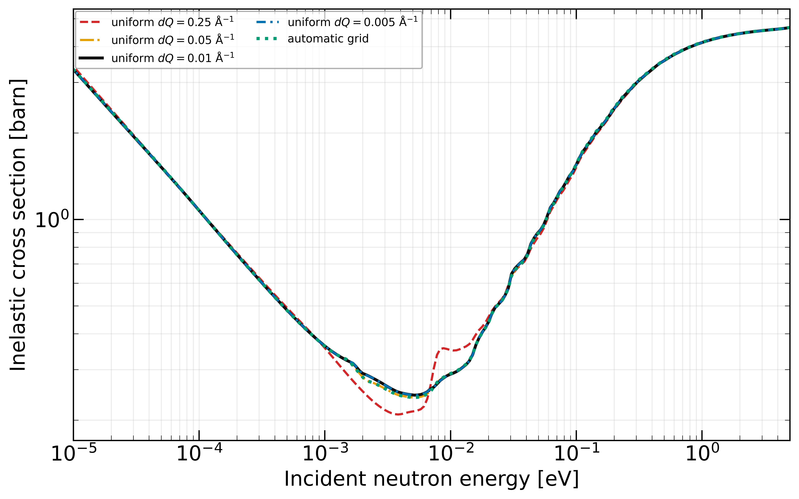
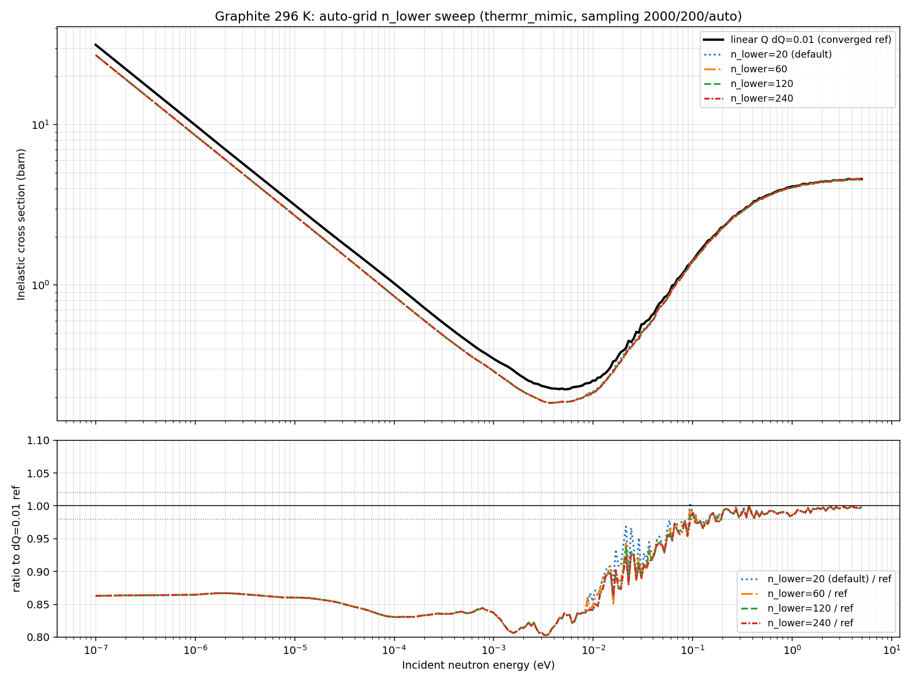

# Automatic grids

IRMA tabulates the thermal scattering law $S(\alpha,\beta)$ on a grid of dimensionless momentum transfer $\alpha$ and energy transfer $\beta$, and everything downstream (the inelastic cross section, the secondary-energy distributions THERMR reconstructs, the size of the ENDF tape) is computed by integrating over that table. A grid that is too coarse in the wrong place silently under-integrates the cross section; a grid that is too fine everywhere produces enormous tapes for no accuracy gain. This page explains the automatic $\beta$ and $\alpha$ grids IRMA builds for you, the physics behind their shapes, the validated accuracy you can expect, and when to override them by hand to match a reference evaluation.

Automatic grids are built in the GUI (the ENDF form's Grids part) or through the `irma.core.grids` functions from Python. The GUI writes the resulting explicit Cards 7–9 into the deck; there is no deck-level auto-grid flag.

## Why the grid shape matters

The tabulated $S(\alpha,\beta)$ is the only thing the cross-section integrators see. The thermal-energy inelastic cross section is dominated by a narrow band of small $\alpha$ (the upscatter windows, roughly $\alpha \sim 0.01\text{–}0.3$, equivalently momentum transfer $Q \sim 1\text{–}6\ \text{Å}^{-1}$), while the $\beta$ direction must resolve the phonon spectrum's peaks and van Hove singularities. The two axes therefore want different spacing strategies, and IRMA's automatic grids are built to put points where the integrands actually live rather than spreading them uniformly.

## The beta grid: three regions

`generate_beta_grid` builds the energy-transfer axis in three contiguous regions, each with its own GUI control. The grid always starts at $\beta = 0$.

| Region | Spacing | GUI parameter | What it captures |
|--------|---------|---------------|------------------|
| Lower tail | Logarithmic, from $\beta_\min = 10^{-9}\ \text{eV}/kT$ up to the phonon region | **Beta N lower (log)** | Thermal quasi-elastic scattering very near $\beta = 0$, where $S(\alpha,\beta)$ varies rapidly |
| Phonon region | Linear, spacing $\text{freq\_max}/\text{N\,phonon}$ over $(0, \text{freq\_max})$ | **Beta N phonon (linear)** | The phonon spectrum itself: peaks and singularities resolved uniformly |
| Upper tail | Logarithmic for log-lin (`iint=0`) decks; step-capped below the recoil ridge for lin-lin (`iint=1`) decks (see [the lin-lin upper tail](#the-upper-tail-on-lin-lin-int2-grids)) | **Beta N upper (log)** and **Beta max** | Multiphonon contributions and the smooth exponential high-energy tail |

The linear phonon region runs up to the maximum phonon frequency `freq_max`, which you can enter directly or auto-detect from a DOS file or `phonopy.yaml` in the GUI. The upper tail extends to **Beta max** (default 5 eV). The 5 eV default suits most solid moderators, but hydrogen's large recoil pushes significant scattering well past 5 eV; give hydrogen 10 eV or more so the tabulated $S(\alpha,\beta)$ is not truncated.

## The alpha grid: linear in momentum transfer

The $\alpha$ axis (`generate_alpha_grid`) is linear in momentum transfer $Q$, which makes $\alpha$ quadratic in $Q$. Points are placed at $Q = \text{dQ}, 2\,\text{dQ}, \dots$ up to a cutoff $Q_\text{cut}$, after which a logarithmic tail runs out to the maximum $Q$ that matches the $\beta$ grid's kinematic reach, $\alpha_\max = 4\beta_\max/A$. Each grid $Q$ maps to $\alpha$ through

$$
\alpha = Q^2 \,\frac{\hbar^2/2m}{A\,kT}.
$$

This design requires a temperature (the map from $Q$ to the dimensionless $\alpha$ contains $kT$), so the automatic $\alpha$ grid is built per temperature block.

### Why not mirror the beta grid?

Earlier versions of the code built $\alpha$ from the recoil relation $\alpha = 4\beta/A$, which copies the *linear-in-energy* layout of the $\beta$ grid straight onto $\alpha$. But the thermal cross section is governed by $S(\alpha,\beta)$ in the upscatter windows at small $\alpha$ ($Q \sim 1\text{–}6\ \text{Å}^{-1}$), and there a constant-$\Delta\alpha$ grid is several times too coarse compared with the quadratic-in-$Q$ spacing the physics asks for. Putting points uniformly in $Q$ concentrates resolution exactly where the integrand is sharp.

### Validated accuracy

On graphite at 296 K (all five grids scored with the same `thermr_mimic` inelastic cross section on the same incident-energy nodes, below ~25 meV), the default grid and every finer grid agree; only a deliberately coarse grid under-resolves the thermal window:

| Resolution class | Thermal inelastic XS vs the dQ = 0.01 reference |
|------------------|-----------------------------------|
| dQ = 0.25 (deliberately coarse) | 12% low at the 5 meV minimum, up to 29% off near 8.3 meV |
| dQ = 0.05 (default) | −0.33% on the 0.01–25 meV integral, 1.2% rms pointwise |
| dQ = 0.01 (finer) | reference; halving dQ again moves the integral by −0.001% (0.27% maximum) |
| automatic grid (399 columns) | same agreement as dQ = 0.05, at a fifth of the columns |

The default `dq_ang_inv = 0.05` is already converged: relative to the dQ = 0.01 reference it changes the 0.01–25 meV integral by −0.33% and agrees pointwise to a root-mean-square difference of 1.2%. The largest local difference is 4.3% (at 2.12 meV), among the narrow unbroadened coherent features in the thermal window around the inelastic cross-section minimum, where the cross section is only about 0.25 b (a few percent of the total). The compact automatic grid reaches the same agreement with 399 alpha columns against 2000 for uniform dQ = 0.05 (5.72 MB of tape against 27.22 MB), which is why it is the shipped default. An earlier automatic grid built $\alpha$ by mirroring the recoil relation $\alpha = 4\beta/A$; that layout was several times too coarse through the thermal upscatter windows, and the linear-in-Q grid described above replaced it.


*The compact automatic grid (green dotted) reproduces the converged dQ = 0.05, dQ = 0.01, and dQ = 0.005 cross sections across the whole range; only the deliberately coarse dQ = 0.25 grid under-resolves the thermal window, and no grid overshoots the free-atom limit at high energy. All five grids scored with the same `thermr_mimic` implementation on the same incident-energy nodes.*


*Sweeping the number of low-beta logarithmic points: the thermal peak stabilises once the lower tail is adequately resolved.*

## Defaults

| Parameter | GUI label | Default | Meaning |
|-----------|-----------|---------|---------|
| `n_lower` | Beta N lower (log) | 15 | Low-$\beta$ logarithmic points |
| `n_phonon` | Beta N phonon (linear) | 300 | Linear subdivisions of the phonon region $(0, \text{freq\_max})$ |
| `n_upper` | Beta N upper (log) | 80 | High-$\beta$ tail density (GUI default; the `generate_beta_grid` function default remains 20 for byte-stable log-lin grids). On a lin-lin (`iint=1`) grid the tail gains extra step-capped points below the recoil ridge, so the final tail count exceeds `n_upper` (see below) |
| `beta_max_eV` | Beta max | 5.0 eV | Upper bound of the $\beta$ grid |
| `dq_ang_inv` | Alpha dQ | 0.05 Å⁻¹ | $Q$ spacing of the linear $\alpha$ segment |
| `q_cut_ang_inv` | Alpha Q cut | 12.0 Å⁻¹ | End of the linear segment (set by neutron kinematics, not the material) |
| `n_log` | Alpha N log | 160 | Logarithmic $\alpha$ points from $Q_\text{cut}$ to $Q_\max$ |

The $\alpha$ and $\beta$ grids are independent: `nalpha` is decoupled from `nbeta`, so you can refine one axis without inflating the other.

The **Alpha Q cut** is set by neutron kinematics, not by the material's phonon cutoff: the linear segment must cover the thermal upscatter windows. The default 12.0 Å⁻¹ rarely needs changing.

#### The upper tail on lin-lin (INT=2) grids

A purely logarithmic tail lets the step grow without bound: $\Delta\beta \approx 30$ near the default $\beta_\max$ for the coarse `n_upper=20` tail. Log-lin (INT=4) interpolation tolerates that, because INT=4 reproduces the $\exp(-\beta/2)$ detailed-balance tail exactly on any grid. Lin-lin (INT=2) interpolation instead connects the tabulated points with straight lines, and across a step that wide the straight segments lie far above the decaying exponential between the points, so the reconstructed cross section overshoots the free-atom cross section by more than 100% at high incident energy. The grid builders therefore key the tail on the deck's Card 4 `iint` flag (`generate_beta_grid_for_iint`; the GUI, `irma mlip emit`, and the NCrystal pack exporter all build their $\beta$ grids through it):

- **`iint=0` (log-lin):** the tail is purely logarithmic with `n_upper` points, byte-stable with existing decks.
- **`iint=1` (lin-lin):** the logarithmic step is capped at $\Delta\beta = 0.5$ (`DELTA_BETA_MAX_LINLIN`; the exact midpoint overshoot of $\exp(-\beta/2)$ at that step is $\cosh(0.125) - 1 \approx 0.78\%$) from the end of the phonon region up to the recoil ridge $\beta = 4\beta_\max/A$, the highest $\beta$ at which $S(\alpha,\beta)$ is still appreciable (back-scatter at the maximum incident energy). Above the ridge $S(\alpha,\beta)$ is only the negligible off-ridge $\exp(-\beta/2)$ tail, and the original coarse log spacing resumes, so the grid stays compact. The tail therefore has more than `n_upper` points and is not logarithmic. Validated on graphite: $\sigma(5\ \text{eV})$ within ~1.5% of the converged reference, against +144% for lin-lin interpolation on the pure log tail.

The GUI defaults `n_upper` to 80; the `generate_beta_grid` function default remains 20 so existing log-lin grids stay byte-identical.

## Manual grids: matching a reference evaluation

When you need IRMA's grid to match an existing evaluation column-for-column (for a direct tape comparison, or to reproduce a published LEAPR deck), supply the grids explicitly on Cards 7–9 instead of letting IRMA build them. The deck format is NJOY free-format:

```text
nalpha nbeta lat /        $ Card 7: grid sizes; lat=1 = grids at the 0.0253 eV reference temperature
a1 a2 a3 ... /            $ Card 8: nalpha alpha values, strictly increasing, all > 0 (may span lines)
b1 b2 b3 ... /            $ Card 9: nbeta  beta  values, strictly increasing, from >= 0
```

Both lists must be strictly increasing; the $\alpha$ values must be positive and the $\beta$ values may start at zero. With `lat=1` the grids are interpreted as being given at the 0.0253 eV reference temperature, exactly as in LEAPR.

It is important to note that no grid choice, manual or automatic, protects a tape from one defect in stock NJOY2016 THERMR: a coherent `inelastic_mode=2` table can trigger the `cliq` liquid-extrapolation guard regardless of the grid spacing, because the failure follows the shape of the tabulated $S(\alpha,\beta)$, not whether the $\beta$ grid is uniform. See [NJOY interoperability](njoy.md) for the symptom and the one-line patch; mode-0/1 tapes and most materials are unaffected.

Grid size also drives file size directly: ENDF tapes carry roughly 6-significant-figure values, so a 2000×5001 grid is on the order of 270 MB. Refine only the axis and region that needs it.
