# GUI guide

The IRMA graphical interface has four top-level tabs:

- **ENDF Evaluation**: a single-page front end for building a LEAPR-style input file (LEAPR is NJOY's thermal scattering law module, whose input format IRMA extends)
  and computing the thermal scattering law S(α,β) without hand-editing cards.
  The page is one scrolling form of five parts in the order the input file is written
  (**Material**, **Scattering**, **Grids**, **Phonon**, and **Run**) that you
  fill in top to bottom; the **Jump to** bar above the form scrolls any part to
  the top.
- **Neutron Scattering Experiments**: the forward-spectra panel; it predicts
  instrument-resolved INS spectra and 2-D S(Q,E) maps from a phonopy calculation or a
  phonon DOS, with no ENDF tape involved. Covered in
  [its own section below](#neutron-scattering-experiments-tab).
- **NCrystal plugin**: exports the per-temperature material data file that the
  companion transport plugin samples on the fly. Covered in
  [its own section below](#ncrystal-plugin-tab); the format and workflow are
  documented on the [NCrystal data exporter](ncrystal-plugin.md) page.
- **MLIP phonon models**: builds a bundle, a packaged phonon calculation, from a structure file
  with a pretrained machine-learned interatomic potential (MLIP) and generates
  ready-to-edit inputs for the other tabs. Introduced in
  [its own section below](#mlip-phonon-models-tab); the full reference is the
  [MLIP phonon calculations](mlip.md) page.

The defining behavior of every tab is *progressive disclosure*: a field appears only when the mode that reads it is selected, so you never stare at controls that have no effect on your calculation. Importing an existing input file reveals exactly the sections it uses.

The second rule is what a fresh form does and does not claim: **everything you should not have to think about is filled in, everything only you can know is empty.** Method settings (mesh, `ndir`/`mpdir`, the automatic-grid knobs, the multiphonon order, the elastic format) ship at the recommended production values, so a first evaluation needs no tuning to be taken seriously. Material *identity* ships blank: `ZA`, `MAT`, `AWR`, `sigma_free` (all defined in the Scattering part below), the lattice parameters, the Card 6d atom types, and the per-element scatterer tables on the other tabs. IRMA cannot know your material, and a plausible-but-wrong prefill is worse than an empty field: someone evaluating BeO would see graphite's numbers, not recognize them, and ship a tape for the wrong material. Each blank group carries a gray hint naming the ways to fill it: **Import Input File**, a committed input file under `examples/`, **Fill structure from phonopy.yaml** (ENDF, modes 1/2), **Fill AWR + sigma_free from ZA**, or **Auto-fill elements from phonopy.yaml** (Neutron Scattering tab). This page describes each part in turn and calls out the pitfalls worth knowing before your first run.

## Launching

```bash
irma-gui
# or
python -m irma --gui
```

The window title bar shows the product name, and the bottom bar shows the installed IRMA version.

How much of the form you see is decided by the modes you pick. Choosing `iel=10` in the Material part unlocks the crystal-structure and phonopy sections; choosing `inelastic_mode=1` or `2` unlocks the phonopy mesh and control fields and flags the legacy Phonon cards as not read; choosing a special mode (`ncold`, `nsk`, `nss`) in the Scattering part unlocks just that mode's extra inputs. Everything else stays hidden.

---

## Material part

This is where you declare *what* you are modeling: the elastic treatment, and, for `iel=10`, the crystal structure and the noncubic inelastic mode.

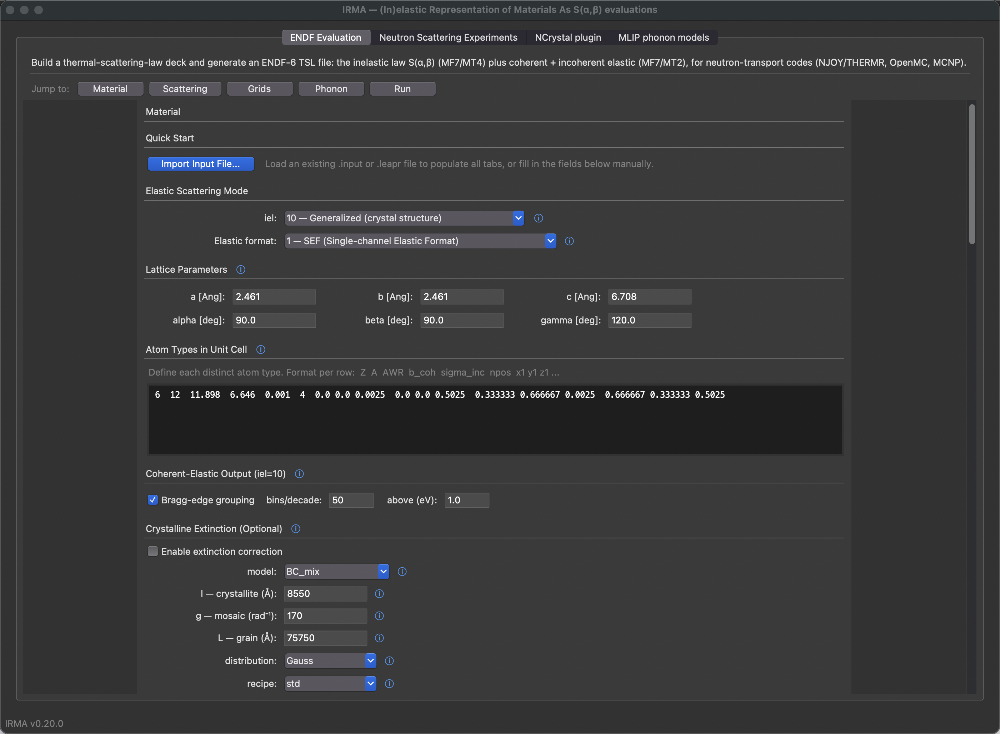

Progressive disclosure in action: with `iel=10` and `inelastic_mode=2`, the lattice parameters, atom-type table, and the phonopy controls (mesh, `ndir`/`mpdir`, auto-size order, …) are all shown. Selecting a classic mode collapses them to a single dropdown:

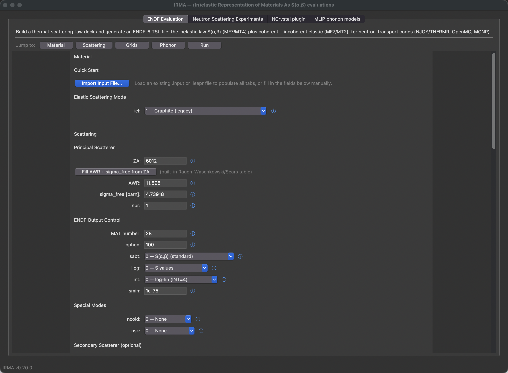

### Quick Start (input file import)

The **Quick Start** panel has a single **Import Input File...** button (also reachable from **File ▸ Import Input File**). Point it at an existing `.input` or `.leapr` input file and IRMA parses it and populates the whole form. Because import writes the same internal variables that your clicks do, the conditional sections reveal themselves automatically: an input file with `iel=10` shows the crystal cards, one with a secondary scatterer shows the secondary fields, and so on. This is the fastest way to start from a known-good evaluation and tweak it. Import is optional: you can also fill in every field by hand; the button just saves typing.

### Inelastic Mode (`inelastic_mode`)

This section chooses the inelastic model.

The `inelastic_mode` radio buttons:

| `inelastic_mode` | Label | What it does |
|------------------|-------|--------------|
| `0` | legacy cubic | Isotropic Debye-Waller, phonon expansion from a scalar DOS supplied in the Phonon part. |
| `1` | incoherent approx. | The inelastic part comes from the phonopy calculation with directional Debye-Waller factors, treating every atom as an incoherent scatterer (no interference between atoms). |
| `2` | coherent (exact 1-phonon) | The same, except the one-phonon term is exact: coherent interference between atoms is included. Multiphonon orders stay in the incoherent approximation. Matches the Neutron Scattering Experiments panel's "2 (coherent 1ph+multi)". |

Modes 1 and 2 require the optional `phonopy` package, a `phonopy.yaml` with force constants, and the Card 6g controls below. They do **not** read the legacy continuous-DOS, translational, or oscillator cards in the Phonon part: MT4 and the directional elastic Debye-Waller factors come straight from the phonopy calculation. Selecting mode 1 or 2 reveals the phonopy sub-frame; mode 0 hides it.

Modes 1 and 2 are also defined only for `iel=10`, the generalized crystal-structure elastic treatment, so selecting one narrows the `iel` dropdown below to the generalized entry and switches the selection to it. Mode 0 restores the full `iel` list and leaves your selection alone. (Mode 0 is the legacy cubic treatment driven by the DOS you supply in the Phonon part, so it works with every `iel`; no phonopy is involved.)

#### Phonopy parameters (modes 1/2 only)

When `inelastic_mode` is 1 or 2, the sub-frame exposes:

| Control | Default | Purpose |
|---------|---------|---------|
| `phonopy.yaml` | — | Path to the phonopy YAML. Force constants are read from the YAML if embedded, otherwise discovered alongside it (`force_constants.hdf5`, `FORCE_CONSTANTS`, or `FORCE_SETS`). |
| **Fill structure from phonopy.yaml** | — | Button. Prefills the `iel=10` **Lattice Parameters** and the whole **Atom Types** block from the phonopy.yaml named above, after a preview you confirm. See [Atom Types](#atom-types-iel10-only). |
| Mesh `nx ny nz` | `40 40 40` | Monkhorst-Pack mesh for the Brillouin-zone sampling behind the directional (tensor) phonon DOS (matches the Neutron Scattering Experiments tab and the validation suite). Anisotropic crystals may use an asymmetric mesh. |
| `ncpu` | all cores | Parallel worker processes for the modes-1/2 workflow (prefilled with the machine's core count). |
| `ndir` | `10000` | One-phonon powder-average direction count: the validation-campaign sampling, well converged for production runs; drop to ~4000 for a faster look or ~1000 for a quick one. Cost is roughly linear. |
| `mpdir` | `1000` | Multiphonon powder-average directions over the unit sphere (golden-spiral / Fibonacci); converged by ~50–100, so the default carries ample margin. |
| Auto-size multiphonon order | **on** | When on (the default), IRMA sizes the multiphonon order `nphon` from the anisotropic Debye-Waller physics. When off, your Card 3 `nphon` is honored exactly (see below). |
| Minimum phonon energy [meV] | blank | Removes every phonon mode with energy at or below the value from all terms (nothing replaces them; the run is a truncated vibrational model, and the log reports the removed weight and the Debye-Waller change, with a warning above 1%). Blank or 0 keeps the automatic floors, which already exclude imaginary modes. Written as the optional one-value card before Card 6g. |
| Use BORN corrections (NAC) | off | Non-analytical correction for polar materials; checking it reveals a BORN-file selector. Leave unchecked for non-polar materials such as graphite. |

With the anisotropic Debye-Waller factor the multiphonon order needed to reach the free-gas limit grows with Q, so a hand-set `nphon` that is fine at low Q will silently truncate the high-Q rows of the cross section. With the default grids (`Beta max = 5 eV`, graphite AWR) the grid reaches Q ≈ 98 Å⁻¹, where an order near 223 is needed while the default `nphon` is 100. The GUI therefore ships **Auto-size multiphonon order** on. If you turn it off (a deliberate low-order study), IRMA honors your `nphon` exactly and prints a terminal warning when it is too low.

The multiphonon powder average converges quickly: for graphite-like crystals it is already converged by roughly 50–100 directions, so the default `mpdir` of 1000 is deep inside the converged regime. Cost scales linearly with `mpdir`, so larger values cost proportionally more without improving a converged result; raise it only to verify convergence on a new material.

The coherent one-phonon powder averaging always uses the golden-spiral direction quadrature; it is not user-selectable.

The GUI defaults produce Card 6g `10000 1000 1`: 10000 coherent directions, 1000 multiphonon directions, auto-sized multiphonon order, the same sampling the validation campaign ran and `irma mlip emit` writes. (The powder averages converge well below these counts, so entering `4000 200` gives a faster exploratory run.)

### Elastic Scattering Mode (`iel`)

The `iel` dropdown selects the coherent-elastic (Bragg-edge) treatment.

| `iel` | Meaning |
|-------|---------|
| `0` | No coherent elastic scattering |
| `1`–`6` | Legacy built-in materials: graphite, Be, BeO, Al, Pb, Fe (hardcoded crystal structures) |
| `10` | **Generalized**: Bragg edges computed from the crystal structure you define in this part, for any material |

`iel=10` is the recommended option for new evaluations and is the default selection. It also unlocks the rest of the part: the **Elastic format** selector, **Lattice Parameters**, **Atom Types**, **Coherent-Elastic Output**, and **Crystalline Extinction** appear only for `iel=10`. For the built-in materials (`iel=0`–`6`) those cards are not read, so the GUI hides them to keep you from filling in fields that have no effect. The **Inelastic Mode** section above is not part of that group; it stays visible for every `iel`.

### Elastic format (`elastic_mode`, iel=10 only)

| `elastic_mode` | Format | Behavior |
|----------------|--------|----------|
| `1` | SEF (single-channel elastic format) | One ENDF-legal elastic section per tape: a single-atom material gets coherent elastic scaled by the full strength when sigma_coh > sigma_inc, else incoherent elastic carrying the sum; a polyatomic cell routes the designated-coherent atom (the one minimizing the incoherent contribution) to coherent elastic and redistributes the rest incoherently (Eq. 26 of the mixed-elastic paper, NIM-A 1027 (2022) 166227). See [the theory page](theory.md#elastic-format-sef-vs-mef-card-6b-field-1) for the exact rule. Standard format, supported by all transport codes. |
| `2` | MEF (Mixed Elastic Format) | Every atom gets both coherent and incoherent elastic (LTHR=3). More accurate for polyatomic materials, but needs downstream transport-code support for the mixed format. |

### Lattice Parameters (iel=10 only)

Six fields define the unit cell: edge lengths `a`, `b`, `c` in Ångström and angles `alpha`, `beta`, `gamma` in degrees. They start **blank** (the cell is your material's identity, not something IRMA can guess) and are filled by hand, by **Fill structure from phonopy.yaml** (modes 1/2, below), or by importing an input file. Common settings:

- Cubic: `a = b = c`, `alpha = beta = gamma = 90`
- Hexagonal: `a = b`, `alpha = beta = 90`, `gamma = 120`

### Atom Types (iel=10 only)

A free-text box, **empty on a fresh form** (like the lattice, the atom block is your material's identity), one line per distinct atom species, in the column order shown in the header:

```
Z  A  AWR  b_coh  sigma_inc  npos  x1 y1 z1  x2 y2 z2 ...
```

| Field | Meaning |
|-------|---------|
| `Z` | Atomic number |
| `A` | Mass number |
| `AWR` | Atomic weight ratio to the neutron mass |
| `b_coh` | Coherent scattering length (fm) |
| `sigma_inc` | Incoherent cross section (barn) |
| `npos` | Number of equivalent positions in the cell |
| `x y z ...` | Fractional coordinates of each position |

For a polyatomic material such as NaCl, use one line per species. Scattering lengths and cross sections come from the NIST neutron scattering-length tables.

#### Filling the structure from a phonopy calculation

For `inelastic_mode` 1 or 2 the **Fill structure from phonopy.yaml** button (under the phonopy.yaml selector) writes both the lattice fields and the whole atom block from the phonopy.yaml named on Card 6f. The cell it reads is the phonopy **primitive** cell, loaded through phonopy itself: the cell those modes require, since IRMA matches every Card 6d position against the phonopy primitive cell's atom positions and refuses an input file whose positions do not correspond.

The button never fires on its own: not when you select a phonopy.yaml, not on input-file import, not on reset. It opens a preview of the exact lattice line and atom rows it would write; **Apply** replaces both together, **Cancel** changes nothing, so phonopy positions can never end up beside a hand-typed lattice.

Each species is filled as the **natural element**: ENDF codes that as `A = 0`, and `AWR`, `b_coh` and `sigma_inc` are that element's natural-abundance values, so the identity and the constants always come from one table entry. A phonopy calculation names elements, not isotopes: it typically labels deuterium as `H` and says nothing about enrichment, so an isotopic or enriched material must be edited afterwards. Elements whose tabulated scattering length is a resonance-region (energy-dependent) value are refused rather than prefilled.

Cells that are not in Ångström are converted, not refused. phonopy keeps cells in the *calculator's* native length unit and does not convert them on load, so a calculation built through the `qe`, `abinit`, `elk`, `siesta`, `wien2k`, `DFTB+`, `TURBOMOLE`, `fleur`, `abacus` or `qlm` interface carries a cell in bohr. IRMA applies the calculator's factor once, at load, in the same place `inelastic_mode` 1/2 does, so the lattice this button writes is the lattice the engine runs. A phonopy.yaml is refused only when its length unit is genuinely unusable: a `physical_unit: length:` name IRMA cannot map to a factor, or a calculator interface missing from phonopy's own units table.

### Coherent-Elastic Output (iel=10 only)

The **Bragg-edge grouping** controls live in their own frame between the atom-type table and the phonopy section, because they are a coherent-**elastic** MF7/MT2 output option that applies to *every* `iel=10` inelastic mode, including the classic mode 0, which needs no phonopy at all.

The **Bragg-edge grouping** checkbox is **on by default** (compact tapes); uncheck it to keep every Bragg edge. When checked, two fields control the grouping of dense high-energy edges, following ENDF-102 §7.2.2. Importing an input file sets the checkbox to match it (on only if it carries the Card 6b grouping fields).

| Field | Default | Meaning |
|-------|---------|---------|
| Bragg-edge grouping (checkbox) | **on** | Group dense high-energy edges. Uncheck to write every edge (the former default). |
| bins/decade | `50` | Above the threshold, the energy axis is split into this many log-uniform bins per decade; all edges in a bin merge into one step at the structure-factor-weighted log-mean energy. |
| above (eV) | `1.0` | Energy above which grouping may occur. Edges at or below it are always kept individually. |

Grouping preserves the cumulative edge sum (the running total of Bragg-edge strengths), the total bound cross section, and the high-energy 1/E tail; only the placement of merged high-energy steps is approximate (IRMA prints the resulting integral cross-section error per temperature). These map to optional fields 5–6 on Card 6b. Grouping **composes with extinction**: extinction refines the Bragg edges below ~0.1 eV while grouping compacts those above the threshold.

### Crystalline Extinction (iel=10 only)

The **Crystalline Extinction (Optional)** frame applies a dynamical-diffraction reduction to the coherent-elastic Bragg edges, the effect that makes a real crystallite's peaks weaker than ideal theory predicts. It is a *specimen* property, off by default.

Tick **Enable extinction correction** and the parameter fields appear (hidden while the correction is off): pick a **model** (five available; the coupled `BC_mix`/`BC_mod` need `l`, `g`, and `L` all > 0), and set the specimen sizes: **l** (crystallite, primary), **g** (mosaic) and **L** (grain) for secondary, plus the **distribution**, **recipe**, and tabulation **rmse_tol**. Every control has an **ⓘ help glyph** (hover for a preview, click for the full text) explaining the parameter and linking the references; the attribution line credits the NCrystal CrysXT plugin. Changing the model snaps the distribution to that model's default (`Gauss` for Becker-Coppens, `rect` for Sabine). The section round-trips through input-file export/import.

See **[Crystalline extinction](extinction.md)** for the full physics, the extinction card, validation, and references.

---

## Scattering part

Here you describe the principal scatterer, control the ENDF output, and opt into any special moderator physics.

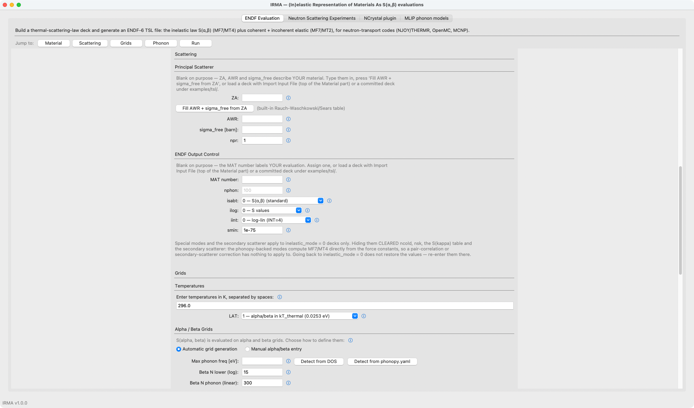

### Principal Scatterer

The first three fields are material identity and ship **blank**; `npr` is a convention and does not.

| Field | Default | Meaning |
|-------|---------|---------|
| `ZA` | *(blank)* | Scatterer identity as Z×1000 + A, with `A = 0` naming the natural element (`6000` = natural carbon). Must match an atom type from the Material part; **Apply ZA** makes that element's row match (see below). |
| `AWR` | *(blank)* | Atomic weight ratio to the neutron mass; drives recoil kinematics and alpha-grid scaling. |
| `sigma_free` (`spr`) | *(blank)* | **FREE-atom** scattering cross section (barn), exactly as on LEAPR Card 5. IRMA derives the bound cross section that normalizes S(α,β) internally as `sigma_b = sigma_free·((1+AWR)/AWR)²` and writes `npr·sigma_free` into the tape's B(1) field (an ENDF bookkeeping value). Do **not** enter the bound value (carbon: enter 4.739, not 5.55; hydrogen: enter ~20.45, not ~82; the bound value makes every MT4 cross section ~4× too large for H). |
| `npr` | `1` | Number of principal scattering atoms in the compound, not in the unit cell (≥ 1). For `iel=1`–`6` it also scales the built-in Bragg-edge cross sections. |

The **Apply ZA: fill AWR + sigma_free, relabel the atom row** button looks
the ZA up in IRMA's built-in nuclear table (the Rauch–Waschkowski/Sears
compilation, see `irma.core.nuclear_data`), overwrites AWR and `sigma_free`
with the tabulated values (`sigma_free` derived from the bound cross section
as `sigma_b·(AWR/(1+AWR))²`, so the free/bound convention is always right),
and makes the Material part agree. The engine requires the principal
`(Z, A)` to be one of the **Atom Types** rows, and **Fill structure from
phonopy.yaml** fills every row as the natural element (`A = 0`) because a
phonon model names elements, not isotopes. So after filling the structure,
type the isotope's ZA (`6012` for C-12) and press the button: the row of
that element is relabelled to the same nuclide, taking its `A`, `AWR`,
`b_coh` and `sigma_inc` from the one table entry, positions kept, and the
line under the button says exactly what changed (`atom row 1: C -> C-12
(A 0 -> 12, awr 11.9078 -> 11.8969, ...); positions kept`). Typing `6000`
and pressing again returns the row to the natural element.

The rules that keep this from ever silently overwriting your own numbers:
only the button changes a row (typing a ZA changes nothing); a row is
relabelled without a question only when its constants are the table's own
values for its current nuclide, and a row that carries other constants
(yours, or an imported evaluation's) is replaced only after a dialog
showing old and new, where *No* changes nothing on Card 5 either; other
elements' rows are never touched (in BeO, applying `4009` relabels the Be
row and leaves O natural); with two rows of the same element the button
refuses and asks you to set the intended row's `A` by hand; a nuclide with
no tabulated constants or energy-dependent ones (B, Cd, Gd, …) is refused
before anything changes. Relabelling a row changes the scattering identity
and constants only: the phonopy model's masses and phonons are whatever the
model contains, so a model that labels deuterium as H still carries H
masses after the row becomes D.

If the deck is still inconsistent when you press **Run** or **Save** (a
hand-typed row, for example), the same offer is made once more, and *No*
stops with the engine's own message naming the row it found and the two
ways to fix the deck. Pressing the button with `ZA` still empty says so and
changes nothing.

Each input file evaluates one principal scatterer: for `inelastic_mode=1/2`, IRMA writes one principal-scatterer MT4 section per input file even when the crystal has several atom types. If you need more than one principal (for example Be and O in BeO), run separate input files.

### ENDF Output Control

| Field | Default | Meaning |
|-------|---------|---------|
| `MAT number` | *(blank)* | ENDF material number for the output library; it labels *your* evaluation, so it is blank until you assign it or import an input file. |
| `nphon` | `100` | Maximum phonon expansion order. Light scatterers (H, D) reach much larger α for the same β grid and generally need *more* terms; heavy scatterers converge with fewer. For modes 1/2 this is also the multiphonon maximum order (unless Auto-size is on, the GUI default). |
| `isabt` | `0 — S(α,β)` | Which form of S(α,β) is stored. `0` is the standard symmetric S(α,β) required by THERMR; `1` writes the asymmetric S̃ form (diagnostics only, not for library production). |
| `ilog` | `0 — S values` | Storage form. `0` stores S directly; `1` stores ln(S) (ENDF LLN=1), useful when the table spans many decades and the processor supports it. |
| `smin` | `1e-75` | S(α,β) values below this threshold are treated as zero (LEAPR convention). |

### Special Modes

These selectors stay collapsed by default; choosing a non-zero value reveals only that mode's extra inputs.

| Selector | Options | Reveals |
|----------|---------|---------|
| `ncold` | None / Ortho-H / Para-H / Ortho-D / Para-D | The S(κ) table (`dka`, S(κ) values) when non-zero. |
| `nsk` | None / Vineyard / Sköld | The S(κ) table, plus `cfrac` (coherent fraction) when non-zero. |

The S(κ) inputs (`dka` grid spacing and the space-separated S(κ) values) appear whenever `nsk > 0` **or** `ncold > 0`. For `nsk > 0` you must also give `cfrac`.

Neither selector is available with the phonopy modes: `ncold` and `nsk` are rejected with `inelastic_mode=1/2`, because MT4 comes from the phonopy calculation rather than a tabulated pair-correlation treatment. Selecting `inelastic_mode=1` or `2` therefore hides the Special Modes and Secondary Scatterer sections **and clears them**: `ncold`, `nsk`, the S(κ) table and the whole secondary scatterer go back to their off values, so the rejected combination cannot be reached from the form at all. Switching back to `inelastic_mode=0` does not restore the values; re-enter them there. A hand-written input file that carries the combination is still refused by the parser.

### Secondary Scatterer (optional)

Set `nss` to **1 — One secondary scatterer** to reveal the secondary-species fields:

| Field | Meaning |
|-------|---------|
| `b7` | Secondary model: `1` free gas (most common, e.g. O in H₂O), `2` diffusion, `0` bound two-pass (the secondary gets its own phonon-spectrum pass, e.g. O in BeO). |
| `AWS` | Secondary atomic weight ratio (> 0). |
| `sigma_s` | Secondary free-atom cross section in barn (> 0). |
| `mss` | Number of secondary atoms in the unit (≥ 1). |

Choosing `b7 = 0` also reveals the **Secondary phonon model (b7 = 0 two-pass only)** panel (its own DOS spacing/values, translational weights, and oscillator energies/weights), which IRMA emits as a complete second pass through the temperature block (the secondary species' own spectrum and weights) and merges with bound-cross-section weighting. The two-pass merge exists only with the classic elastic options: with generalized elastic (`iel = 10`) a bound `b7 = 0` secondary is rejected at parse time (use `b7 = 1`/`2` or `nss = 0`).

For most polyatomic materials, evaluators generate a separate table per species (`nss = 0`) instead of using the mixed-moderator approach. A secondary scatterer is not supported with `inelastic_mode=1/2`, and combining `ncold`/`nsk` with the two-pass case is input-file-only.

---

## Grids part

This part defines the temperatures and the α/β grids on which S(α,β) is tabulated (α and β are the dimensionless momentum and energy transfer; β = E/kT).

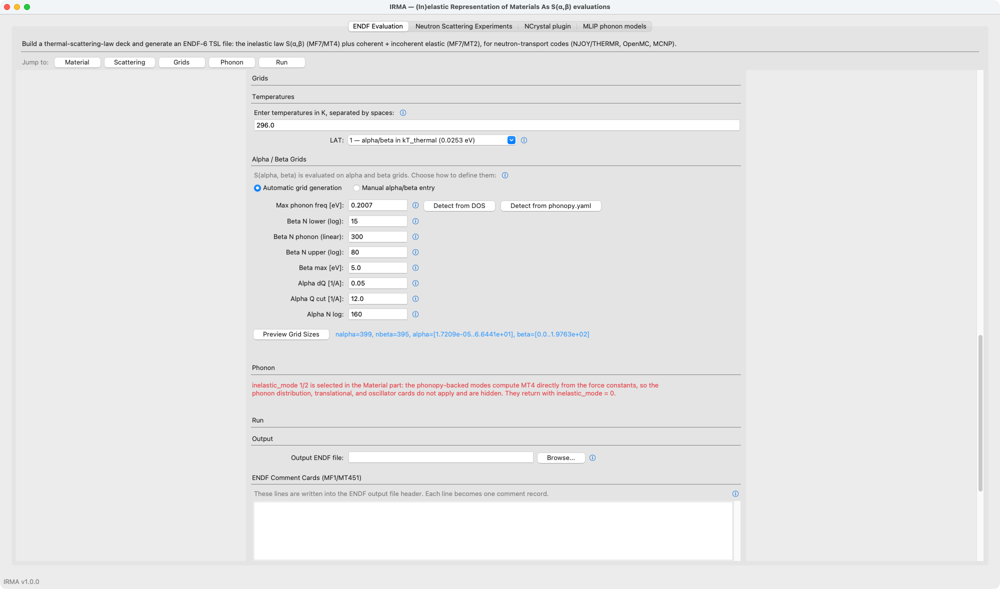

With **Automatic grid generation** selected, **Preview Grid Sizes** reports the resulting point counts and ranges without running the calculation.

### Temperatures

Enter temperatures in Kelvin, space-separated. The phonon spectrum is read only at the first temperature; subsequent temperatures reuse it and recompute S(α,β) for the new Boltzmann population.

The **LAT** selector controls α/β scaling:

| LAT | Meaning |
|-----|---------|
| `0` | α/β in units of kT = k_B·T (grid meaning changes per temperature). |
| `1` | α/β in units of a fixed kT_thermal = 0.0253 eV (T = 293.6 K). Standard ENDF TSL convention; the same grid serves all temperatures. **Recommended** (default). |

### Alpha and beta grids: automatic vs manual

A radio pair switches between **Automatic grid generation** (default) and **Manual alpha/beta entry**; only the chosen mode's fields are shown.

#### Automatic beta controls

The beta grid has three regions: a logarithmic low-β tail, a linear phonon region over [0, freq_max], and a logarithmic high-β tail up to Beta max.

| Field | Default | Meaning |
|-------|---------|---------|
| Max phonon freq | `0.20` | Upper bound of the linear region (eV). The **Detect from DOS** and **Detect from phonopy.yaml** buttons fill this in for you. |
| N lower (log) | `15` | Logarithmic points in the low-β (thermal quasi-elastic) tail. |
| N phonon (linear) | `300` | Linear points across [0, freq_max], where phonon features live. |
| N upper (log) | `80` | Logarithmic points in the high-β multiphonon tail. 80 is conservative: it keeps the high-β step fine enough that lin-lin (INT=2) interpolation does not overshoot the free-atom limit at high incident energy. Fewer (~20) suffice for log-lin or thermal-only runs; verify grid convergence for your energy range and adjust up or down. |
| Beta max | `5.0` | Maximum energy transfer (eV) for the upper tail. Hydrogen may need 10 eV or more. |

#### Automatic alpha controls

The alpha grid is **linear in momentum transfer Q**: points every `dQ` out to `Q cut`, then a logarithmic tail to the beta grid's kinematic reach (α_max = 4·beta_max/AWR).

| Field | Default | Meaning |
|-------|---------|---------|
| Alpha dQ | `0.05` | Q spacing (1/Å) of the linear segment; α = Q²·(ℏ²/2m)/(AWR·kT). Sets how well the thermal upscatter windows (Q ≈ 1–6 1/Å) are resolved. |
| Alpha Q cut | `12.0` | Q (1/Å) where the grid switches from linear to a logarithmic tail. Fixed by neutron kinematics, not the material; rarely needs changing. |
| Alpha N log | `160` | Logarithmic points from Q cut to the grid maximum (feeds the epithermal cross section and the free-gas limit). |

The linear-in-Q layout exists because the thermal-energy inelastic cross section integrates S(α,β) over upscatter windows at small α (Q ≈ 1–6 1/Å): an alpha grid that simply mirrors the beta layout under-integrates that cross section by 10–20%. On graphite at 296 K the default `dQ = 0.05` grid lands within 3–5% of the converged result at only ~400 columns; a linear `dQ = 0.01` grid is converged (halving dQ again moves results ≤0.3%).

#### Manual entry

Two text boxes take space-separated α and β values, both ascending; the β list should start at 0. Use this to match a reference evaluation exactly or to control grid placement precisely.

### Preview

The **Preview Grid Sizes** button reports the resulting `nalpha` and `nbeta` (and the α/β endpoints in auto mode) without running the calculation, a quick sanity check on grid budget before you commit. The alpha and beta point counts are decoupled, so you can resolve the thermal Q window densely without inflating the energy grid.

---

## Phonon part

This part supplies the scalar phonon input used by the **legacy cubic** treatment (`inelastic_mode = 0`). When `inelastic_mode = 1` or `2` is selected in the Material part, the phonon distribution, translational, and oscillator sections disappear and a note explains why: modes 1 and 2 compute MT4 directly from the force constants and never read these cards. Selecting `inelastic_mode = 0` (or a classic `iel`) brings the sections back.

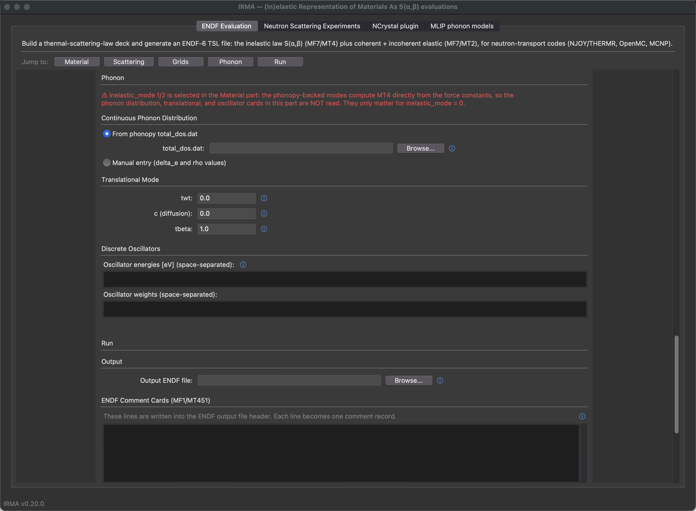

### Continuous Phonon Distribution

A radio pair chooses the DOS source, and only the selected source's fields appear directly beneath its button:

- **From phonopy total_dos.dat** (default) — a file selector for a phonopy `total_dos.dat` (two columns: frequency in THz and DOS). IRMA converts THz→eV and normalizes the spectrum.
- **Manual entry**: `delta_e` (uniform energy spacing, eV) plus a space-separated `rho` list on the equidistant grid starting at E = 0.

### Translational Mode

| Field | Default | Meaning |
|-------|---------|---------|
| `twt` | `0.0` | Weight of the translational (diffusive/free-gas) component. `0` for a crystalline solid. |
| `c (diffusion)` | `0.0` | Diffusion constant; `0` is free-gas translation, `> 0` is the Egelstaff-Schofield diffusion model. Used only when `twt > 0`. |
| `tbeta` | `1.0` | Weight of the continuous distribution. The weights satisfy `tbeta + twt + Σ(oscillator weights) = 1`. |

### Discrete Oscillators

Two text boxes take space-separated oscillator **energies** (eV) and **weights** for isolated vibrational modes treated analytically, typically intramolecular modes such as the H₂O bend and stretch. Leave them empty for most crystalline solids.

---

## Run part

The final part sets the output destination, optional ENDF documentation, and launches the job.

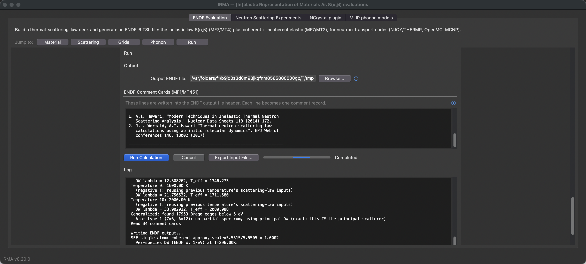

- **Output ENDF file**: destination for the ENDF-6 tape (S(α,β) in MF7/MT4, plus MF7/MT2 Bragg edges when `iel > 0`). This tape is what NJOY's THERMR and ACER modules process downstream into transport-ready data.
- **ENDF Comment Cards (MF1/MT451)**: free-text box; each line becomes one comment record (truncated to 66 characters). Document the method and references here.
- **Run Calculation**: generates the input file from the current fields and runs it, streaming progress into the **Log** pane with an indeterminate progress bar, a status label, and a live phase readout showing the engine's current stage. **Cancel** terminates a running calculation; **Clear Log** empties the pane.
- **Export Input File...**: writes the generated input file to a `.input`/`.leapr` file without running, so you can inspect, archive, or hand it to the command-line tool.

#### Coherent mode-2 tapes need a stock-NJOY THERMR patch

A coherent `inelastic_mode = 2` tape (graphite and similar) processed through unpatched NJOY2016 THERMR comes out as ~`1e91`-barn garbage above ~`0.27 eV`, or stalls for hours. This is a `cliq` bug in stock `thermr.f90` (its guard tests decay along alpha but not beta), not an IRMA tape defect, and it fires on the shape of S(α,β), not its grid spacing, so no beta-grid choice avoids it. Apply the one-line two-axis guard patch first; `inelastic_mode = 0/1` tapes and most materials are unaffected. See [NJOY interoperability](njoy.md).

---

## Neutron Scattering Experiments tab

The second top-level tab is the forward-spectra panel. It answers a different
question than the ENDF Evaluation tab: that tab computes S(α,β), while this
panel predicts what your instrument would measure, either an
instrument-resolved 1-D INS spectrum or a 2-D S(Q,E) powder map, computed
directly from a phonon calculation with no ENDF tape involved. It is the GUI face of
the `irma spectra` command line; **Save Config...** / **Open Config...**
round-trip the same YAML files the CLI runs, so you can prototype in the GUI
and script the production run.

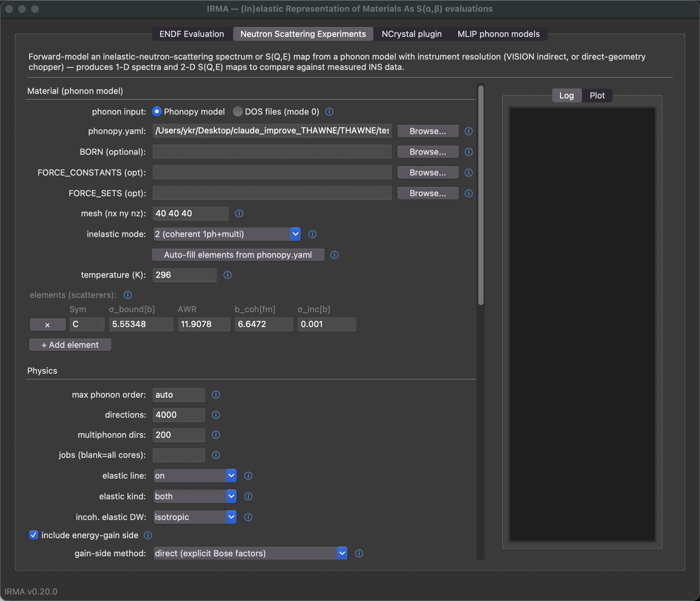

### Material (phonon input)

The first control, **phonon input**, gates the whole panel:

- **Phonopy model** (default): point **phonopy.yaml** at your phonopy file
  (force constants are discovered next to it, or set **FORCE_CONSTANTS** /
  **FORCE_SETS** / **BORN** explicitly) and choose the **mesh**.
  **Auto-fill elements from phonopy.yaml** populates the element table with
  the cell's species and multiplicities.
- **DOS files (mode 0)**: the route with no phonopy; each element row carries its
  own 2-column phonon **DOS file** (frequency, intensity; meV/eV/cm⁻¹/THz)
  instead. See [DOS-based spectra (mode 0)](spectra-mode0.md).


Below the gate sit the **inelastic mode** (`0` DOS + isotropic Debye-Waller,
`1` incoherent approximation, `2` exact coherent one-phonon; modes 1/2 need
the phonopy input), the **temperature**, the optional **lattice** (needed only
for the mode-0 coherent-elastic line), and the per-element table: symbol,
σ_bound, awr, b_coh, σ_inc; plus, in DOS-files mode, the multiplicity, DOS
file and frequency-unit columns, and, whenever a mode-0 elastic line is
requested, the fractional **positions** column (flat `x y z x y z …`, as in an
ENDF input file).

The table starts as **one empty row**: the scatterers name your material, so
IRMA declares none of them. Typing a symbol (`Be`, `O`, …) and leaving the
cell autofills the still-empty nuclear columns from IRMA's built-in table
(`irma.core.nuclear_data`, the Rauch–Waschkowski/Sears compilation);
anything you typed yourself is never overwritten, and typing a new symbol
over a machine-filled row refreshes the prefilled constants. Nuclides with energy-dependent scattering lengths
(B, Cd, Gd, …) are left blank on purpose: enter constants appropriate for
your energy range by hand. **Auto-fill elements from phonopy.yaml** draws
from the same table, and the NCrystal-plugin tab's element table behaves
identically. Isotope labels (`C-13`, `D`, …) autofill too, but keep them
for the DOS-files mode where the symbol is a free label: phonopy-backed
modes and the NCrystal export match rows to the structure's chemical
species by exact symbol, so an enriched material there needs the bare
element symbol with hand-entered isotope constants.

### Physics, Grid, and the elastic line

**Physics** holds the engine controls: **max phonon order** (`auto`
recommended), **min phonon energy** (blank; a positive value removes the
modes at or below it from every term, see the ENDF part's field of the
same name), and for modes 1/2 the powder-average **directions**,
**multiphonon dirs**, and worker **jobs**, plus the **elastic line** switch,
**elastic kind** (`both`, `coherent`, `incoherent`), and two toggles:
**include energy-gain side** (anti-Stokes by detailed balance, on by default)
and **kinematic kf/ki** (multiply by the flux factor to get the
double-differential cross section, off by default). The elastic line is
computed directly, with no ENDF file involved, from the same Debye-Waller
factors as the inelastic part.
**Grid** sets the energy window (**E min/E max/dE**) and the powder-average Q
resolution (**dQ**), with an optional **Q max** cap.

### Instrument geometry and resolution

Two sub-tabs select the geometry:

- **Indirect (VISION defaults)**: fixed final energy **Ef**; the VISION
  preset fills Ef = 3.5 meV and the 45°/135° banks, or enter your own
  **angles**.
- **Direct**: fixed incident energy **Ei** plus an **output** selector:
  *fixed cuts* (**cut by** detector **angles** or **constant-Q** values, with
  an optional **cut dQ** band average) or a *2-D S(Q,E) map* masked to the
  instrument's **detector coverage 2θ** arch.

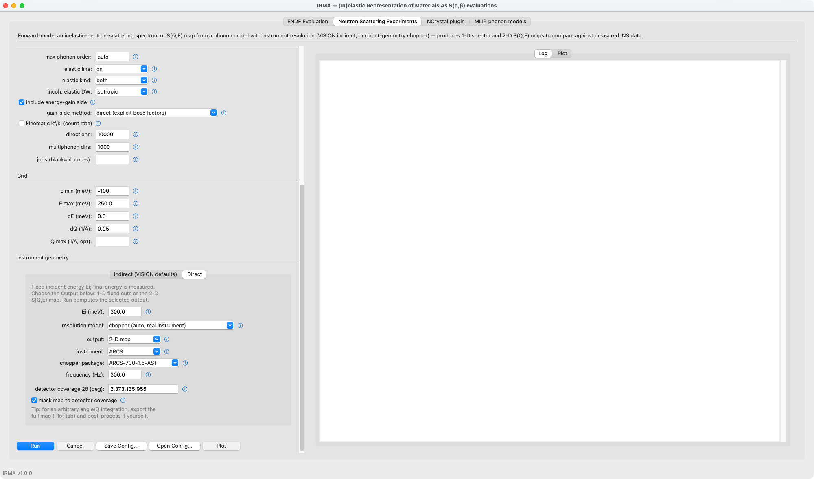

The **resolution model** is either a width polynomial (three labeled
coefficients, `sigma(E) = c0 + c1·|E| + c2·E²` (meV), mirrored on the
energy-gain side) or the automatic
**chopper** model: pick the **instrument** (ARCS, SEQUOIA, MAPS, MARI, MERLIN,
HYSPEC, CNCS, LET), the **chopper package**, and the **frequency**, and the
energy-dependent width is computed for you (validated against Mantid PyChop to
~1%). **resolution shape** chooses Gaussian or Lorentzian.

The chopper model is an independent BSD reimplementation written from the
published resolution literature; no PyChop (GPL) source is included. PyChop
is the black-box validation reference and the collected source of the
factual instrument parameters; see `THIRD_PARTY_NOTICES.md` in the
repository for the full provenance statement.

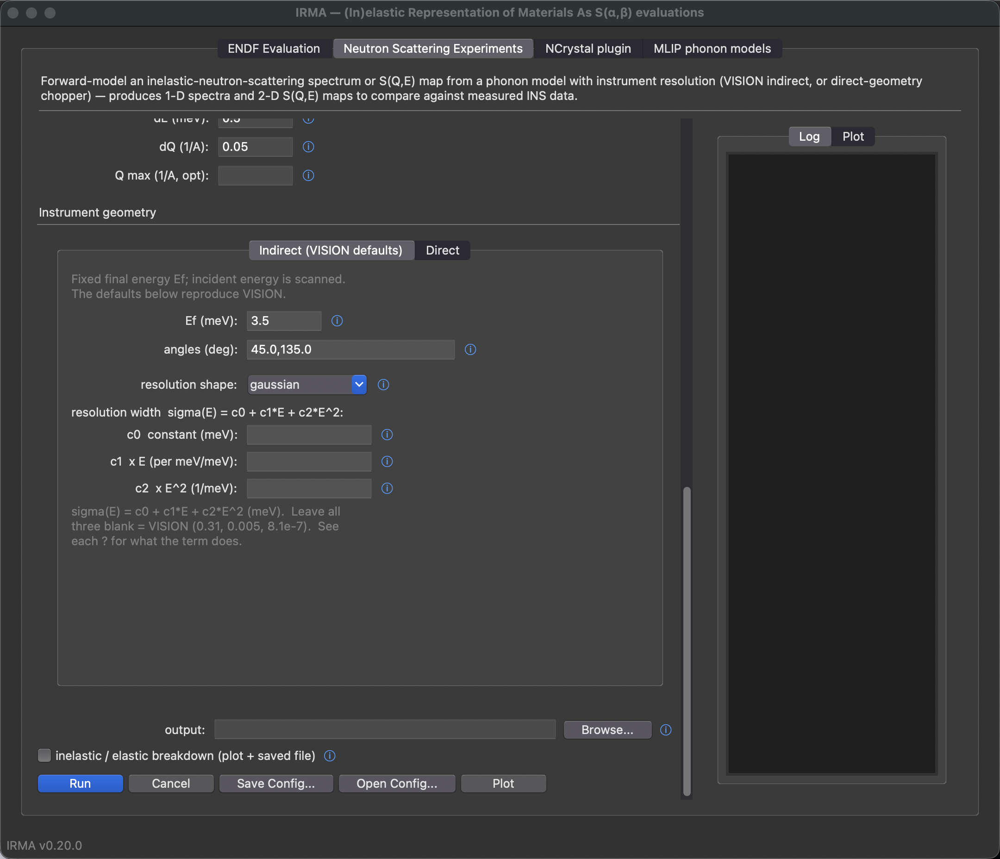

### Running and plotting

**Run** streams progress into the **Log** pane and enables **Plot** when done:
spectra plot per-bank/per-cut curves (linear or log y-axis), maps render with
the kinematic envelope and a **mask to accessible (q,E)** toggle, and **Save
map...** exports the 2-D map to CSV/npz. The spectrum itself is written to the
**output** path (CSV, npz, or JSON by extension); the **inelastic / elastic
breakdown** toggle next to it keeps each cut's component columns in the saved
file and overlays them on the 1-D plot.


---

## NCrystal plugin tab

This tab writes the per-temperature material data files (`.irmapack` plus the
`@CUSTOM_IRMA` NCMAT snippet) that the companion transport plugin samples; the
data format, the conventions, and the plugin side are documented on the
[NCrystal data exporter](ncrystal-plugin.md) page. The form is the same
material block as the other tabs: **phonopy.yaml** (plus optional **BORN** /
**FORCE_CONSTANTS** / **FORCE_SETS**), **mesh**, **temperature**, and the
scatterer table, which starts as one empty row and autofills its nuclear
constants when you type a symbol; then the export settings
(**material_id**, **inelastic mode**, the powder-average **directions** and
**multiphonon dirs**, the **multiphonon order**, **min phonon energy**
(the same truncation as on the ENDF and spectra tabs; the pack's provenance
records it), the incoherent-elastic
Debye-Waller treatment, **jobs**) and the shared **S(α,β) grid** section, which
is either the converged automatic grid or an explicit alpha/beta pair.

Three actions sit under the **output dir**:

- **Export NCrystal data** writes the config to a temporary YAML and runs
  `python -m irma.ncrystal` on it out of process, streaming its progress into
  the **Log** pane. What the GUI runs is therefore exactly what the command
  line runs.
- **Cancel** stops that run and its workers.
- **Open Config...** reads an exporter config back into the form: one written
  by this tab, hand-edited afterwards, or the `ncrystal.yaml` that
  `irma mlip emit` generates from a bundle. The file is parsed by
  the exporter's own loader, so the form accepts nothing the export would
  reject; a file it refuses reports the reason and leaves the form exactly as
  it was. Loading replaces the scatterer table with one row per species in the
  file and selects the grid mode the file implies (explicit when it carries
  both `alpha_grid` and `beta_grid`, automatic otherwise), leaving the other
  mode's fields at their defaults. Export settings with no control on this
  form (`gain_side`, `elastic`, `coherent_partition_mode`, `site_groups`,
  `lat`) are carried through unchanged rather than reset, and the Log names
  the ones that were carried.

---

## MLIP phonon models tab

When you have no phonon calculation at all, this tab builds one from a
structure file: pick the file and a potential, optionally set the supercell
and mesh, and click **Build bundle**. The form mirrors `irma mlip build`
field for field (every control has the ⓘ help glyph), the **Log** pane
streams the relaxation and force-evaluation progress, and the **DOS** pane
plots the bundle's quick-look DOS after a successful build (or on demand
via **Show DOS**). The sections below the build form operate on a finished
bundle, which is auto-filled after a build: **Validate** re-runs the bundle
checks, and **Generate IRMA inputs** is `irma mlip emit`: it writes the
ENDF input file, spectra YAML, or NCrystal exporter YAML for the selected
targets, ready for the other tabs. The **Potential environments** section
creates and removes the per-potential environments that isolate
conflicting package pins; it is only needed when a potential's packages
are not importable from the running environment. A status line under
the build form's potential selector says whether the chosen potential
can run right now, and points here when it cannot. The jobs field
reveals the matching thread control: a serial-threads field when
`jobs = 1`, a threads-per-worker field when `jobs > 1`. The Generate IRMA
inputs form discloses the same way: only the fields the selected
targets read are shown (MAT numbers, inelastic mode and elastic format
for endf, material id for ncrystal), and each field's
help says which target it feeds. The command line follows the
disclosure exactly — a hidden field is neither validated nor passed
to the CLI, so a value left over from an earlier selection can
neither block the run nor reach it silently.

The scattering constants come from a **nuclear data (per species)**
table in that same form: one row per species in the selected bundle,
read from the bundle's own `phonopy.yaml` as soon as you pick it (a
short hint stands in until then). Each row chooses where its constants
come from — **natural** (the default: the natural element, ENDF
identity `A = 0`, natural-abundance constants), **isotope** (a
selector of that element's isotopes; the identity *and* the constants
both switch to it), or **custom** (`b_coh_fm`, `sigma_inc_b`, `awr`
typed in; `sigma_bound_b` is always derived, never entered). The
constants are on screen for every row, read-only unless the row is
custom, so you see what will be written before you emit. The table
assembles `--nuclide` and `--species` for the CLI; a table left alone
is all-natural and passes neither flag, which is exactly the emission
the CLI performs on its own.

Two things the table handles that the command line can only report
after the fact. A species whose tabulated scattering length is an
energy-dependent resonance-region value — natural B, Cd, In, Sm, Eu,
Gd, or per isotope 6-Li and 10-B but not natural Li or 11-B — opens
its own row as **custom**, with blank boxes and a note saying why;
without that, the emit refuses during the cross-target preflight and
leaves no files behind to edit. And because an isotope choice changes
the constants but not the masses in the phonon calculation, a row warns
(never blocks) when the isotope's mass disagrees materially with the
mass this bundle's `phonopy.yaml` carries for that species — selecting
`2-H` on a bundle built with ordinary hydrogen pairs deuterium
constants with hydrogen phonon masses. See
[MLIP phonon calculations](mlip.md) for the potential roster, the
conservative-force rule, and the disordered workflow, and
[MLIP examples](mlip-examples.md) for validated end-to-end builds.

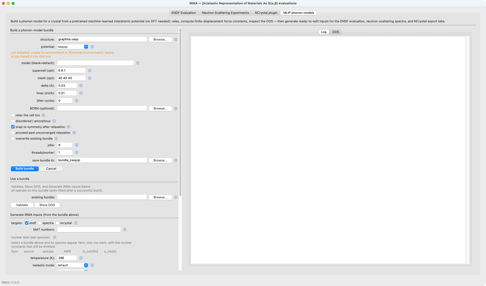

---

## End-to-end example: graphite, iel=10, inelastic_mode=0

A minimal pass down the form for a crystalline-graphite evaluation:

1. **Material**: keep `iel = 10` and `inelastic_mode = 0`, then describe the crystal: lattice `2.4612 2.4612 6.7079 90 90 120`, and one atom line `6 0 11.898 6.646 0.001 4  0.0 0.0 0.25  0.0 0.0 0.75  0.333333 0.666667 0.25  0.666667 0.333333 0.75`. (Both are blank on a fresh form; `examples/tsl/graphite_iel10_classic.input` is exactly this input file if you would rather import it.)
2. **Scattering**: enter `ZA = 6000`, press **Fill AWR + sigma_free from ZA** (or type `AWR = 11.898`, `sigma_free = 4.739180`, the free-atom value; IRMA derives the bound normalization itself), and give the evaluation a `MAT` number, e.g. `30`.
3. **Grids**: enter `296.0`, leave LAT = 1, keep the automatic grid (click **Detect from DOS** to set Max phonon freq), and **Preview Grid Sizes**.
4. **Phonon**: point **From phonopy total_dos.dat** at your own phonopy `total_dos.dat` for graphite (two columns: frequency in THz and DOS, as written by `phonopy -p mesh.conf`; IRMA converts THz→eV on load).
5. **Run**: choose an output `.endf` path and click **Run Calculation**.

For reference, IRMA's mode-0 graphite result with the ENDF/B phonon spectrum overlays the ENDF/B-VIII.1 crystalline-graphite inelastic cross section:

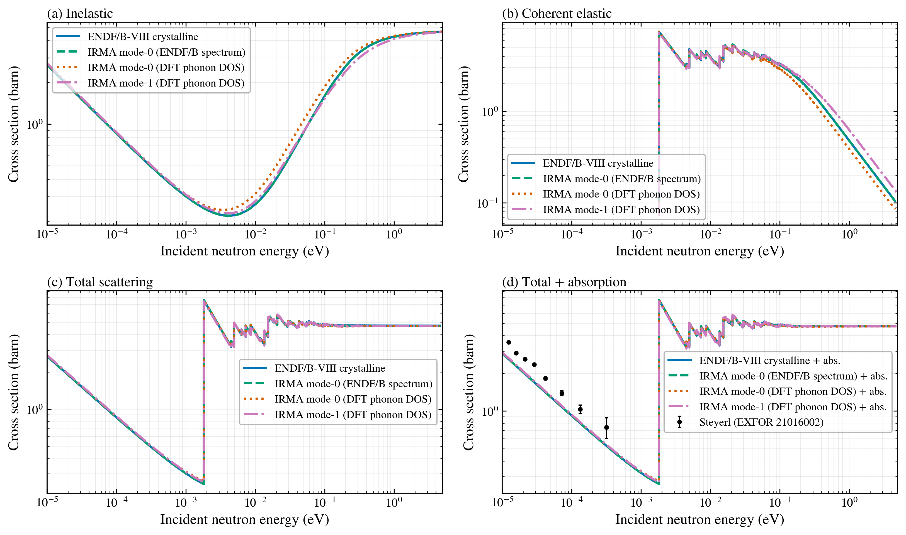

and the linear-in-Q automatic alpha grid recovers the thermal inelastic cross section at a fraction of the column budget of a brute-force reference:


