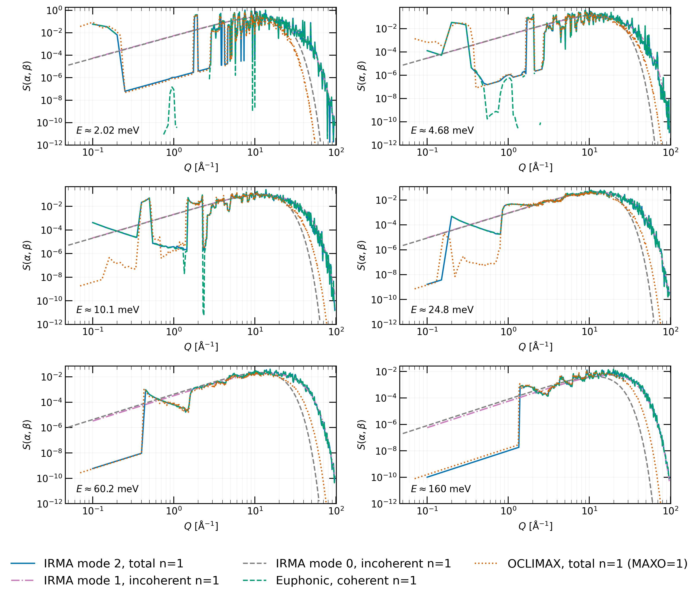

# Input file reference

An IRMA input file is written in NJOY free-format and follows the LEAPR card
structure, so if you have driven LEAPR before the layout will feel familiar.
Throughout, α and β are the dimensionless momentum and energy transfer of
the thermal scattering law S(α,β) (β = E/kT, α ∝ Q²/kT; the
[theory page](theory.md) gives the exact conventions), and a tape is an
ENDF output file, the historical name.
This page is the authoritative card-by-card reference: the cards are read in
the fixed order given below, and each conditional card (the
generalized-elastic block, the per-temperature detail block, the phonopy
controls) is introduced together with the mode that triggers it. Two
complete, runnable input files (a classic one and a generalized `iel=10`,
`inelastic_mode=2` one) close the page; copy and adapt them for your own
material.

To run an input file:

```bash
python -m irma <input_file> <output_file>
```

`<input_file>` is the LEAPR-style input file; `<output_file>` is the path where
the ENDF-6 tape is written: the inelastic MF7/MT4 section, the elastic
MF7/MT2 section when an elastic option is active, and the MF1/MT451
header built from the input file's comment cards. The `irma` console script and the GUI
(`irma-gui` or `python -m irma --gui`) accept the same input files.

## Input file format rules

IRMA tokenizes input the way NJOY's list-directed (free-format) reader does,
with two differences: Fortran null values (`,,`) and repeat counts (`3*0.0`)
are refused, and a scalar card never continues onto the next line. Knowing
these few rules prevents the great majority of input problems.

| Rule | Behavior |
|------|----------|
| **Free format** | Values are separated by spaces or commas. A card is *not* tied to a fixed number of columns. |
| **Card terminator `/`** | A `/` ends the current card. Any values not supplied before the `/` take their documented defaults. |
| **One record per line** | Each input line is one Fortran-style record. A scalar card read consumes the whole line up to the `/` (or to end-of-line); leftover tokens on that line are discarded, never carried into the next card. |
| **Multi-line arrays** | Grid and spectrum cards (alpha, beta, rho values, …) may span several lines. Continuation lines carry no `/`; the array's single `/` terminator goes on the **last data line**, after the final value. |
| **Quoting** | The title and comment cards are quoted strings. Both `'…'` and `"…"` delimiters are accepted. A doubled quote inside a `'`-quoted string (`''`) is a literal quote, following Fortran convention. |
| **D-exponents** | Fortran D-exponent notation is accepted in numeric fields: `1.0d-5`, `2D3`, `3.899867e-04` all parse. The `d`/`D` is mapped to `e`. |
| **Integer vs. float fields** | Integer-coded fields reject non-integral values: `200.0` is accepted as `200`, but `1.9` is an input error rather than a silent truncation. |
| **Underscores and overflow** | `1_000` (Python digit grouping) is *not* Fortran numeric syntax and is rejected, as is an overflowing exponent such as `1e999`. Both fail loudly instead of being admitted as numbers. |
| **Comments** | Only text after the card's `/` on the same line is ignored (any marker works there: `-- …`, `$ …`, plain text). There is **no standalone comment-line syntax**: a line without a `/` is parsed as data; mid-file it mis-feeds the next card read, and in the trailing comment section it silently becomes an MF1/MT451 comment card. |

A full NJOY job stream is also accepted on input. IRMA locates the
`leapr … stop` block automatically and ignores the surrounding modules, so
you can point IRMA at an existing NJOY input file without editing it.

When an input file is malformed, IRMA raises a `DeckError` that names the card
being read, the expected/found values, and the input line number in the
file, for example:

```
iel must be an integer, got the non-integral value 1.9
while reading Card 5 (awr spr npr iel ncold nsk) (input line 6 of my_deck.input)
```

The CLI and GUI present this message without a Python traceback. Semantic
checks (a lattice angle out of range, a non-increasing grid) are reported
against the line where the offending card *started*.

## Card-by-card reference

The cards below are read in order. Cards 1–6 and Cards 7–9 are read for every
input file. The generalized-elastic block (Cards 6b–6g) is read only when `iel=10`,
between Card 6 and Card 7. The per-temperature detail block (Cards 11–19) is
read only for the classic kernels and `inelastic_mode=0`.

### Control cards (every input file)

| Card | Fields | Defaults | Notes |
|------|--------|----------|-------|
| **1** | `nout` | — | Output unit. Kept for LEAPR compatibility; IRMA writes the file named on the command line and ignores this value. |
| **2** | `'title'` | empty | Quoted title string. A numeric or unquoted token is stringified (this card is free text). |
| **3** | `ntempr iprint nphon` | `1 1 100` | Temperature count (`≥ 1`), print level, and phonon-expansion order (`≥ 1`). For `inelastic_mode=1/2`, `nphon` is also the multiphonon maximum order. |
| **4** | `mat za isabt ilog smin [iint]` | `0 0 0 0 1.0e-75 0` | ENDF `MAT` (`≥ 1`; the material number that labels the evaluation in a library, yours to assign) and `za`; `isabt` (0/1) selects S(α,−β) storage; `ilog` (0/1) selects log storage; `smin` is the minimum stored S; optional `iint` (0/1) selects the MF7/MT4 interpolation scheme (see below, default 0). **For `iel=10`, `za` must encode the physical nuclide as `1000·Z + A`** so the principal scatterer can be matched to a Card 6d atom (`A = 0` names the natural element on both cards, e.g. `za = 6000` matching a Card 6d row with `A = 0`). |
| **5** | `awr spr npr iel ncold nsk` | `0 0 0 0 0 0` | Principal scatterer (the atom species the evaluation is written for): mass ratio `awr` (`> 0`), free-atom cross section `spr` (`> 0`), atom count `npr` (`≥ 1`), elastic option `iel`, cold-hydrogen option `ncold` (0–4), pair-correlation option `nsk` (0–2). See the `iel` table below. |
| **6** | `nss b7 aws sps mss` | `0 0 0 0 0` | Secondary scatterer: count `nss` (0 or 1); `b7` selects the secondary type; mass ratio `aws` (`> 0`), cross section `sps` (`> 0`), atom count `mss` (`≥ 1`). Fields 2–5 are validated only when `nss > 0`. A bound two-pass secondary (`nss=1`, `b7=0`) is rejected with `iel=10` (see the `b7` table below). |

It is important to note that tapes for cryogenic temperatures need
`ilog=1` on Card 4. With `ilog=0` the symmetric thermal scattering law
S(α,β) is stored linearly as `S·exp(−β/2)`. Below ~50–100 K, `β = E/kT` is
large enough that high-energy-transfer values underflow to zero in the ENDF
field, silently dropping the optic-mode structure on read-back. Set
`ilog=1` (ENDF `LLN=1`, log storage) for low-temperature tapes; IRMA warns
at write time if you leave it at 0 and lose data. See
[Troubleshooting](troubleshooting.md#high-energy-optic-phonon-structure-missing-at-low-temperature).

The optional `iint` flag is the sibling of `ilog`: `ilog` chooses how S is
*stored*, `iint` chooses how S is *interpolated* between stored points, the
ENDF `INT` flag written on both the α (per-β `TAB1`) and β (`TAB2`) tables
of MF7/MT4. The default, `iint=0`, writes log-linear interpolation
(`INT=4`), the classic, NJOY-faithful choice, and its output is
byte-identical to IRMA versions from before the flag existed. `iint=1` writes linear-linear (lin-lin,
`INT=2`) instead, which matters for a coherent one-phonon S(α,β): the table
has structural near-zeros (for example the graphite (002) dip) that
logarithmic interpolation floors, which biases the cross section low in the
thermal minimum. Lin-lin preserves the near-zeros, and an `INT`-aware
THERMR (NJOY's thermal processing module) honors whichever flag is written. Use `iint=1` only with a Q/α grid
converged near sharp coherent peaks: lin-lin connects the tabulated points
with straight lines, and those lines still cut below a peak the grid does
not resolve.

**`iel` (Card 5): coherent elastic treatment**

| `iel` | Meaning |
|-------|---------|
| `0` | No coherent elastic. (Falls back to incoherent elastic when there is also no translational mode.) |
| `1`–`6` | Built-in coherent elastic for graphite, Be, BeO, Al, Pb, Fe (in that order). |
| `10` | Generalized coherent elastic: Bragg edges computed from the user's crystal structure (any material). Cards 6b–6g follow. Recommended for new evaluations. |

**`ncold` (Card 5): cold hydrogen/deuterium option**

| `ncold` | Meaning |
|---------|---------|
| `0` | None. |
| `1` | Ortho-hydrogen. |
| `2` | Para-hydrogen. |
| `3` | Ortho-deuterium. |
| `4` | Para-deuterium. |

Any `ncold > 0` makes every temperature's detail block supply the `S(κ)`
grid (Cards 17–18), which feeds the intramolecular structure of the
cold-hydrogen kernel.

**`nsk` (Card 5): pair-correlation option**

| `nsk` | Meaning |
|-------|---------|
| `0` | None. |
| `1` | Vineyard. Cards 17–19 must be supplied, but, matching NJOY LEAPR, **no correction is applied**. With `ncold = 0` the resulting tape is identical to `nsk = 0`; with `ncold > 0` the `S(κ)` table feeds the cold-hydrogen kernel exactly as for any `nsk`. Use `nsk = 2` for a correction that modifies S(α,β). |
| `2` | Sköld: `α` is rescaled by the static structure factor `S(κ)` (Cards 17–18) and the coherent piece is blended in with weight `cfrac` (Card 19). Applied only when `ncold = 0`. |

| `b7` | Meaning |
|------|---------|
| `0` | Bound (two-pass): a second full temperature block follows the principal's. Not supported with generalized elastic (`iel=10`): the generalized MF7/MT2 builder would use the secondary's Debye-Waller data instead of the principal's, so the combination is rejected at parse time; use `b7=1`/`2`, `nss=0`, or classic `iel=0`–`6`. |
| `1` | Free gas. |
| `2` | Diffusion. |

The noncubic modes (`inelastic_mode=1` or `2`, set on
Card 6b) do not support cold hydrogen/deuterium, the Sköld/Vineyard
pair-correlation option, or a secondary scatterer. Input files combining
`inelastic_mode=1/2` with `ncold > 0`, `nsk > 0`, or `nss > 0` are
rejected at parse time, before the phonopy mesh is loaded.

### Generalized-elastic cards (only when `iel=10`)

These cards are read between Card 6 and Card 7 when `iel=10`. They define the
crystal structure and the elastic/inelastic treatment, following the formalism
of Ramic et al., *NIM-A* 1027 (2022) 166227.

#### Card 6b: elastic mode and atom counts

```
elastic_mode  nat  nspec  inelastic_mode  [bins_per_decade]  [threshold_eV]  /
```

| Field | Default | Notes |
|-------|---------|-------|
| `elastic_mode` | — | `1` = SEF (single-channel elastic format): one elastic component per tape. Single atom type: the dominant component carries the full elastic strength, coherent (LTHR=1) if `σ_coh > σ_inc`, else incoherent (LTHR=2). Polyatomic: the designated-coherent atom (the species with the smallest incoherent contribution, which SEF selects to carry the coherent elastic) gets LTHR=1, every other principal gets LTHR=2 (see [Theory](theory.md#elastic-format-sef-vs-mef-card-6b-field-1)). `2` = MEF (Mixed Elastic Format): LTHR=3 (coherent + incoherent together). Must be 1 or 2. |
| `nat` | — | Number of distinct atom types in the unit cell (`≥ 1`). |
| `nspec` | — | Number of partial phonon spectra that follow (Card 6e). Meaningful only for `inelastic_mode=0`. **For `inelastic_mode=1/2`, `nspec` must be 0** and Card 6e is omitted (input error otherwise). |
| `inelastic_mode` | — | `0` = isotropic Debye-Waller + cubic inelastic (no phonopy). `1` = directional DW + in-process noncubic S(α,β) with incoherent-approximation one-phonon plus incoherent-approximation multiphonons. `2` = directional DW + in-process noncubic S(α,β) with **exact** one-phonon (coherent + incoherent) plus incoherent-approximation multiphonons. Modes 1/2 require Cards 6f/6g. |
| `bins_per_decade` | `0` (off) | Optional. ENDF-102 §7.2.2 coherent-elastic Bragg-edge grouping: above `threshold_eV`, dense edge steps are merged into this many log-uniform bins per decade with structure-factor-weighted placement, preserving cumulative S and the total cross section. |
| `threshold_eV` | `1.0` | Optional. Grouping threshold in eV; used only when `bins_per_decade > 0`. |

#### Card 6c: lattice parameters

```
a  b  c  alpha  beta  gamma  /
```

`a`, `b`, `c` are lattice constants in Ångström (each finite and `> 0`);
`alpha`, `beta`, `gamma` are the lattice angles in degrees
(alpha between the b and c axes, beta between a and c, gamma between a
and b), each in `(0, 180)`. An angle
triple that does not form a valid cell (non-positive metric determinant) is
rejected with Card-6c context.

#### Card 6d: atom types (repeated `nat` times)

`A` names the isotope, or `0` for the natural element. It is an
identity key rather than a physical input: the scattering constants on
the same line (`awr`, `b_coh`, `sigma_inc`) carry the physics, while
`A` is what Card 4's `za` and any Card 6e partial spectrum are matched
against. Naming the natural element as `A = 0` (ENDF's own convention)
avoids borrowing an isotope's mass number for constants that are
natural-abundance values.

For each atom type:

```
Z  A  awr  b_coh  sigma_inc  npos  /
x1 y1 z1  x2 y2 z2  ...  (npos fractional positions)  /
```

| Field | Notes |
|-------|-------|
| `Z` | Atomic number (`≥ 1`). |
| `A` | Mass number (`≥ 1`). |
| `awr` | Atomic weight ratio to the neutron mass (`> 0`). |
| `b_coh` | Coherent scattering length in fm (finite). |
| `sigma_inc` | Incoherent scattering cross section in barns (`≥ 0`). |
| `npos` | Number of positions of this atom in the cell (`≥ 1`; for `inelastic_mode=1/2` the cell is the phonopy primitive cell). |
| positions | `npos` fractional coordinate triples on the next data line(s). |

For `inelastic_mode=1/2`, the Card 6d atom types and positions must match
the phonopy **primitive** cell (not the conventional cell). A mismatch (wrong species, wrong positions, or a
principal ZA that has no matching phonopy site) is reported as a Card 6d
input error, not as a phonopy failure.

The principal nuclide may be split over several Card 6d entries. For
`inelastic_mode=1/2`, multiple Card 6d atom types that carry the principal
nuclide (the Card 4 `za`) are merged into a single group: their position
lists are combined, and the MT4 S(α,β) accumulates over every represented
site. The merged entries must agree in `awr`, `b_coh`, and `sigma_inc`;
differing values are a Card 6d input error. Non-principal types are never
merged.

#### Card 6e: partial phonon spectra (repeated `nspec` times)

Read only when `nspec > 0` (i.e. `inelastic_mode=0`). For each spectrum:

```
Z  A  delta  ni  /
rho(1) rho(2) ... rho(ni)  /
```

`Z`/`A` identify which Card 6d atom type the spectrum belongs to; `delta` is
the equidistant energy grid spacing in eV (`> 0`); `ni` is the number of DOS
values (`≥ 2`); `rho(j)` is the partial phonon density of states (each `≥ 0`,
not all zero). These spectra feed the per-species Debye-Waller integrals in
the isotropic path.

For `inelastic_mode=1/2`, phonopy supplies MT4 and the Debye-Waller
factors, so Card 6e has no role: `nspec` must be 0 and the card must be
omitted (input error otherwise).

Each partial spectrum must carry its species' full vibrational weight. The
per-species Debye-Waller integral normalizes each Card 6e spectrum with a
continuous weight of 1 (the `tbeta = 1` convention): there is no
per-species translational, diffusion, or discrete-oscillator weight, and
Card 6e has no `tbeta` field. A partial spectrum must therefore represent
all of its species' vibrational weight; a spectrum carrying only part of it
would bias that species' Debye-Waller lambda.

A Card 6d atom type with no matching Card 6e spectrum falls back to the
principal scatterer's Debye-Waller lambda (computed from the Card 11/12
spectrum). For the principal type itself this is exact. For any other type
it is only an approximation, and it directly sets that species' elastic
`W'(T)` on the tape, so IRMA prints a warning naming the type. To give such
a species its own lambda, raise `nspec` on Card 6b and supply a Card 6e
spectrum for it.

#### Card 6f: phonopy mesh (`inelastic_mode=1/2` only)

How to produce the phonopy calculation this card names, from your own
force-constant calculation, is covered in
[Preparing a phonopy calculation](phonopy-input.md).

```
'path/to/phonopy.yaml'  /
mesh_nx  mesh_ny  mesh_nz  ncpu  use_born  /
'path/to/BORN'  /        (only if use_born = 1)
```

#### Optional minimum phonon energy (`inelastic_mode=1/2` only)

An optional one-value card may appear after Card 6f (and its optional BORN
path) and immediately before Card 6g:

```
minimum_phonon_energy_meV /
```

The card has one value and Card 6g has two or three, so a deck without it
is read as before. Omitting it, or giving `0`, keeps IRMA's automatic mode
floors exactly (1 µeV, and 0.1 meV at Γ), which already exclude imaginary
modes and numerical noise near zero energy. A positive value removes every
phonon mode with energy at or below it from every term: the phonon DOS,
the Debye-Waller tensors, the coherent and incoherent one-phonon
scattering, and the multiphonon expansion. Nothing replaces the removed
modes and the remaining spectrum is not renormalised: the evaluation
describes a truncated vibrational model, and the run log and the
metadata (`min_phonon_energy_meV`, `phonon_cutoff`) say what was removed.
The same setting exists on the spectra and NCrystal paths
(`min_phonon_energy_meV` in their configurations) and in `irma mlip emit
--min-phonon-energy`, so the three paths agree.

It is not a repair for an unstable model: a positive value only ever
removes real, positive modes. And it is easy to underestimate. Mean-square
displacements weight modes as 1/E², so a cutoff that removes a negligible
share of the modes can remove a large share of the Debye-Waller exponent:
on graphite at 296 K a 5 meV cutoff removes 0.13% of the modes but 29% of
the displacement, and raises the Debye-Waller intensity factor along the c
axis by 74% at Q = 10 Å⁻¹. IRMA prints a warning when the displacement
trace moves by more than 1%.

| Field | Notes |
|-------|-------|
| phonopy.yaml path | Quoted path to the phonopy calculation. Force constants are read from the YAML if embedded, otherwise discovered **next to it** in the order `force_constants.hdf5`, `FORCE_CONSTANTS`, `FORCE_SETS`. If none is found this is a hard error; files in the process working directory are never consulted. |
| `mesh_nx/ny/nz` | Monkhorst-Pack mesh for the phonon calculation (each `≥ 1`). |
| `ncpu` | Worker-process count for the in-process SAB calculation (`≥ 1`). Values above the available core count are clamped to it (with a console warning). Workers use the spawn start method with the compute context in shared memory, so `ncpu > 1` works on all platforms, Windows included. Note the standard spawn requirement: a script that drives IRMA programmatically must wrap its entry point in `if __name__ == "__main__":` (the `irma` CLI and `python -m irma...` already do). Native BLAS/OpenMP threads are pinned to 1 by design. |
| `use_born` | `1` applies the non-analytical-term correction (LO-TO splitting) from the `BORN` file named on the next card; it is applied consistently to the MT2 directional Debye-Waller factors and to every MT4 mode sum. An unreadable `BORN` file is a hard error. With `use_born=0`, a `nac:` block embedded in the named phonopy.yaml is still honored, but a `BORN` file in the working directory is never auto-read, so the applied physics never depends on where IRMA runs. |

The mesh line must contain exactly five values; the BORN path card is present
only when `use_born = 1`.

#### Card 6g: noncubic inelastic controls (`inelastic_mode=1/2` only)

```
ndir  mpdir  [auto_order]  /
```

| Field | Default | Notes |
|-------|---------|-------|
| `ndir` | — | Coherent powder-average directions (golden-spiral quadrature; `≥ 1`). |
| `mpdir` | — | Multiphonon powder-average directions (`≥ 1`). Converged by ~50–100; the GUI/production default 1000 (the validation-campaign sampling) carries ample margin. Cost is linear in `mpdir`. |
| `auto_order` | `0` | `0` = honor Card 3 `nphon` verbatim; `1` = auto-size the multiphonon order from the anisotropic Debye-Waller physics. |

The incoherent powder average is always the exact numerical orientational
average.

Make sure `nphon` (or `auto_order=1`) gives the tabulated S(α,β) real
support across the requested beta grid. Transfers beyond the table are
covered downstream by THERMR's short-collision-time extension, driven by
the tape's effective temperature (a spectrum-weighted temperature LEAPR
writes for exactly this purpose). With `auto_order=1` the order rises to
converge the anisotropic-DW Poisson sum at the grid's Q-max; a graphite
grid reaching Q ≈ 100 Å⁻¹ needs an order near 223, and a fixed `nphon=100`
truncates the high-Q part of the table (the engine warns).

#### Extinction card: crystalline extinction (optional)

An optional card placed **last in the `iel=10` block** (after Cards 6d/6e, or
Card 6g for `inelastic_mode=1/2`), before Card 7. It is off by default; when
present it reduces the coherent-elastic Bragg edges of MF7/MT2 for
dynamical-diffraction extinction, a property of the physical specimen. The
card needs a coherent-elastic component: `elastic_mode=2` (MEF)
always has one; with `elastic_mode=1` (SEF) the input file must actually route
MF7/MT2 to the coherent builder, otherwise the card is rejected at parse time
(see [Crystalline extinction](extinction.md) for the two SEF configurations
this excludes).

```
extinction <model> l=<Å> g=<rad⁻¹> L=<Å> [dist=<...>] [rec=cls|std] [rmse_tol=<frac>]
```

| Field | Default | Description |
|-------|---------|-------------|
| `<model>` | — | `Sabine_uncorr`, `Sabine_corr`, `BC_pure`, `BC_mix`, `BC_mod`. `BC_mix`/`BC_mod` require `l>0`, `g>0` and `L>0`. |
| `l` | `0` | Crystallite size [Å] (primary extinction). |
| `g` | `0` | Mosaic spread [rad⁻¹] (secondary). |
| `L` | `0` | Grain size [Å] (secondary). |
| `dist` | `Gauss`/`rect` | `Gauss`/`Lorentz`/`Fresnel` (BC) or `rect`/`tri` (Sabine). |
| `rec` | `std` | Becker-Coppens recipe `std` (BC2025) or `cls` (BC1974). |
| `rmse_tol` | `1e-3` | Adaptive MF7/MT2 tabulation tolerance below the cutoff. |

See **[Crystalline extinction](extinction.md)** for the physics, models,
validation, and references (CrysXT, Kittelmann 2026, Xu 2025).

### Grid cards (every input file)

| Card | Fields | Notes |
|------|--------|-------|
| **7** | `nalpha nbeta lat` | Grid sizes: `nalpha ≥ 1`, `nbeta ≥ 2`. `lat` (0 or 1): `lat=1` means the grids are given at the 0.0253 eV reference temperature. |
| **8** | `nalpha` α values | Strictly increasing, all `> 0`. May span multiple lines; one `/` ends the card. |
| **9** | `nbeta` β values | Strictly increasing, all `≥ 0`. May span multiple lines; one `/` ends the card. |

You do not have to build these grids by hand: the GUI (the **Grids**
part) and the bundled grid generators can build them for you; the
[automatic grids](grids.md) page describes the generators and their
defaults. The beta grid has three regions: a log
lower tail, a linear phonon region over `(0, freq_max)`, and a log upper
tail. The upper-tail cap is specified as an energy transfer (default
5 eV) and converted to dimensionless β at the actual temperature. The alpha grid is linear in momentum
transfer Q: points every `dq` (default 0.05 Å⁻¹) up to a Q cut (default
12 Å⁻¹), then a logarithmic tail (default 160 points) to the beta grid's
kinematic reach (`alpha_max = 4·beta_max/awr`). This layout resolves the
upscatter windows that drive the thermal-energy cross section, which a
beta-mirrored alpha grid under-samples.

### Temperature cards (Card 10 onward)

One temperature card per requested temperature. **A negative temperature
reuses the previous temperature's entire detail block unchanged** and
recomputes S(α,β) at `|T|` (the LEAPR shared-DOS convention); no detail cards
follow it. Exception: the **first** temperature always supplies a detail
block, even if written negative (there is nothing yet to reuse; S(α,β) is
still computed at `|T|`). This matches NJOY LEAPR.

| Card | Fields | When read | Notes |
|------|--------|-----------|-------|
| **10** | `T` | every temperature | Temperature in K; must be nonzero. A negative value reuses the previous temperature's detail block (the first temperature always supplies one). |
| **11** | `delta ni` | classic / `inelastic_mode=0`, first or positive `T` | Continuous-spectrum energy spacing in eV (`> 0`) and point count `ni` (`≥ 2`). |
| **12** | `rho(1..ni)` | with Card 11 | Phonon density of states on the equidistant grid (each `≥ 0`, not all zero). |
| **13** | `twt c tbeta` | with Card 11 | Translational weight `twt` (`≥ 0`), diffusion constant `c` (0 = free gas), continuous weight `tbeta` (`> 0`). |
| **14** | `nd` | with Card 11 | Number of discrete oscillators (`≥ 0`). |
| **15/16** | oscillator energies / weights | only if `nd > 0` | Energies in eV (each `> 0`); weights (each `≥ 0`). |
| **17/18** | `nka dka` / `S(κ)` values | only if `nsk > 0` or `ncold > 0` | Sköld S(κ) grid count (`≥ 1`) and spacing (`> 0`), then `nka` values. |
| **19** | `cfrac` | only if `nsk > 0` | Coherent fraction. |

For `inelastic_mode=1/2` the detail block is omitted entirely: the
inelastic S(α,β) comes from the phonopy calculation, so those input files supply only
the temperature cards (Card 10), and Cards 11–19 are not read.

After the last temperature block, optional quoted comment cards (one per line)
become the ENDF MF1/MT451 description. A bare `/` ends the comment section.

## End-to-end example: classic input file (`iel=1`, graphite)

This is a complete classic input file: a built-in coherent-elastic material
(`iel=1`, graphite), the legacy continuous-DOS inelastic path, and two
temperatures. It reproduces the published NJOY LEAPR crystalline-graphite
result (the classic kernels reproduce published LEAPR tapes to 7e-5). The
alpha, beta, and rho arrays are abridged here with `…`; supply the full grids
in a real input file.

```text
leapr
24 /                                  -- Card 1: output unit (ignored)
'graphite'/                           -- Card 2: title
10 2 100/                             -- Card 3: ntempr=10 iprint=2 nphon=100
30 130/                               -- Card 4: mat=30, za=130 (the historical TSL ZA of the published graphite library; iel=10 input files use the physical 1000*Z+A instead)
11.898 4.73918 1 1 0/                 -- Card 5: awr, spr, npr=1, iel=1 (graphite), ncold=0
0/                                    -- Card 6: nss=0 (no secondary scatterer)
150 400 1/                            -- Card 7: nalpha=150, nbeta=400, lat=1
3.322045E-03 3.550353E-03 ... 6.644091E+01/   -- Card 8: 150 alpha values
0.000000E+00 3.952570E-02 ... /               -- Card 9: 400 beta values
296/                                  -- Card 10: first temperature (K)
0.001 201/                            -- Card 11: delta=0.001 eV, ni=201 (continuous spectrum)
0.000000E+00 2.389404E-04 ... 0.000000E+00/   -- Card 12: 201 rho values
0. 0. 1. 0./                          -- Card 13: twt=0, c=0, tbeta=1 (pure solid)
0/                                    -- Card 14: nd=0 (no discrete oscillators)
-400.0/         -- Card 10: negative T -> reuse the 296 K spectrum, recompute S(α,β) at 400 K
... (repeat negative-T cards for the remaining 8 temperatures) ...
'crystalline graphite, generated with IRMA'/   -- comment card -> MF1/MT451
/                                     -- bare '/' ends the comment section
stop
```

Card 13 with `twt = 0` and `tbeta = 1` is a pure crystalline solid: all
weight sits in the continuous spectrum, with no translational or diffusion
mode. The negative temperatures after the first reuse the 296 K detail
block; this is how one phonon spectrum serves many temperatures.

## End-to-end example: generalized `iel=10`, `inelastic_mode=2` input file

This is a complete, runnable noncubic input file for hcp beryllium using the
exact coherent one-phonon treatment (`inelastic_mode=2`). It is the structure of the
committed mode-2 cross-validation template, with one addition: Card 4 sets
`iint=1`, the lin-lin MF7/MT4 interpolation recommended for the sharp
structure of a coherent one-phonon S(α,β) (see the `iint` discussion under
the control cards above). For a production input file, build the grids with the
`iint=1` [automatic grids](grids.md), whose high-β step is capped for
lin-lin. Substitute a real path for `PHONOPY_YAML_PATH` (the `phonopy.yaml`
plus its force-constants file must sit together). The alpha/beta arrays are
abridged with `…`.

```text
leapr
20 /                                                              -- Card 1: output unit
'tsl Be metal - mode2 exact n=1 (mesh 40^3, ndir=10000)' /        -- Card 2: title
1 1 1 /                                                            -- Card 3: ntempr=1, iprint=1, nphon=1
26 4009 0 0 1.0e-75 1 /                                            -- Card 4: mat=26, za=4009 (Be-9 = 1000*4+9), isabt=0, ilog=0, smin, iint=1 (lin-lin)
8.93478 6.153875 1 10 0 0 /                                        -- Card 5: awr, spr, npr=1, iel=10, ncold=0, nsk=0
0 0 0 0 0 /                                                        -- Card 6: nss=0 (no secondary scatterer)
1 1 0 2 /                                                          -- Card 6b: SEF, nat=1, nspec=0, inelastic_mode=2
2.2856 2.2856 3.5842 90.0 90.0 120.0 /                            -- Card 6c: hcp lattice (a, a, c, 90, 90, 120)
4 9 8.93478 7.79 0.0018 2 /                                        -- Card 6d: Z=4 A=9, awr, b_coh=7.79 fm, sigma_inc, 2 positions
0.33333333 0.66666667 0.75  0.66666667 0.33333333 0.25 /          --          the 2 fractional positions
'PHONOPY_YAML_PATH' /                                             -- Card 6f-1: phonopy.yaml path
40 40 40 14 0 /                                                    -- Card 6f-2: mesh 40x40x40, ncpu=14, use_born=0
10000 1000 /                                                      -- Card 6g: ndir=10000, mpdir=1000 (auto_order omitted = 0: keep Card 3's exact n=1 order)
150 200 1 /                                                       -- Card 7: nalpha=150, nbeta=200, lat=1
3.052968E-03 3.270915E-03 ... 8.847604E+01 /                      -- Card 8: 150 alpha values
0.000000E+00 2.727760E-02 ... 1.976285E+02 /                      -- Card 9: 200 beta values
296.0 /                                                            -- Card 10: temperature (no detail block in mode 2)
' IRMA mode-2 exact one-phonon (nphon=1) cross-validation input. '/   -- comment -> MF1/MT451
' Coherent+incoherent n=1 S(a,b) for hcp beryllium.               '/
/                                                                 -- bare '/' ends comments
stop
```

Because `inelastic_mode=2`, the input file supplies only the temperature card
(Card 10): no continuous-DOS, oscillator, or Sköld detail block. `nspec=0`
on Card 6b and Card 6e is absent. The inelastic S(α,β) and the directional
Debye-Waller factors come from the phonopy calculation named on Card 6f. To add
LO-TO splitting, set `use_born=1` on Card 6f-2 and add a BORN path card.

The mode-2 exact coherent one-phonon S(α,β) produced by this mode is
cross-validated against Euphonic (an independent code, the same phonon
calculation), coherent component against coherent component: the symmetric
S(α,β) integrals agree to ratios of 1.00001 (graphite), 1.0002 (Be), and
0.9998 (BeO).



## See also

- The grid figures and validation plots referenced above live under
  `docs/assets/validation/graphite/`.
- For tapes destined for NJOY processing (THERMR/ACER), see
  [NJOY interoperability](njoy.md): coherent `inelastic_mode=2` tapes can
  trigger a `cliq` defect in stock THERMR regardless of the grid spacing; a
  one-line patch fixes it. Mode-0/1 tapes and most materials are unaffected.
