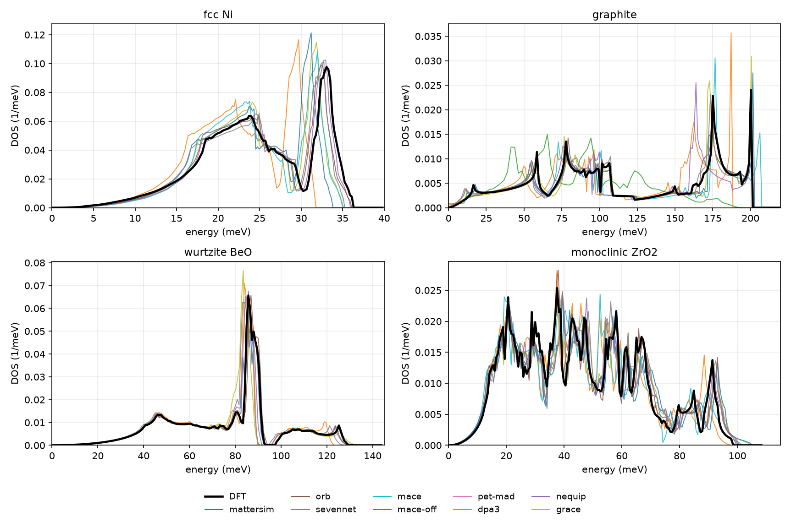
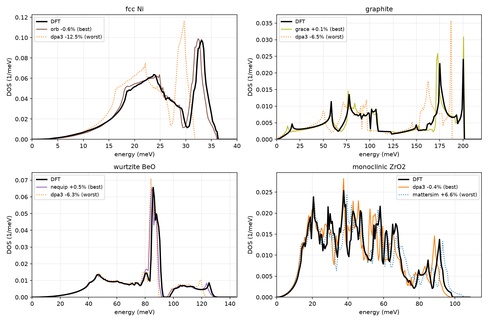
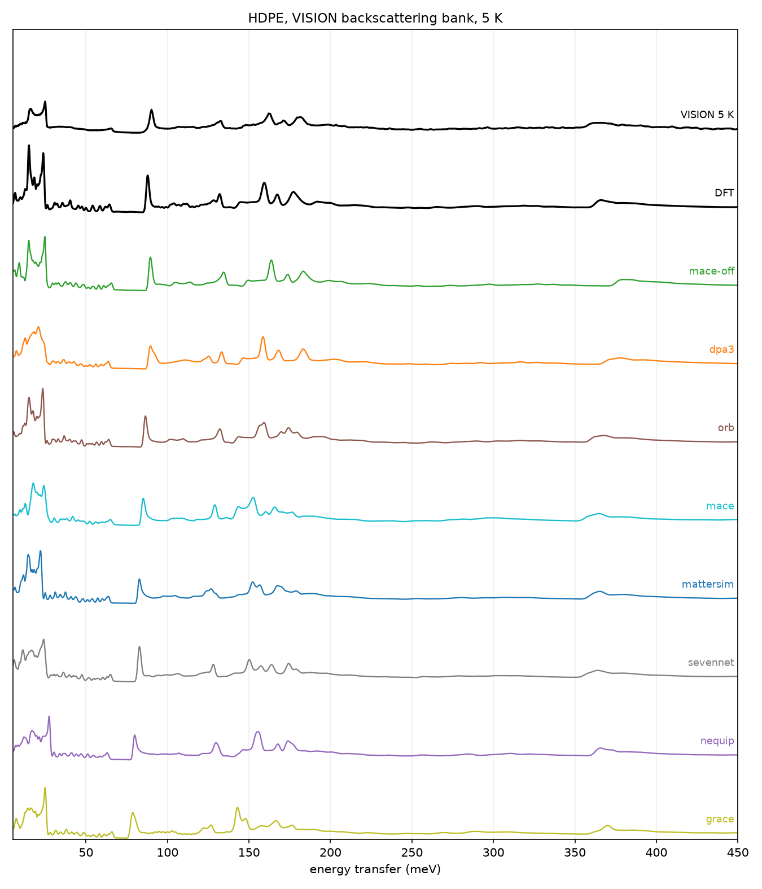
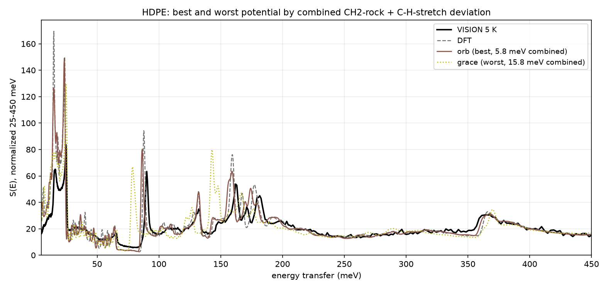
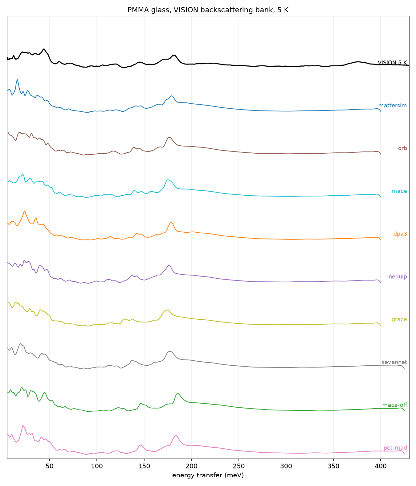
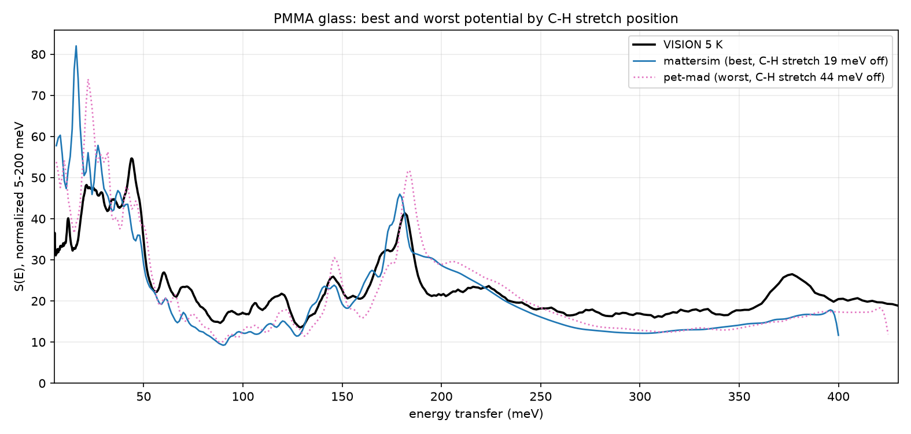

# Examples

The machine-learned interatomic potential (MLIP) front end exists to give
you a usable phonon model without a DFT calculation: a structure file and
a choice of potential are enough to produce ENDF tapes, spectra, and
NCrystal data. It is meant as a starting point, in particular for users
who are not lattice-dynamics specialists.
The pretrained potentials differ from DFT, from each other, and from
experiment, and the size of those differences depends on the material.
This page shows three evaluations against independent references, with
the commands that produced them, so you can judge whether the accuracy is
sufficient for your application before investing in a full
material-specific evaluation.

Two things to keep in mind while reading. First, the rankings change
from material to material; the potential that wins one benchmark loses
another, so treat every ranking here as a calibration point rather than
a recommendation. Second, all calculations on this page use the
potentials exactly as shipped. Nothing is fitted or adjusted.

## Crystals against DFT

Four crystals with published or database DFT phonon references: fcc Ni
(VASP, 4x4x4 supercell), graphite (published PBE model), wurtzite BeO
(paper model, no NAC on either side), and monoclinic ZrO2 (phonondb
mp-2858, PBEsol, NAC on both sides). Each MLIP build used the
reference's cell, supercell, and mesh, for example:

```bash
irma mlip build zro2_cell.vasp -o bundle_nequip --potential nequip \
    --supercell "3 2 2" --mesh "20 20 20" --born BORN --snap-symmetry --jobs 9
```



The first figure shows the total DOS for every potential in the roster
against DFT. The spread is the point: on BeO and ZrO2 the roster tracks
DFT closely, on Ni one potential (dpa3) misplaces the optical peak by
12%, and on graphite the molecular potential mace-off fails broadly,
because its training set contains no interlayer physics. That last curve
is the clearest warning on this page: a potential applied outside its
training domain does not degrade gracefully.



The second figure isolates the best and worst potential per material,
labeled with the deviation of the highest phonon frequency from DFT.
dpa3 is the worst case on three of the four panels and the best case on
ZrO2. The full deviation matrix:

| potential | Ni | graphite | BeO | ZrO2 |
|---|---|---|---|---|
| mattersim | -6.8 | +0.6 | +2.8 | +6.6 |
| orb | -0.6 | +0.2 | +3.3 | +1.3 |
| sevennet | -2.9 | +0.4 | -2.1 | +2.0 |
| mace | -3.3 | +2.9 | - | +3.0 |
| mace-off | - | -3.5 | - | - |
| pet-mad | -4.6 | +1.5 | +2.6 | +3.3 |
| dpa3 | -12.5 | -6.5 | -6.3 | -0.4 |
| nequip | -1.0 | +0.5 | +0.5 | +1.9 |
| grace | -3.7 | +0.1 | +4.6 | +5.9 |

Deviation of the highest phonon frequency from the DFT reference, in
percent. Most entries sit within a few percent, and the outliers are not
random: they follow training-set coverage. These numbers are best read
against the practical alternative. When no phonon calculation is
available for a material, whether from DFT or another atomistic method,
thermal scattering evaluations have historically fallen back on analytic
forms such as a Debye spectrum, which carry no material-specific
structure. The potentials shown here generally provide a much more
detailed and realistic starting point than such models.

## Crystalline polyethylene against VISION

High-density polyethylene is a crystalline polymer with a measured
VISION spectrum, which makes it a direct test of the full chain from
potential to instrument. The builds used the experimental orthorhombic
cell and the same supercell as the DFT reference:

```bash
irma mlip build pe_cell.vasp -o bundle_orb --potential orb \
    --supercell "2 3 6" --mesh "20 30 40" --snap-symmetry --jobs 9
irma mlip emit bundle_orb --to spectra
irma spectra run bundle_orb/spectra.yaml -o pe_vision.csv
```

For the comparison below, the emitted spectra configuration was edited
to the measurement conditions: `inelastic_mode: 1`, 5 K, the VISION
geometry, and an energy grid to 1000 meV.



The stack shows the measured spectrum, DFT, and all eight potentials
that completed (pet-mad could not relax this crystal below 0.02 eV/A and
is absent), ordered by the accuracy of the CH2 rock band at 90.2 meV.
Scanning down the stack, the rock peak walks away from the measured
position, from within 1 meV (mace-off, dpa3) to 11 meV low (grace). The
C-H stretch near 366 meV moves the other way: the potentials that place
the rock well overshoot the stretch by 12-14 meV, and the potentials
that place the stretch within 2 meV soften the rock by 5-10 meV. No
potential in the roster gets both bands right. DFT places both within
2.4 meV.



| model | CH2 rock (meV) | C-H stretch (meV) |
|---|---|---|
| measured | 90.2 | 365.6 |
| DFT | -2.4 | +0.4 |
| dpa3 | -0.7 | +11.6 |
| mace-off | -0.7 | +13.9 |
| orb | -3.7 | +2.1 |
| mace | -5.2 | -0.9 |
| mattersim | -7.4 | -0.4 |
| sevennet | -7.4 | -1.9 |
| nequip | -10.2 | +0.1 |
| grace | -11.4 | +4.4 |

Peak positions relative to the measurement. The best-balanced potentials
are orb and mace; converged DFT beats the entire roster on both bands at
once.

## Amorphous PMMA against VISION

PMMA (Plexiglas) exercises the disordered path: a 302-atom periodic
glass model of two atactic chains, built at the experimental density of
1.18 g/cm3 and relaxed with the potential. The build runs at the Gamma
point only, and the emitted spectra configuration drives the DOS-based
forward model:

```bash
irma mlip build pmma_glass.vasp -o bundle_mattersim --potential mattersim \
    --disordered --jobs 9 --fmax 0.05 --jitter-cycles 3
irma mlip emit bundle_mattersim --to spectra --allow-unstable
irma spectra run bundle_mattersim/spectra.yaml -o pmma_vision.csv
```

The loosened `--fmax` and the jitter cycles reflect a measured property
of current potentials on glasses: the reported forces stall near
0.01-0.05 eV/A at the energy minimum, so the default convergence gate
cannot be met (see the troubleshooting notes in the manual). A few
percent of residual imaginary modes at Gamma is normal for a glass model
and `--allow-unstable` accepts them for emission.



The stack shows the measurement and all nine potentials, ordered by the
position of the C-H stretch band. The molecular fingerprint region below
200 meV comes out close to the measurement for most of the roster
without any adjustment: the torsion cluster at 15-50 meV, the 145 meV
doublet, and the strong carbonyl/CH-bend peak at 181 meV are all present
within a few meV. Three systematic discrepancies are visible in every
curve. The C-H stretch, measured at 376.7 meV, computes 19-44 meV high;
the smaller offsets (mattersim, nequip) are the usual harmonic
overestimate, and the larger ones are potential error on top of it. The
250-350 meV plateau is under-predicted by every model. Below 50 meV the
details vary between glass realizations of the same material, so
differences there should not be over-read.


