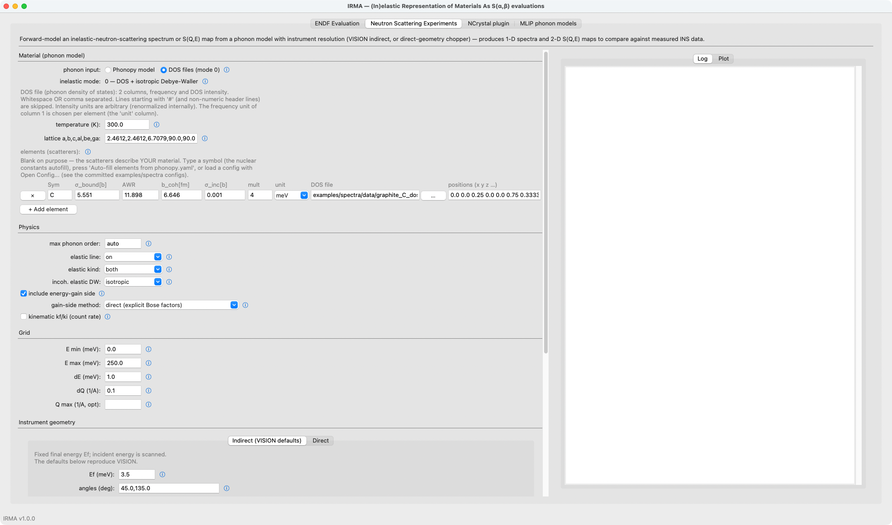

# DOS-based spectra (mode 0)

The neutron-scattering forward model (`irma.spectra`) turns a phonon model into
an instrument-resolved 1-D inelastic neutron scattering (INS) spectrum or a
2-D `S(Q,E)` powder map. Its `inelastic_mode` selects how the inelastic
scattering is computed:

| Mode | Inelastic engine | Debye-Waller | Needs |
|------|------------------|--------------|-------|
| `0` | **DOS** incoherent-approximation phonon expansion | isotropic (scalar λ per element) | a phonon **DOS** (file or phonopy) |
| `1` | phonopy eigenvectors, incoherent approximation | anisotropic (per-atom tensors) | `phonopy.yaml` + mesh |
| `2` | phonopy eigenvectors, coherent one-phonon + multiphonon | anisotropic | `phonopy.yaml` + mesh |

Mode 0 is the lightweight end of the range. It runs the same
incoherent-approximation phonon expansion LEAPR uses, straight from a phonon
density of states (DOS), with no eigenvectors and without the mode-1/2
engine. It is the right choice when the material is hydrogen-rich,
incoherent, or disordered, where the incoherent approximation is already
excellent and hydrogen dominates the signal; when a DOS is all you have,
whether from molecular dynamics (via the velocity autocorrelation function),
from a measurement, or from a quick calculation; or when you want a fast
survey before committing to a full mode-1/2 run. It does not capture
coherent inelastic scattering (phonon dispersion); use mode 2 for that. The
modeling level is the same as OCLIMAX `TASK=0`, but driven by IRMA's own
LEAPR kernel and wired into the full instrument, resolution, and elastic
forward model.

## Multi-element materials

Each element scatters by its own partial DOS, mass, and Debye-Waller factor;
the result is the cross-section- and multiplicity-weighted per-atom average

$$
\frac{d^2\sigma}{d\Omega\,dE'}(Q,E)=\frac{1}{N}\sum_d m_d\,\frac{\sigma_d}{4\pi}\,
e^{-2W_d(Q)}\,[\text{expansion of }\rho_d],\qquad
\alpha_d=\frac{C_E\,Q^2}{A_d\,k_BT},
$$

with $N=\sum_d m_d$ the atoms per cell. The $1/N$ makes the absolute scale
per represented atom, the same normalization as `inelastic_mode` 1 and 2 (the
eigenvector engine also normalizes per represented atom), so a mode-0 and a
mode-1/2 spectrum are directly comparable. Hydrogen is never blended away
into a single effective spectrum, and a neutron-weighted generalized DOS
(GDOS) is also produced as a 1-D summary.

## Where the DOS comes from (`dos_source`)

- **`file`** (the default): each element supplies a generic 2-column phonon
  DOS (frequency, intensity). The unit is `meV` (the default), `eV`, `cm-1`,
  or `THz`.
- **`phonopy`**: the partial DOS (and the per-element atom multiplicity) is
  derived from `material.phonopy_yaml` plus `mesh`, as the trace of IRMA's
  anisotropic DOS tensor, normalized to one phonon per atom. You still give
  the scattering data (`awr`, `sigma_bound_b`, …) per element.

## The elastic line (optional, iel=10 analogue)

Give a unit cell and mode 0 builds an elastic line from the same Debye-Waller
factors the inelastic part uses. The coherent component is a set of Bragg peaks
computed from your `lattice`, the per-element `b_coh_fm`, and the fractional
`positions` (the same edge kernel the ENDF MF7/MT2 writer uses). The
incoherent component is a Debye-Waller line averaged per atom over every
element, $\frac{1}{N}\sum_d m_d(\sigma_{\mathrm{inc},d}/4\pi)e^{-2W_d}$, so
the hydrogen line in a CH$_2$ material is kept even though carbon has the
larger coherent length. Coherent and incoherent share the inelastic part's
per-atom scale.

Leave `lattice` blank and the coherent Bragg peaks are skipped. With `elastic_kind:
both` (the default) you still get the lattice-free incoherent line; set
`physics.elastic: false` for an inelastic-only spectrum.

## Configuration

```yaml
material:
  temperature_K: 300.0
  # mode-0 elastic cell (omit for inelastic-only):
  lattice: [2.4612, 2.4612, 6.7079, 90.0, 90.0, 120.0]   # a,b,c,α,β,γ
  scatterers:
    - {symbol: C, sigma_bound_b: 5.551, awr: 11.898, b_coh_fm: 6.646,
       sigma_inc_b: 0.001, dos_file: c_dos.txt, dos_unit: meV, multiplicity: 4,
       positions: [[0,0,0.25],[0,0,0.75],[0.3333,0.6667,0.25],[0.6667,0.3333,0.75]]}
physics:
  inelastic_mode: 0
  dos_source: file        # or: phonopy  (then set material.phonopy_yaml + mesh)
  elastic: true
  elastic_kind: both      # both | coherent | incoherent
grid: {e_max_meV: 250.0, de_meV: 1.0, dq_max_invA: 0.1}
instrument: {geometry: vision, e_fixed_meV: 3.5}
```

### CLI

Run a config file (`irma spectra run config.yaml -o out.csv`), or use the flag
form directly: select `--inelastic-mode 0` and put the mode-0 extras on each
scatterer string as order-free `key=value` tokens:

```
SYMBOL,sigma_bound_b,awr[,b_coh_fm[,sigma_inc_b]][,dos=FILE,unit=U,mult=N,pos=x:y:z;...]
```

```bash
python -m irma spectra vision --inelastic-mode 0 --temperature 300 \
    --scatterer "C,5.551,11.898,6.646,0.001,dos=c_dos.txt,mult=4,pos=0:0:0.25;0:0:0.75;0.3333:0.6667:0.25;0.6667:0.3333:0.75" \
    --lattice 2.4612,2.4612,6.7079,90,90,120 -o graphite_vision.csv
```

`--lattice` (with per-scatterer `pos=` sites) enables the coherent-elastic
Bragg peaks; `--dos-source phonopy` derives the partial DOS from `--phonopy-yaml`
and `--mesh` instead of `dos=` files.

### GUI

In the **Neutron Scattering Experiments** tab the first control, **phonon
input**, gates everything:

- **Phonopy model** (the default): set *inelastic mode* to
  `0 (DOS + isotropic DW)` for the DOS-derived path; the partial DOS comes
  from the phonopy.yaml and mesh. *Auto-fill elements from phonopy.yaml*
  populates the element table for you.
- **DOS files (mode 0)**: the manual path, with no phonopy. Build the element
  table with *+ Add element*; each row gets its own **DOS file** (Browse) and
  *unit*.

Fill the per-element scattering data (σ_bound, awr, b_coh, σ_inc) in the table.
For the coherent-elastic line, set *elastic kind* to include coherent and fill
the material *lattice* and each element's *positions* (flat `x y z x y z …`, the
same format as the ENDF deck; the triplet count must equal *mult*).



## Validation

`tests/mode0_validation/validate_mode0_vs_mode1.py` cross-checks mode 0
against the mode-1 engine on graphite; this is a sanity check, not a
controlled proof. Because both normalize per represented atom, they agree in
absolute scale (the integral ratio is ≈ 1.02) and the area-normalized shapes
track closely (cosine similarity ≈ 0.92). The residual, the ~2% integral
excess and the shape difference, is consistent with mode 0's isotropic
Debye-Waller factor against mode 1's anisotropic one on this strongly
anisotropic crystal, the same approximation OCLIMAX `TASK=0` makes. A
dedicated quantitative comparison against OCLIMAX `TASK=0` and against
measured hydrogen-rich INS spectra has not yet been performed.
