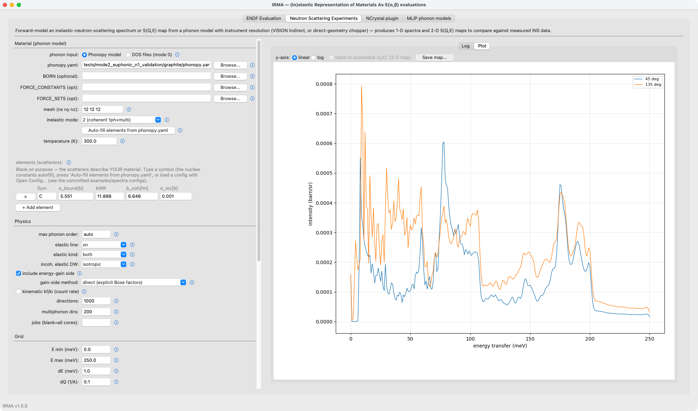
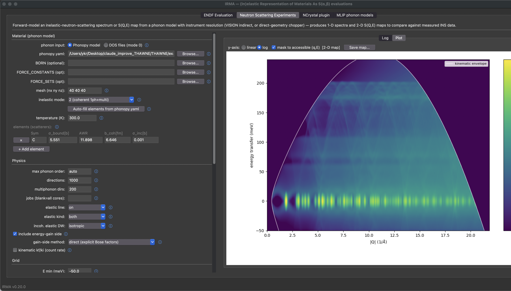

# Neutron scattering spectra (`irma spectra`)

An ENDF tape (a nuclear data file; "tape" is the historical name) tells
a transport code such as MCNP or OpenMC how a material scatters; it does not tell
*you* what your instrument will measure. IRMA's forward model computes that measurement.
It takes the same phonon physics the ENDF side evaluates and turns it into the
quantities an instrument records, an instrument-resolved 1-D inelastic neutron
scattering (INS) spectrum or a dense 2-D `S(Q,E)` powder map, with no ENDF
tape involved. The calculation computes a powder `S(Q,E)`, projects it onto
the instrument's kinematic locus (the path through `(Q,E)` the geometry can
reach: fixed final energy for indirect geometry, fixed incident energy for
direct), convolves it with an energy-resolution model, and adds an
elastic line built from the same Debye-Waller factors as the inelastic part.
Use it to preview an experiment before beam time, to compare a phonon
calculation
against measured data, or to sanity-check an evaluation by looking at it the
way a beamline would.

The physics level is the same `inelastic_mode` as on the ENDF side (see
[Scattering modes](modes.md)):
mode `0` builds `S(Q,E)` straight from a phonon density of states (DOS), with
no eigenvectors (see [DOS-based spectra (mode 0)](spectra-mode0.md) for that
whole workflow), while modes `1` and `2` run the phonopy-backed engine (the
incoherent approximation, or the exact coherent one-phonon term) on a
`phonopy.yaml` plus force constants ([Preparing a phonopy
calculation](phonopy-input.md) covers producing one). The model covers VISION, generic
indirect, and direct (chopper) geometries, with an automatic chopper
resolution model validated against PyChop. Install the extra first:
`pip install -e ".[spectra]"` (plus `[phonopy]` for modes 1/2).

## An end-to-end example: graphite, two instruments

The committed examples are the fastest orientation. From `examples/spectra/`
(the configs use paths relative to that directory), the highest-fidelity 1-D
spectrum (exact coherent one-phonon, anisotropic Debye-Waller, VISION
resolution) is one command:

```bash
cd examples/spectra
python -m irma spectra run graphite_mode2_vision.yaml -o graphite_vision.csv
```

and the same phonon calculation becomes a direct-geometry ARCS `S(Q,E)` map, with
the chopper resolution computed automatically and the map masked to the
detector coverage (the ARCS config runs mode 1 for speed; set
`inelastic_mode: 2` for the exact coherent one-phonon term):

```bash
python -m irma spectra map graphite_arcs_map.yaml -o graphite_arcs.npz
```

These are the two product shapes (per-bank energy spectra and the 2-D map),
shown here as the GUI's Plot pane renders them (the CLI writes the same data
to CSV/npz):





The rest of this page is the reference for driving the model: the CLI
subcommands, the common flags (`irma spectra <subcommand> --help` lists them
all), and the config-file schema. The GUI face of the same
model is the **Neutron Scattering Experiments** tab, covered in
[the GUI guide](gui.md#neutron-scattering-experiments-tab).

## Two ways to drive it

Two entry points drive the model, and they share exactly one compute path:

- **Flag form**: `irma spectra vision|indirect|direct …` builds a config from
  command-line flags. A convenience layer for quick runs.
- **Config form**: `irma spectra run <config> -o out.csv` (or `map`) loads a
  `SpectraConfig` file (YAML / TOML / JSON). This form is reproducible, and
  the GUI writes these files.

All temperatures default to 296 K; override with `--temperature` (flag form)
or `material.temperature_K` (config form).

## CLI subcommands

### `vision`: VISION preset (indirect)

```bash
irma spectra vision \
    --phonopy-yaml graphite/phonopy.yaml --mesh 40 40 40 \
    --inelastic-mode 2 \
    --scatterer C,5.551,11.898 \
    -o graphite_vision.csv
```

The VISION preset fills in its own `Ef = 3.5 meV`, its 45°/135° banks, and
the published resolution polynomial; override `Ef` with `--ef`.

### `indirect`: generic fixed-final-energy geometry

```bash
irma spectra indirect --ef 3.5 --angles 45,90,135 \
    --phonopy-yaml model.yaml --inelastic-mode 2 \
    --scatterer C,5.551,11.898 -o spec.csv
```

`--angles` accepts a comma list (`45,90,135`) or an inclusive
`start:stop:step` range (`30:150:15`).

### `direct`: generic fixed-incident-energy geometry

```bash
irma spectra direct --ei 250 --e-max 245 --angles 5:140:5 \
    --resolution-model chopper --chopper-instrument ARCS \
    --chopper-package ARCS-700-1.5-AST --chopper-frequency 600 \
    --phonopy-yaml model.yaml --inelastic-mode 2 \
    --scatterer C,5.551,11.898 -o arcs.csv
```

Direct geometry requires `--e-max` strictly below `Ei` (a neutron cannot lose
its full incident energy and still reach the detector). Since the `--e-max`
default is 250 meV, `--ei 250` needs an explicit `--e-max` or a higher `Ei`.
`--resolution-model chopper` auto-computes the energy resolution for any
of the eight supported direct-geometry instruments (ARCS, SEQUOIA, MAPS,
MARI, MERLIN, HYSPEC, CNCS, LET). `--kinematic-factor` multiplies by `kf/ki` for a count-rate spectrum.

### `run`: execute a config file

```bash
irma spectra run material.yaml -o spec.csv --set material.temperature_K=500
```

`--set a.b.c=value` applies dotted overrides on top of the file (repeatable).

### `map`: dense 2-D `S(Q,E)` powder map

```bash
irma spectra map material.yaml --q-min 0.0 --q-max 12 --dq-map 0.05 \
    --angle-range 5 140 --mask -o map.npz
```

The map runs for any geometry; the kinematics follow the config's
`instrument.geometry`. `--angle-range MIN MAX` attaches the instrument's
kinematic envelope, and `--mask` blanks `S(Q,E)` outside the accessible
"arch". Output is `.npz` (the default) or long-form `.csv`.

With `physics.elastic: true` (the default) the map carries the same elastic
model as the 1-D spectra: the per-Q elastic cross section appears as a ridge
at `E = 0` (the Bragg peaks plus the incoherent Debye-Waller line, smeared
over the map's `--dq-map` Q bin) and is broadened by the energy-resolution
model like every other feature.

Both the map and the 1-D spectra show the part of the broadened spectrum
that falls inside the energy axis: the convolution uses `S(Q,E)` beyond both
axis ends, and nothing is renormalized to the axis. A value at a given energy
therefore does not depend on `e_min` or `e_max`. Each resolution line shape is
scaled so that its samples on the energy grid (continued past the axis) add up
to 1, so a grid step that is coarse compared with the resolution width, such
as VISION's 1 meV step against its 0.3 meV width near `E = 0`, neither creates
nor loses intensity. When the axis starts at 0
(`e_min = 0`, the default), only the loss half of the elastic line is on it,
so its integral over the axis is half the elastic area; use `e_min < 0` to
see the whole line.

### Common flags (all geometries)

| Flag | Meaning | Default |
|------|---------|---------|
| `--inelastic-mode {0,1,2}` | 0 = DOS + isotropic Debye-Waller; 1 = incoherent approximation; 2 = exact coherent 1-phonon + incoherent multiphonon | 2 |
| `--scatterer` | `SYMBOL,sigma_bound_b,awr[,b_coh_fm[,sigma_inc_b]]`: bound cross section [b], atomic weight ratio (mass over neutron mass), coherent scattering length [fm], incoherent cross section [b]; IRMA's built-in nuclear-data table supplies all four for any element (the GUI and `irma mlip emit` fill them automatically). Mode-0 `key=value` tokens (`dos=`, `unit=`, `mult=`, `pos=`) append. Repeatable. | — |
| `--mesh NX NY NZ` | phonon q-mesh | `40 40 40` |
| `--temperature` | sample temperature (K) | 296 |
| `--de` / `--e-min` / `--e-max` | energy grid step / start / end (meV); negative `e-min` adds the energy-gain side | 0.5 / 0 / 250 |
| `--dq` | `S(Q,E)` Q-support spacing (1/Å) | 0.05 |
| `--max-phonon-order` | multiphonon order; `auto` sizes to convergence in every mode (mode 0 derives it from the DOS's Debye-Waller integral) | auto |
| `--directions` / `--mp-directions` | modes 1/2 coherent / multiphonon powder-average directions | 10000 / 1000 |
| `--elastic {on,off}` / `--elastic-kind {both,coherent,incoherent}` | elastic line | on / both |
| `--gain-side {direct,detailed_balance}` | energy-gain (E<0) evaluation: explicit Bose factors vs detailed-balance mirror | direct |
| `--resolution-shape {gaussian,lorentzian}` | line shape | gaussian |
| `--jobs` | worker processes | all cores |
| `-o, --output` | output `.csv` (default) / `.npz` / `.json` | required |

## Config file reference (`SpectraConfig`)

A config file is a mapping of four sections: `material`, `physics`, `grid`,
`instrument`. All keys below are optional except `material.scatterers` (and
`material.phonopy_yaml` for modes 1/2;
[Preparing a phonopy calculation](phonopy-input.md) covers how to make one
from your own force calculation). The GUI writes these files, or you
can write them by hand in YAML, TOML, or JSON.

### `material`

| Key | Type | Default | Meaning |
|-----|------|---------|---------|
| `phonopy_yaml` | str | — | phonopy calculation; required for modes 1/2 and mode-0 `dos_source: phonopy` |
| `force_constants` / `force_sets` / `born` | str | discovered | explicit FC / FORCE_SETS / BORN (NAC) files; force constants embedded in the phonopy.yaml win over an explicit FC / FORCE_SETS file (phonopy's rule; a warning says the file is not used) |
| `mesh` | `[nx,ny,nz]` | `[40,40,40]` | phonon q-mesh |
| `temperature_K` | float | 296 | sample temperature |
| `scatterers` | list | — | per-species scattering data (see below) |
| `lattice` | `[a,b,c,α,β,γ]` | — | mode-0 only, unit cell (Å, deg) for the coherent-elastic Bragg peaks |

Each **scatterer** entry: `symbol`, `sigma_bound_b`, `awr`, `b_coh_fm` and
`sigma_inc_b` (both required for `inelastic_mode` 1/2 except for C, which has
built-in values; in mode 0 only for the elastic line that uses them), and mode-0 fields `dos_file`, `dos_unit` (`meV|eV|cm-1|THz`),
`multiplicity`, `positions` (fractional `[x,y,z]` sites for the elastic Bragg peaks).

### `physics`

| Key | Default | Meaning |
|-----|---------|---------|
| `inelastic_mode` | 2 | 0 DOS / 1 incoherent-approx / 2 coherent 1-phonon + incoherent multiphonon (2, the validated mode, is the default) |
| `dos_source` | `file` | mode-0 DOS origin: per-scatterer `dos=` files or `phonopy` |
| `max_phonon_order` | `auto` | int ≥ 1 or `auto` |
| `min_phonon_energy_meV` | 0 | modes 1/2: remove every phonon mode with energy at or below this value (meV) from all terms; 0 keeps the automatic floors. Nothing replaces the removed modes; see the input reference's optional minimum phonon energy card. CLI: `--min-phonon-energy` |
| `n_directions` / `multiphonon_directions` | 10000 / 1000 | powder-average directions (modes 1/2) |
| `jobs` | null (all cores) | worker processes |
| `elastic` / `elastic_kind` | true / `both` | elastic line on/off and channel (`both`/`coherent`/`incoherent`) |
| `elastic_from_tape` | — | build the elastic line from an ENDF tape's elastic section (MF7/MT2) instead of from the phonon calculation |
| `incoherent_elastic_mode` | `isotropic` | Debye-Waller treatment of the incoherent elastic line: `isotropic` (one scalar Debye-Waller parameter per species, the trace/3 W′ the ENDF convention stores) or `directional` (powder-averaged anisotropic `⟨exp(-Q² û·U·û)⟩` per atom; modes 1/2 only; needs the engine's displacement tensors). Same option name as the NCrystal export. |
| `include_energy_gain` | true | add the energy-gain (E<0) side |
| `gain_side` | `direct` | energy-gain (E<0) evaluation. `direct` computes the gain side with explicit Bose occupation factors in every mode (the energy-loss output is unchanged); `detailed_balance` mirrors the loss side instead. The two agree to sub-bin level, with `direct` the more accurate: it uses each line's true energy, not the loss bin center |
| `kinematic_kf_ki` | false | multiply by `kf/ki` (count-rate spectrum or 2-D map) |

### `grid`

| Key | Default | Meaning |
|-----|---------|---------|
| `e_min_meV` / `e_max_meV` / `de_meV` | 0 / 250 / 0.5 | energy-transfer grid (negative `e_min` includes energy gain) |
| `dq_max_invA` | 0.05 | `S(Q,E)` Q-support spacing |
| `q_pad_invA` | 0.5 | margin added to the instrument locus's Q range when the Q support is built |
| `q_max_invA` | — | 2-D map Q-axis maximum (1-D runs derive Q from the instrument) |

### `instrument`

| Key | Default | Meaning |
|-----|---------|---------|
| `geometry` | `vision` | `vision` / `indirect` / `direct` |
| `e_fixed_meV` | 3.5 | `Ef` (vision/indirect) or `Ei` (direct) |
| `angles_deg` | preset | detector angles (deg) |
| `q_cuts` | — | constant-\|Q\| cuts (1/Å); honored whenever supplied, alongside the angle/bank spectra |
| `bank_halfwidth_deg` | 5 | detector-bank angular half-width |
| `sigma_coeffs` | per geometry | resolution width polynomial σ(E) = c0 + c1·|E| + c2·E² (meV); default: the VISION polynomial for `vision` and `indirect`, a constant 0.02·Ei for `direct` |
| `resolution_shape` / `resolution_model` | gaussian / poly | line shape; `poly` or `chopper` |
| `chopper_spec` | — | `{instrument, package, frequency}` for `resolution_model: chopper` |
| `combine` | mean | combine detector banks by `mean` or `sum` |
| `output_mode` / `cut_by` | cuts / angles | `cuts` (1-D spectra) or `map` (dense 2-D `S(Q,E)`, any geometry); `cut_by` (direct geometry only): `angles` (bank spectra, plus any `q_cuts`) or `q` (constant-Q cuts only) |
| `cut_dq_invA` | — | half-width of the constant-Q cut band: each cut averages \|Q\| over Q0 ± `cut_dq_invA` (None → thin slice) |
| `map_coverage_deg` / `map_mask` | — / true | 2-D map kinematic envelope band + masking |
| `export_components` | false | also write the inelastic + elastic breakdown (else total only) |

The `physics.inelastic_mode` choice decides what the model needs from you.
Mode 0 builds `S(Q,E)` straight from a per-species phonon DOS, with no
eigenvectors; it is fast and well suited to incoherent and hydrogen-rich
materials, and [DOS-based spectra (mode 0)](spectra-mode0.md) covers that
whole workflow. Modes 1 and 2 use the phonopy eigenvectors (mode 2's exact
one-phonon term is built from them).

#### Which chopper was in the beam? (finding `chopper_spec`)

`resolution_model: chopper` needs the Fermi chopper package and frequency
that were actually in the beam for the run you are modeling. Take these from
the run's data files, not from the beam-time request: the two can differ, and the choice matters, since a 0.5 mm versus a
1.5 mm slit package changes the elastic width by roughly 2×. On ARCS (SNS),
the in-beam Fermi package is recorded in the raw NeXus file as the DAS log
`BL18:Chop:InUse:ChopperId`, and the Fermi speed is in the chopper-frequency
log; the reduced `NXSPE` or processed file usually also carries the incident
energy and chopper settings in its metadata. Other direct-geometry
instruments expose the same information under their own log names. Look up
the in-beam chopper id and speed for the specific run.

## What the forward model captures, and what it does not

The forward model computes a single-scattering, powder-averaged `S(Q,E)` and
convolves it with an energy-width resolution model: it supplies the
calculated single-scattering counterpart of a measured spectrum, and it
models nothing else about the measurement. That scope keeps it fast and makes
its output a clean expression of the phonon calculation, but it also means several
real measurement effects are deliberately absent. Read any comparison against
measured data with them in mind.

**Single scattering only.** IRMA scatters each neutron once. A real sample of
any appreciable thickness also multiply-scatters, and multiple scattering
adds a broad inelastic background that piles up under and beside the phonon
features. The visible symptom is the elastic-to-inelastic balance: the
single-scattering calculation keeps too much weight in the elastic line
relative to the inelastic continuum, and the gap grows with incident energy
and sample thickness. For a millimeter-thick graphite plate on a
direct-geometry chopper spectrometer, the single-scattering
elastic/inelastic area ratio runs roughly 1.5–2.5× high versus the
measurement (growing with `Ei`), while the phonon peak positions and the
relative one-phonon intensities stay correct. Treat absolute inelastic
intensities and the elastic/inelastic ratio as model bounds, not predictions.

**Resolution is a Gaussian width, not a full lineshape.** The chopper model
(`resolution_model: chopper`) reproduces PyChop's energy-dependent width
(the full width at half maximum, FWHM) to ~1%, and that width is applied as
a symmetric Gaussian. PyChop itself emits only a variance, so there is no
lineshape to borrow. The true elastic line is mildly asymmetric: the
moderator emission pulse leaves a small tail on the energy-gain side,
strongest at low incident energy (half-width asymmetry ≈ 1.2–1.5 at
`Ei` ≈ 30 meV) and fading to near-symmetric by a few hundred meV. The
Gaussian is a good approximation everywhere except the low-`Ei` wings; it
does not model the moderator-pulse, detector-depth, or sample-size
contributions to the line shape, only their contribution to the width,
through the chopper model.

**No sample or instrument geometry.** There is no self-shielding or
absorption, no sample-can or sample-environment scattering, no detector
efficiency or angular-coverage gaps, and no detector-binning kinematics. The
2-D map is an idealized powder `S(Q,E)` on the instrument's kinematic locus.

#### When you need the full instrument: McStas and McVINE

For anything that depends on the effects above (multiple scattering, the
real moderator-pulse lineshape, detector geometry and efficiency, sample
self-shielding, or absolute intensities), model the instrument with a
Monte Carlo package such as McStas or McVINE, using IRMA (or an NCrystal or
ENDF kernel built from the same physics) as the sample scattering kernel.
IRMA's forward model is the right tool for previewing features and for
comparing a phonon calculation to data on an equal footing; a Monte Carlo
instrument model is the right tool for reproducing a measured spectrum in
full. The graphite validation in this project pairs the two exactly this
way: IRMA for the phonon physics, a McStas virtual experiment for the
instrument and multiple scattering.

One caveat when reading such an overlay: the Monte Carlo sample kernel and
IRMA may not use the same inelastic physics. The stock NCrystal graphite
kernel, for example, evaluates the inelastic scattering in the incoherent
approximation, whereas IRMA mode 2 computes the coherent one-phonon term, so
where the two inelastic continua differ, part of the difference is the
scattering model itself, not multiple scattering alone. The graphite
validation also ran McStas with the IRMA plugin's mode-2 kernel, which
removes that difference.
