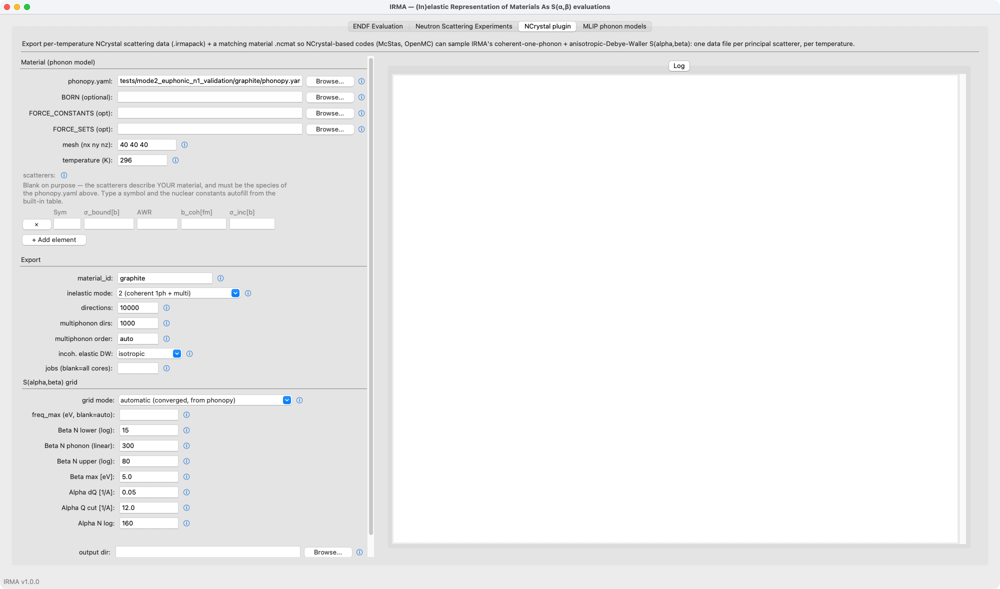

# Tutorial: a transport material for NCrystal

This tutorial writes IRMA's graphite mode-2 physics into an NCrystal
material and then checks the material through NCrystal's own interface. The export takes
75 seconds; the verification takes seconds. Two installations are
involved: IRMA with the phonopy extra for the export itself, and an
NCrystal installation with the in-repo `ncrystal_plugin_IRMA` built
against it for the verification (the build commands are in the
[NCrystal plugins section of the installation
page](../installation.md#ncrystal-plugins-built-separately)).

## The export configuration

The exporter reads a YAML configuration naming the phonon calculation and
the export settings. Save this as `graphite_export.yaml` in the
repository root; the material section is the same graphite the
[ENDF tutorial](endf-evaluation.md) evaluated, and the export section
is the production sampling:

```yaml
material:
  phonopy_yaml: tests/mode2_euphonic_n1_validation/graphite/phonopy.yaml
  mesh: [40, 40, 40]
  temperature_K: 296.0
  scatterers:
    - {symbol: C, sigma_bound_b: 5.551, awr: 11.898, b_coh_fm: 6.646,
       sigma_inc_b: 0.001}
export:
  material_id: graphite
  inelastic_mode: 2
  num_directions: 10000
  multiphonon_num_directions: 1000
  multiphonon_max_order: auto
  jobs: 8
  gain_side: scaled_sym   # store the energy-loss half; NCrystal rebuilds the gain side
  elastic: true
```

No grid appears here because the automatic grid is the default: IRMA
builds the same converged alpha and beta grids an automatic-grid ENDF
evaluation with `iint=1` uses, from the same shared code, so the
exported physics and such a tape from the same calculation do not
drift apart. The
[NCrystal data exporter](../ncrystal-plugin.md) page documents every
field.

## Run the export

```bash
python -m irma.ncrystal graphite_export.yaml -o out/
```

Seventy-five seconds later, `out/` holds two files:

```text
graphite__C.irmapack    4.3 MB   the exported physics
graphite.ncmat          438 B    the loadable material
```

The data file carries the mode-2 $S(\alpha,\beta)$ half-table (the
energy-loss half; NCrystal reconstructs the gain side by detailed
balance at run time) and the
anisotropic Debye-Waller elastic tensors for 296 K, with the `meta.*`
record of the IRMA version and run settings.
The NCMAT file is small because it delegates: the crystal cell comes
from the phonopy calculation, the `@DYNINFO` block is a placeholder, and the
`@CUSTOM_IRMA` section points NCrystal's plugin at the data file:

```text
NCMAT v5
@CELL
  lengths 2.4606 2.46060000039 6.705
  angles 90 90 119.999999995
@ATOMPOSITIONS
  C 0 0 0
  C 0 0 0.5
  C 0.333333333333 0.666666666667 0
  C 0.666666666667 0.333333333333 0.5
@DYNINFO
  element C
  fraction 1
  type vdosdebye
  debye_temp 1037.8
@CUSTOM_IRMA
  pack <absolute path to>/out/graphite__C.irmapack
```

(The cell here comes from the phonopy calculation, so its constants
differ in the last digits from the rounded values of the ENDF
tutorial's input file; that is expected. The `@CUSTOM_IRMA` section
records the data file by the absolute path the exporter wrote, so keep
the pair where the export put them, or re-run the export at the new
location.)

## Verify it inside NCrystal

In the Python environment where you built the plugin
(`pip install --no-build-isolation ./ncrystal_plugin_IRMA`), NCrystal's
own plugin test comes first:

```bash
ncrystal-pluginmanager --test IRMA
```

```text
NCrystal: End of plugin test function "test_IRMA".
All ok
```

Then load the material and ask for cross sections, from `out/`:

```python
import NCrystal as NC
mat = NC.load("graphite.ncmat;temp=296K")
for e_meV in (5.0, 25.3, 100.0):
    xs = mat.scatter.crossSectionIsotropic(e_meV * 1e-3)
    print(f"E = {e_meV:6.1f} meV   sigma_scatter = {xs:8.3f} barn/atom")
```

```text
E =    5.0 meV   sigma_scatter =    4.983 barn/atom
E =   25.3 meV   sigma_scatter =    5.125 barn/atom
E =  100.0 meV   sigma_scatter =    4.801 barn/atom
```

That is IRMA's coherent one-phonon plus anisotropic-Debye-Waller
physics answering through NCrystal's standard interface. The values are
deterministic for a given export: yours should match to the printed
digits, and a larger deviation means a version or input mismatch. The `;temp=296K` in the load string must name a
temperature the export actually wrote: the data files are strictly
per-temperature, and the plugin treats a mismatch as a hard error
rather than a silent interpolation (the
[exporter page](../ncrystal-plugin.md) has the details). To cover several temperatures, run the exporter once
per temperature; each run writes its own data file.

## Use it in a transport code

Any NCrystal-aware code takes the same material string. In McStas, the
`NCrystal_sample` component's `cfg` parameter accepts
`"graphite.ncmat;temp=296K"`; in OpenMC, `openmc.Material.from_ncrystal`
does the same. From there an entire beamline simulation samples IRMA's
physics; the [graphite validation record](../validation/graphite.md)
shows this route carried all the way to a McStas model of the ARCS
spectrometer compared against measurement.

## The same export in the GUI

The NCrystal plugin tab is this tutorial as a form: the material and
export sections mirror the YAML, each scatterer row fills its nuclear
constants from the built-in table once you type the symbol, and the Log
column streams the same export log.


