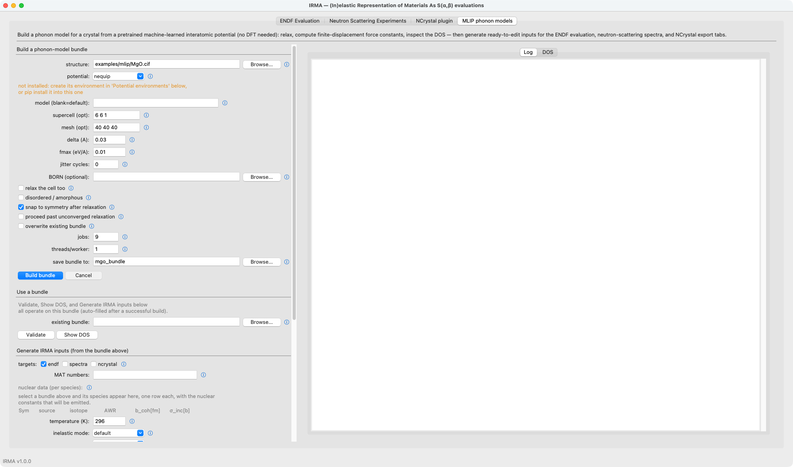

# Tutorial: from a crystal structure to a predicted spectrum

This tutorial starts with nothing but a crystal structure file and
ends with a predicted VISION spectrum, plus ready-to-edit inputs for
the other two IRMA outputs. A pretrained machine-learned interatomic
potential stands in for the first-principles calculation, so no DFT
and no phonon model are needed up front. The material is the committed
rocksalt MgO cell, `examples/mlip/MgO.cif`; after a one-time
environment build, the whole chain runs in under a minute. You need
the mlip and spectra extras
(`pip install -e ".[mlip,spectra]"`, see
[Installation](../installation.md)).

Any structure file that ASE can recognize from its name works in place
of the CIF here; the naming rule (and its one failure mode) is spelled
out at the top of [MLIP phonon models](../mlip.md).

## One-time setup: the potential's environment

The pretrained potentials are never installed with IRMA, because their
package stacks conflict with each other. Instead, each potential gets
its own Python environment, built once:

```bash
irma mlip env create nequip
```

```text
  building a dedicated environment for nequip ...
  create venv ...
  install requirements ...
  verifying `import nequip.ase` ...
  registered nequip -> ~/.cache/irma-mlip/envs/nequip/bin/python
  done; builds with --potential nequip now run in it automatically
```

The step is network-bound (it downloads the potential's package stack)
and takes a few minutes. From then on, every `irma mlip` command
detects the registered environment and runs nequip in it; nothing else
needs activating.

## Build the phonon model

```bash
irma mlip build examples/mlip/MgO.cif -o mgo_bundle --potential nequip
```

```text
  relaxing with nequip (fmax=0.01 eV/A, nmax=100, cell=no)
  relaxation: converged=True fmax=2.27e-07 eV/A in 0 steps
  supercell (3, 3, 3), quick-look mesh (9, 9, 9)
  2 displacement(s), 216 atoms/supercell, jobs=1
  displacement 1/2 done
  displacement 2/2 done
  bundle written and validated: mgo_bundle
```

The build relaxes the structure with the potential, chooses a
supercell, and runs the phonopy finite-displacement workflow with the
potential supplying the forces. Rocksalt symmetry reduces MgO to two
displacements, so this build finishes in 19 seconds on a laptop; lower
symmetry means more displacements and proportionally more time. The
bundle directory now holds the phonon model (`phonopy.yaml`), the
relaxed cell (`structure_relaxed.vasp`), a provenance manifest, and
the phonon density of states as both data (`dos.dat`) and a plot
(`dos.png`). Look at `dos.png` before going further: a sensible DOS
with no imaginary modes is the cheapest sanity check the bundle
offers, and the [MLIP examples](../mlip-examples.md) page shows what
healthy and unhealthy ones look like.

## Generate the three inputs

```bash
irma mlip emit mgo_bundle --to endf,spectra,ncrystal --mat Mg=45 --mat O=46
```

The `--mat` values are the ENDF material numbers the two evaluations
will carry; they are yours to choose. The command prefills one deck
per principal scatterer (`endf_Mg.input`, `endf_O.input`), a spectra
configuration (`spectra.yaml`), and an NCrystal export configuration
(`ncrystal.yaml`), and it prints the exact commands that run each one.
The prefilled files carry the production settings, a campaign-density
phonopy mesh (24x24x24 for this cell) and the full validation-campaign
sampling, so running them unedited gives production quality, not a
quick approximation. The command also warns about anything it had to
assume:

```text
  Mg: natural element (za=12000); select an isotope with --nuclide Mg=<A>-Mg to take its identity AND its constants
  O: natural element (za=8000); select an isotope with --nuclide O=<A>-O to take its identity AND its constants
```

A phonopy model names elements, not isotopes, so each species is
emitted as the natural element with that element's natural-abundance
scattering constants. If your material is isotopically enriched, or
you are evaluating a specific isotope, say so with `--nuclide`: it
takes the ENDF identity and the constants from the same isotope
entry, so the two cannot disagree.

## Run the spectrum

```bash
irma spectra run mgo_bundle/spectra.yaml -o spectrum.csv
```

About twenty seconds later, `spectrum.csv` holds the mode-2 VISION
spectrum at both detector banks:

```text
# IRMA spectrum: geometry=vision mode=2 angles_deg=[45.0, 135.0] q_cuts=[] components=False elastic=True edges=13
E_meV,total@45deg,total@135deg
0,0.0062721171,0.0061556434
1,3.4521343e-05,3.4512376e-05
```

The [spectra](../spectra.md) page documents everything the
configuration can change: instrument geometry, resolution,
temperature, energy grid, and the DOS-based mode 0 that needs no
eigenvectors at all.

## The other two outputs

The emitted decks run exactly like the
[ENDF tutorial](endf-evaluation.md): `irma mgo_bundle/endf_Mg.input
endf_Mg.endf` produced a 5.0 MB tape in 198 seconds here, the log
noting that the prefilled multiphonon order 100 already exceeded the
78 the grid required. The `ncrystal.yaml` is the subject of the
[transport tutorial](deck-to-transport.md).

## The same flow in the GUI

The MLIP phonon models tab is the build form: structure, potential,
and every knob the CLI accepts, with the log and the DOS plot
alongside. The "Generate IRMA inputs" section at the bottom is `emit`
with checkboxes.


