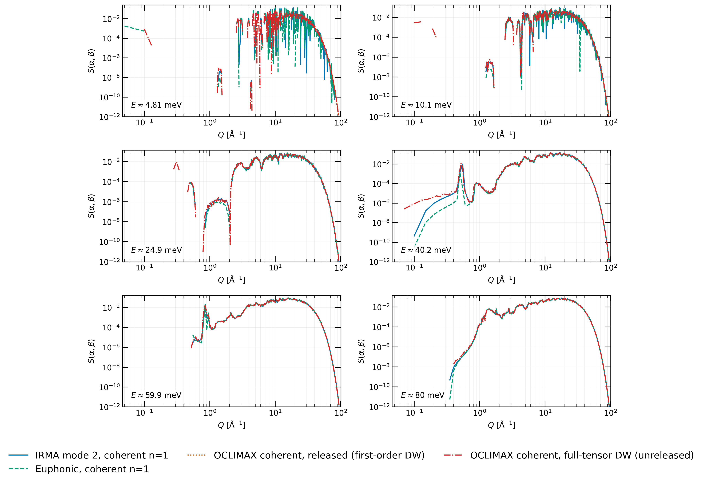
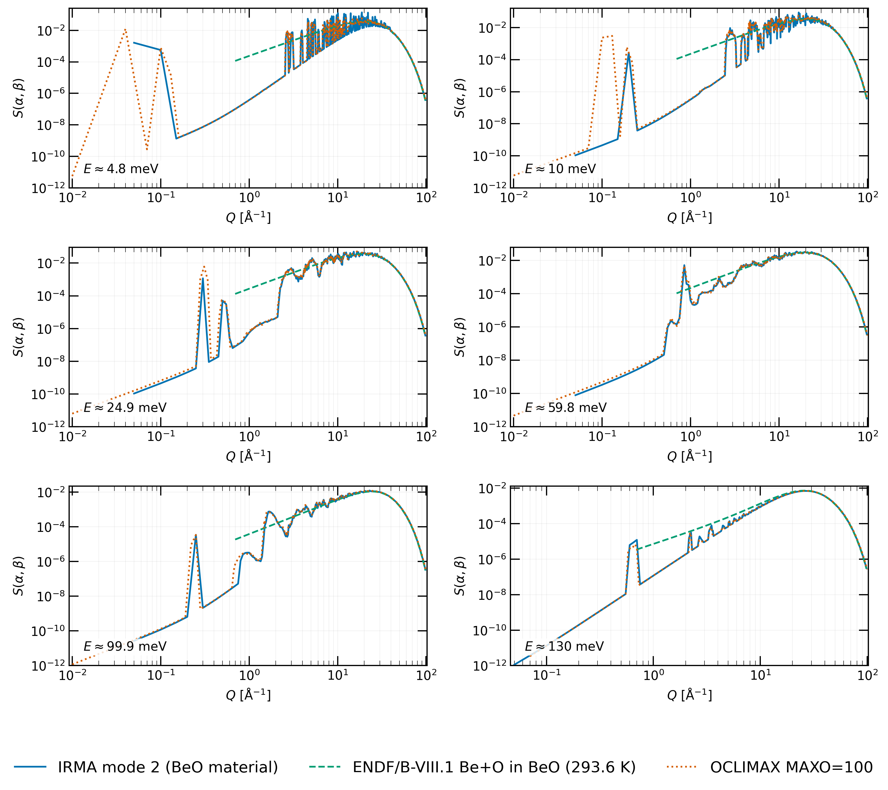
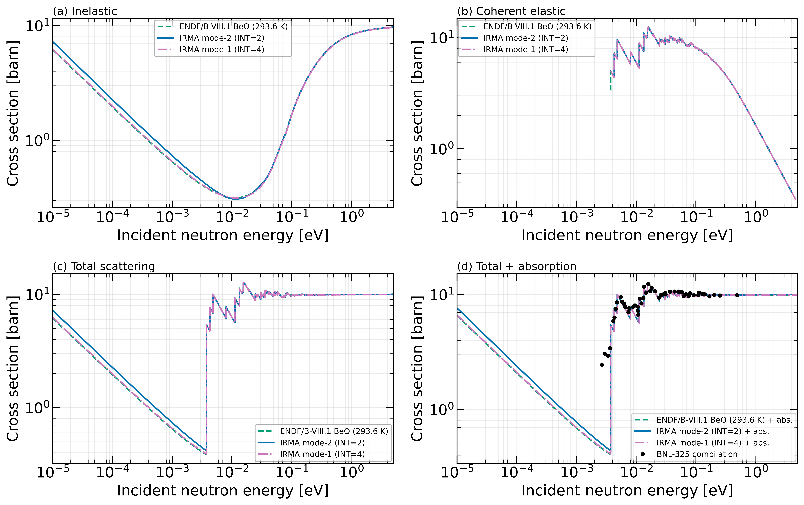
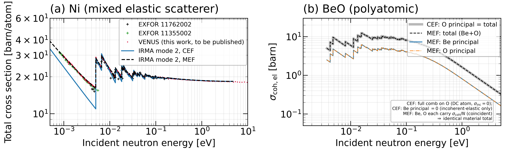

# Beryllium oxide validation

Beryllium oxide is the validation suite's **polyatomic** benchmark. Graphite
and beryllium are single-element crystals, so the thermal scattering law
S(α,β) of each is a single MF7/MT4 section; BeO has two principal
scatterers (beryllium and oxygen), and the material S(α,β) is the sum of a
Be-in-BeO evaluation and an O-in-BeO evaluation. BeO therefore exercises
IRMA's per-principal partition of the coherent one-phonon interference and
the recombination into a material S(α,β), on top of the directional
Debye-Waller physics established for graphite. The BeO phonon model is a
representative VASP/PAW PBE calculation (4×4×3 supercell) from the same
workflow as the graphite model, a test case for the polyatomic methods
rather than a model optimized against experiment. IRMA results are at
296 K; the released ENDF/B-VIII.1 evaluation is tabulated at 293.6 K.

Throughout this page, **IRMA mode 2 (material)** is the
scattering-cross-section-weighted material S(α,β) formed from the
beryllium and oxygen principal evaluations, and **IRMA mode 1** is its
incoherent-approximation counterpart. **OCLIMAX** is a single whole-cell
calculation (it does not partition per principal scatterer), truncated at
MAXO=1 or 100. **ENDF/B-VIII.1 BeO** is the released evaluation at
293.6 K, built from a different phonon model and without the distinct
(+Sd) effect. **Euphonic (material)** is the whole-cell coherent
one-phonon reference on the same phonon model, in the beryllium-principal
convention.

It is important to note that a whole-cell OCLIMAX or Euphonic S(α,β)
carries the Be-O interference term and cannot be split into a Be-only and
an O-only contribution without a partition rule. Whole-cell references are
therefore always compared against the *sum* of IRMA's two principal
evaluations, never against a single principal in isolation.

---

## Verifying the polyatomic partition

IRMA writes BeO as two principal evaluations, one carried by beryllium and
one by oxygen. As a reference, the same phonon model was also evaluated in
a single whole-cell calculation, which computes the complete material
S(α,β) directly and partitions nothing. The weighted sum of the two
principal evaluations reproduces this whole-cell result to about 10⁻¹⁵ at
every grid point, and the interference reconstructed from the two written
evaluations matches the directly computed interference to 3.4×10⁻¹⁵.

The quantity being divided is the cross-species interference, which belongs
to the material rather than to either atom, so its assignment to the
principal evaluations is purely conventional: the coherent-cross-section
weights place 64.3% with beryllium and 35.7% with oxygen, and the summed
material S(α,β) does not depend on this choice. The interference is
locally significant but integrally small: its magnitude amounts to about
10% of the coherent one-phonon intensity, yet its positive and negative
regions nearly cancel, and the signed sum over Q ≤ 40 Å⁻¹ and
E ≤ 150 meV is only −0.044%.

---

## The coherent one-phonon term against Euphonic and OCLIMAX

The coherent comparison for BeO is made in the beryllium-principal
convention: α is computed with the beryllium mass ratio and the result is
normalized per atom, so whole-cell references can be overlaid on the sum of
IRMA's principal components. The Euphonic reference was regenerated for a
one-to-one comparison, with the same golden-sphere powder sampling (10000
directions), the same 40³ Debye-Waller mesh, and the material per-atom
normalization. The scattering-cross-section-weighted sum of IRMA's
beryllium and oxygen coherent components matches the Euphonic whole-cell
calculation to a shared-domain integral ratio of 0.9998, which validates
the per-species partition against a code that never partitions. Against
whole-cell OCLIMAX with the incoherent cross sections zeroed, the coherent
ratio is 0.99 with either Debye-Waller variant, as for beryllium: BeO is
nearly isotropic, so the first-order and full-tensor treatments agree.

*Fixed-energy cuts through the coherent one-phonon (n = 1) S(α,β) at
296 K, in the beryllium-principal material convention: the IRMA mode-2
material component (the σ-weighted sum of the beryllium and oxygen
principal components), the Euphonic whole-cell calculation, and OCLIMAX
with the incoherent cross sections set to zero, in the released
(first-order Debye-Waller) and unreleased full-tensor variants; each curve
at the nearest energy of its own tabulated grid.*

---

## The full S(α,β) against OCLIMAX and the released evaluation

*The full BeO mode-2 S(α,β) (symmetric form) at 296 K. The
scattering-cross-section-weighted material result formed from the
beryllium and oxygen principal evaluations is compared with the OCLIMAX
whole-cell result and the ENDF/B-VIII.1 BeO evaluation at 293.6 K. OCLIMAX
starts from the same phonon model as IRMA; the evaluation was built from a
different one.*

With the multiphonon order matched, the shared-window integral ratio of
the symmetric tables against whole-cell OCLIMAX is 0.99. The released
evaluation, built from a different phonon model, still integrates to
within 0.1% of IRMA mode 2 over the full window; that is expected of any
properly normalized S(α,β), because over the full window the integral
measures only the overall normalization. No integral ratio is therefore
quoted against evaluations; the model differences are read from the
pointwise structure and the processed cross sections instead.

---

## Processed cross sections

*BeO cross sections from NJOY processing, formed as the sum of the
processed beryllium and oxygen principal cross sections, with the
interpolation conventions of the graphite page: IRMA mode 2 and mode 1 at
296 K against the ENDF/B-VIII.1 BeO evaluation at 293.6 K. Panels:
inelastic, coherent elastic, total scattering, and total-plus-absorption,
the last with the measured BeO total from the BNL-325 compilation (black
points, barn per BeO formula unit).*

The BeO ENDF/B-VIII.1 evaluation does not include the distinct effect, so
its component counterpart is mode 1, which stays within about 1.3% of the
evaluation below 2.3 meV; mode 2, adding the coherent one-phonon term
absent from the evaluation, is higher there by about 10–16%. The measured
total from the BNL-325 compilation is overlaid for qualitative comparison
with the Bragg-edge structure and the thermal total. Lin-lin interpolation
shifts the BeO thermal features by about 2–5%, smaller than for graphite
because the coherent near-zeros are shallower.

---

## Elastic output formats: SEF and MEF

The polyatomic elastic bookkeeping has two output conventions, selected on
Card 6b: the single-channel elastic format (SEF; LTHR=1 for the
coherent-carrier cases here) and the mixed elastic format (MEF, LTHR=3); see the
[elastic-format rules](../theory.md#elastic-format-sef-vs-mef-card-6b-field-1).
Nickel is the measurement-discriminating case: with σ_coh = 13.3 b and
σ_inc = 5.2 b it is a mixed elastic scatterer, the situation MEF was
introduced for.

*The SEF and MEF elastic formats. (a) Nickel total cross section per atom
at 299.15 K: EXFOR datasets 11762002 and 11355002, the VENUS nickel
measurement (to be published), and IRMA mode-2 evaluations from the same
ferromagnetic DFT phonon model in the SEF and MEF formats, processed
through NJOY THERMR with natural-nickel absorption added. (b) For BeO, the
two formats split the same Bragg-edge sum differently between the principal
evaluations; the summed material cross section is unchanged.*

Above the first Bragg edge both formats follow the measured Bragg structure
equally well, with median calculated-to-measured ratios against the VENUS
points of 0.997 (SEF) and 1.004 (MEF) between 5.2 meV and 4.5 eV; the two
distribute the elastic strength differently around the low-energy Bragg
structure (SEF scales the coherent edges, MEF adds a smooth incoherent
term) and converge above 0.1 eV. Below the edge they separate: SEF carries
the entire elastic strength in the coherent term, whose cross section
vanishes below the first-edge cutoff, so its total falls 24% under the
measured points (median ratio 0.757 between 1 and 4.5 meV), while MEF
retains the incoherent-elastic term and stays on the data (median ratio
1.001).

For BeO, the formats differ in their per-species assignment. SEF places the
complete Bragg-edge sum on the oxygen principal, the designated-coherent
atom of the selection rule (the species with the smallest incoherent
contribution; beryllium is actually the stronger coherent scatterer, with
b_coh = 7.79 fm against 5.80 fm for oxygen, but oxygen's near-zero σ_inc
makes it the designated carrier), and assigns the beryllium principal an
incoherent-elastic term that carries the redistributed remainder. MEF
divides the per-atom Bragg-edge sum equally between the two principal
evaluations. The summed BeO material cross section agrees between the
formats to 5×10⁻⁷; only its representation among the principal evaluations
changes.

---

## What the beryllium-oxide suite establishes

The per-principal partition is verified against a direct whole-cell
calculation to about 10⁻¹⁵, with the conventionally assigned interference
integrally negligible (−0.044% signed sum). The recombined material
S(α,β) matches whole-cell OCLIMAX to 1% (R = 0.99), and the processed
material cross section tracks the released evaluation, with the expected
component-bookkeeping difference below 2.3 meV (mode 1 within 1.3% of the
evaluation, mode 2 higher by the coherent one-phonon term the evaluation
omits) and the BNL-325 measured total overlaid for qualitative comparison.
The SEF/MEF comparison, discriminated by the nickel transmission
measurement, shows the two elastic formats equivalent above the first Bragg
edge and MEF the faithful representation below it for mixed elastic
scatterers; for BeO the choice only redistributes the same material cross
section between the principal evaluations. BeO thereby extends the
validation from single-element crystals to a polyatomic compound: it
exercises the per-principal accumulation and material recombination that
any multi-element evaluation depends on.
