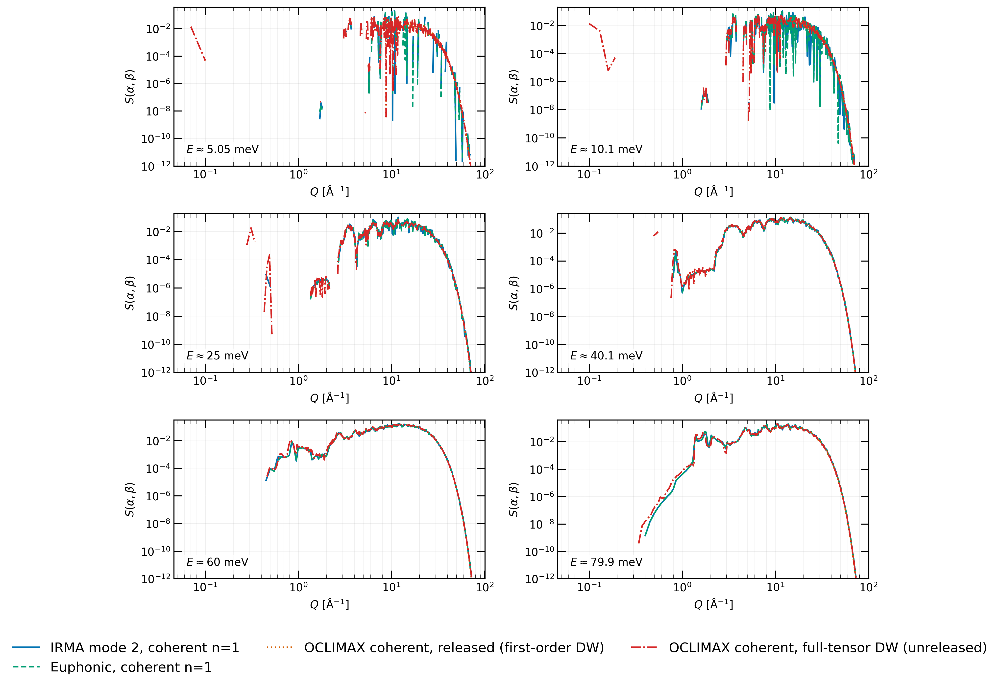
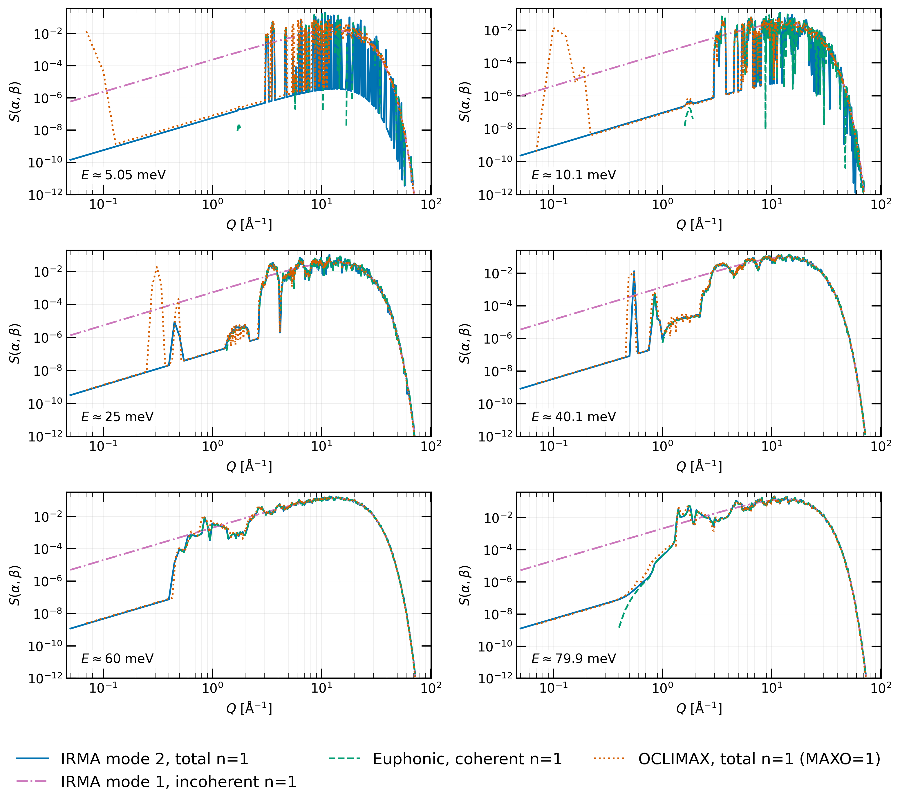
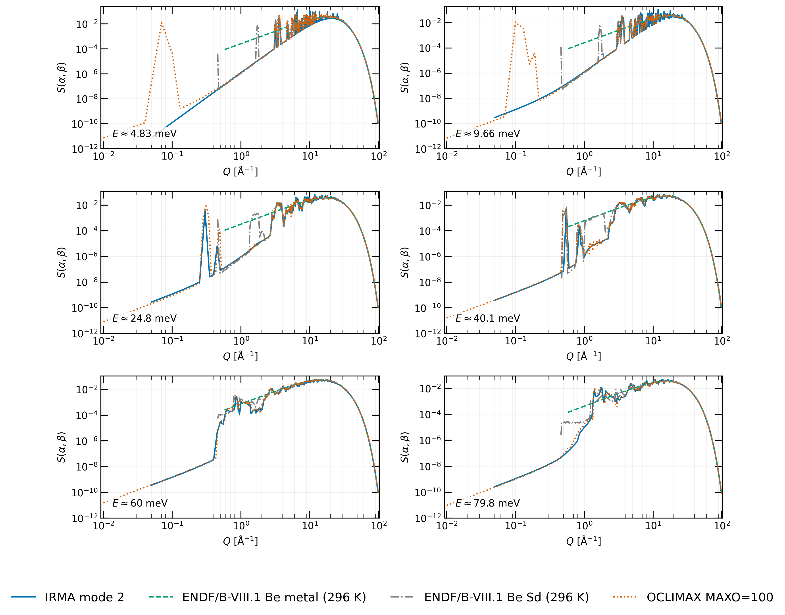
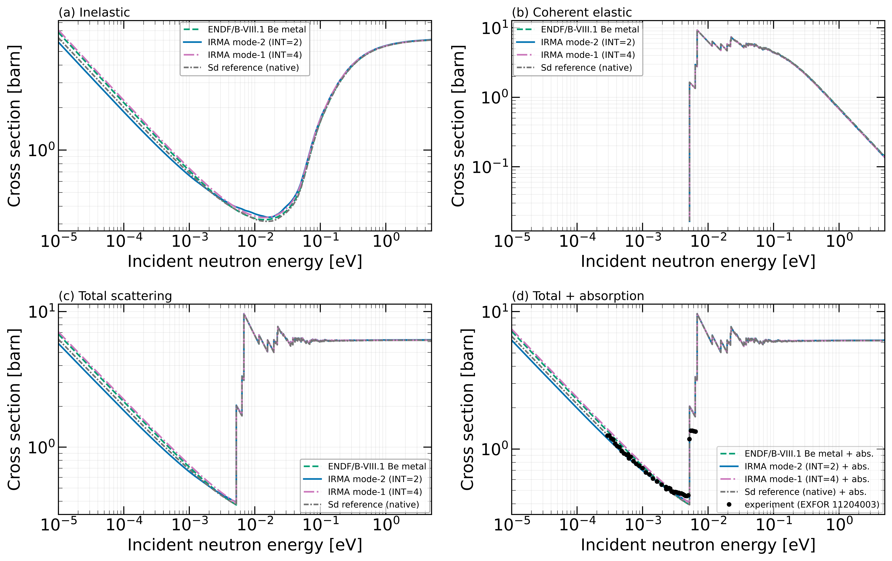
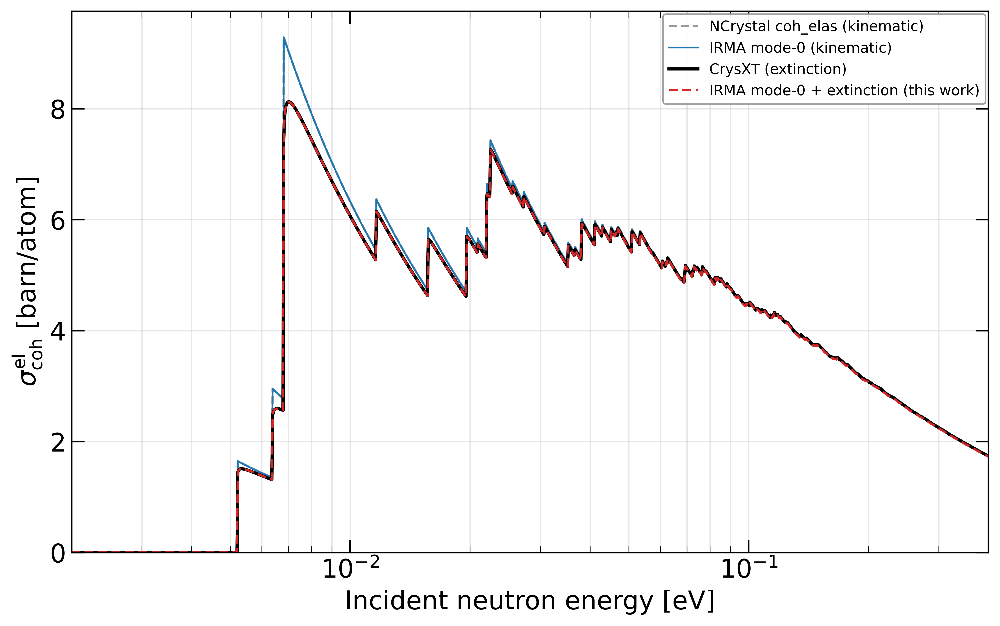

# Beryllium validation

Beryllium metal is the natural companion benchmark to graphite: a coherent
crystalline scatterer with a published ENDF/B-VIII.1 evaluation, a
structure-dependent (+Sd) variant, and a measured cold-neutron total cross
section to overlay. Unlike graphite it is only weakly anisotropic, which
makes it the control case for the Debye-Waller story: where graphite's
$W_c/W_{ab} \approx 6.6$ makes the isotropic approximation fail dramatically
at high momentum transfer, beryllium's near-isotropic displacement tensor
lets the isotropic and directional treatments stay together. The beryllium
phonon model is a representative VASP/PAW PBE calculation (4×4×3 supercell,
finite-displacement force constants in phonopy) from the same workflow as
the graphite model; it is a test case for the anisotropic methods, not a
model optimized against measured spectra, so the results on this page are
method demonstrations rather than best-fit benchmarks. All comparisons are
at 296 K.

!!! note "How to read the curve labels"
    **IRMA mode 2** is the phonopy-backed law with the exact coherent
    one-phonon term; **IRMA mode 1** is its incoherent-approximation
    counterpart; **Euphonic n = 1** is the independent coherent one-phonon
    reference on the same phonon model; **OCLIMAX MAXO=1/100** are OCLIMAX
    runs truncated at multiphonon order 1 or 100 (at MAXO=1 both the
    released code and the unreleased full-tensor Debye-Waller build appear,
    as for graphite); **ENDF/B-VIII.1
    beryllium-metal** and **Be+Sd** are the released evaluations, built from
    phonon models different from the one used here.

---

## The coherent one-phonon term against Euphonic and OCLIMAX

The comparison contract is the same as for
[graphite](graphite.md#the-coherent-one-phonon-term-against-euphonic-and-oclimax):
the coherent part of the n = 1 term on the same phonon model, OCLIMAX
isolated by zeroing the incoherent cross sections in its material file, in
both the released and full-tensor Debye-Waller variants, Euphonic evaluated
at the IRMA (α, β) grid, no regridding or broadening.

*Fixed-energy cuts through the coherent one-phonon (n = 1) law at 296 K:
IRMA mode 2 (coherent component), Euphonic, and OCLIMAX with the incoherent
cross sections set to zero, in the released and full-tensor variants; each
curve at the nearest energy of its own tabulated grid.*

All four coherent curves stay together at every Q. This is the control side
of the Debye-Waller argument: in nearly isotropic beryllium the first-order
approximation costs nothing, the released and full-tensor variants
coincide, and the graphite divergence is thereby pinned to the anisotropy
rather than to any code's implementation of the coherent term. The
shared-domain integral ratio against Euphonic is 1.0002, with a median J(Q)
difference of 0.005% over Q ≤ 20 Å⁻¹; against OCLIMAX the coherent ratio
is 0.99 with either variant.

### The full one-phonon term and its components

*Raw fixed-energy cuts through the beryllium n = 1 scattering laws at
296 K. Euphonic carries only the coherent one-phonon term; IRMA mode 2 and
OCLIMAX MAXO=1 carry both one-phonon components; IRMA mode 1 is the
incoherent counterpart.*

---

## The full law against OCLIMAX and the released evaluations

*Beryllium full mode-2 scattering law (symmetric form) at 296 K, compared
with OCLIMAX (MAXO=100) and the ENDF/B-VIII.1 beryllium-metal and Be+Sd
evaluations, both built from different phonon models.*

With the multiphonon order matched, the shared-window symmetric-law
integrals agree to about 2% (R = 0.98), and the agreement holds within
about 2% at all Q: with no strong anisotropy, no residual accumulates in
the high-Q multiphonon tail as it does for graphite. The Be+Sd file
contains narrow spikes near Q ≈ 0.5, 1.8, and 3 Å⁻¹ that neither the IRMA
nor the OCLIMAX calculation contains; as for the graphite Sd structure,
their origin in the evaluation is not established here.

---

## Processed cross sections and the measured cold-region total

*Beryllium cross sections at 296 K, with the NJOY processing and
interpolation conventions of the graphite page: IRMA mode 2 and mode 1
against the ENDF/B-VIII.1 beryllium-metal and Be+Sd evaluations. Panels:
inelastic, coherent elastic, total scattering, and total-plus-absorption
with the measured cold-region total (EXFOR 11204003).*

Both directional modes follow the evaluations through the inelastic,
coherent-elastic, and total panels, and below the Bragg cutoff the
calculated total-plus-absorption passes through the measured cold-region
points. Lin-lin interpolation shifts the beryllium thermal features by
about 2–5%, smaller than for graphite because its coherent near-zeros are
shallower.

!!! note "Experimental uncertainties"
    EXFOR 11204003 is tabulated without per-point uncertainties, so the
    measured total is shown as points without error bars.

---

## Crystalline extinction

Beryllium is also the verification case for the opt-in
[crystalline extinction](../extinction.md) correction, ported from the
CrysXT NCrystal plugin. At the kernel level, IRMA reproduces CrysXT within
rounding (0.000%) for nine reference cases spanning the five extinction
models; the frozen cases are regression references, so the test requires
neither NCrystal nor CrysXT at test time. At the evaluation level, with the
unit cell matched to the reference structure, a beryllium `iel=10`
evaluation written by IRMA and run through NJOY processing agrees with the
CrysXT coherent-elastic cross section to a median of 0.07%.

*Coherent-elastic cross section per atom for beryllium with and without
crystalline extinction. The kinematic curves are from NCrystal and IRMA
mode 0; the extinction-corrected curves use the Becker-Coppens `BC_mix`
model in CrysXT and IRMA, for a specimen with crystallite size 0.855 μm,
mosaic 170 rad⁻¹, and grain size 7.58 μm.*

For these specimen parameters, extinction reduces the kinematic Bragg
intensity by up to about 20% at the lowest energies; the correction falls
below the tabulation tolerance above approximately 0.1 eV and does not
alter the inelastic component. In the measured cold-region comparison
above, the ideal-crystal calculation jumps to the full kinematic Bragg
pattern at the cutoff, while measured transmission data from real
specimens can rise less sharply; both extinction and instrument
resolution suppress the sharp edge, and fitting the extinction
parameters to a measured transmission (as in Xu et al. 2025, cited on
the [extinction page](../extinction.md)) is exactly the use case the
correction above serves.

---

## What the beryllium suite establishes

The directional one-phonon term agrees with Euphonic to a shared-domain
integral ratio of 1.0002 (median J(Q) difference 0.005%), and the coherent
comparison with OCLIMAX gives 0.99 with either Debye-Waller variant. The full law tracks
order-matched OCLIMAX to 2%, uniformly in Q, and the processed cross
sections follow the released evaluations, passing through the measured
cold-region total below the Bragg cutoff. The extinction port is verified
to 0.000% at the kernel level and 0.07% median through the full evaluation
chain. Just as important, beryllium completes the graphite Debye-Waller
argument: a nearly isotropic crystal is where the isotropic approximation
is supposed to hold, and here it does.
