# Graphite validation

Graphite is IRMA's most thoroughly exercised validation case, and for good
reason: it is strongly anisotropic (the Debye-Waller factor along the *c*
axis is about 6.6 times the in-plane value), it has a published
ENDF/B-VIII.1 evaluation to overlay, it has a classic measured total cross
section (Steyerl) below the first Bragg edge, and it can be driven through
every one of IRMA's inelastic modes and both instrument geometries. The
phonon model behind every directional result on this page is the published
density-functional model of IG-110-type graphite: VASP with PAW potentials
and the PBE functional, a 900 eV plane-wave cutoff, a 3×3×4 Monkhorst-Pack
mesh, and force constants from the finite-displacement method on a 6×6×1
(144-atom) supercell in phonopy. The page follows the validation ladder:
kernel verification against NJOY LEAPR, the one-phonon term against
independent codes, the full thermal scattering law S(α,β) and the processed
cross sections against OCLIMAX and the released evaluation, the measured
total cross section, and finally the same phonon model driven end to end
against measured VISION and ARCS spectra.

#### How to read the curve labels

Every figure on this page draws on the same set of calculations, so the
curve labels are defined once here. **IRMA mode 2** is the phonopy-backed
S(α,β) with the exact coherent one-phonon term. **IRMA mode 1** is its
incoherent-approximation counterpart: the same directional Debye-Waller
tensor, but no interference. **IRMA mode 0** is the legacy isotropic
kernel. **Euphonic n = 1** is the independent coherent one-phonon reference
on the same phonon model. **OCLIMAX MAXO=1/223** are OCLIMAX runs truncated
at multiphonon order 1 or order-matched at 223; at MAXO=1 two variants
appear, the released code, whose coherent powder average uses a first-order
Debye-Waller approximation, and an unreleased full-tensor build provided by
the OCLIMAX author. **ENDF/B-VIII.1 graphite+Sd** is the released
evaluation, generated with FLASSH from a different phonon model. In terms
of the scattering components included, an evaluation with the distinct
effect (the +Sd of the name) is the counterpart of mode 2: its one-phonon
term carries both the coherent and the incoherent contribution. Evaluations
without it correspond to mode 1, with the one-phonon term in the incoherent
approximation.

---

## Kernel verification against NJOY LEAPR

The classic path is verified first: IRMA reproduces the published
ENDF/B-VIII.1 graphite tape (`iel=1`, the continuous phonon expansion) to a
maximum relative difference of 3.4×10⁻⁵ in physically significant values of
S(α,β), across all ten tabulated temperatures. The decks and reference
tapes live in `tests/native_LEAPR_NJOY_ENDF_validation/`, and the
[methodology page](methodology.md) gives the full reference set. Runnable
graphite decks, in classic and generalized-elastic variants, are in
`examples/tsl/`.

---

## The coherent one-phonon term against Euphonic and OCLIMAX

The directional kernels have no LEAPR equivalent, so they are compared with
independent calculations that start from the same phonon model, restricted
to the one-phonon (n = 1) term on a 40³ phonon mesh. The compared quantity
is the coherent part of that term, the piece all three codes compute.
Euphonic computes only that part; IRMA computes the coherent and incoherent
parts of its S(α,β) separately and exposes the components; OCLIMAX isolates
the coherent part when the incoherent cross sections in its material file
(`.oclimax`) are set to zero. Two OCLIMAX variants enter the comparison:
the released code, whose coherent powder average uses a first-order,
almost-isotropic Debye-Waller approximation inherited from aCLIMAX, and an
unreleased build provided by the OCLIMAX author that replaces it with the
full anisotropic tensor. The unreleased build runs on the same inputs and
differs only in that treatment; it appears only in this coherent
comparison, and every other OCLIMAX result in the validation record uses
the released code. Euphonic was evaluated at the IRMA (α, β) grid, OCLIMAX
retained its own grid, and none of the plotted curves was regridded or
energy-broadened.

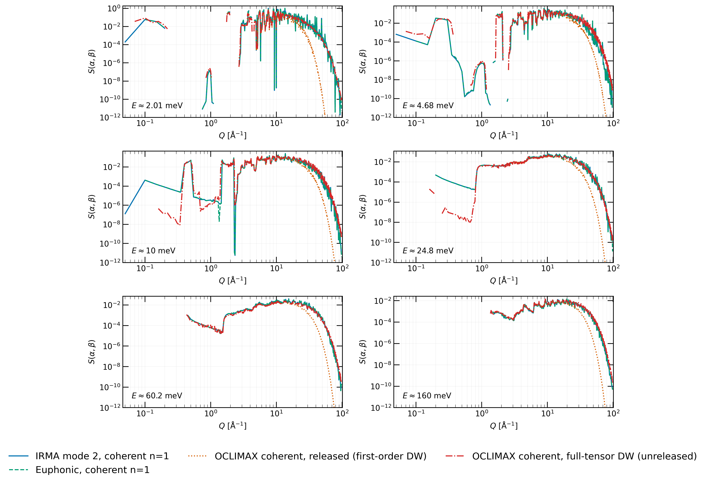

*Fixed-energy cuts through the coherent one-phonon (n = 1) S(α,β) at 296 K:
IRMA mode 2 (coherent component), Euphonic, and OCLIMAX with the incoherent
cross sections set to zero, in the released (first-order Debye-Waller) and
unreleased full-tensor variants; each curve at the nearest energy of its
own tabulated grid, no broadening or regridding.*

All four coherent curves coincide across the interference structure at low
and intermediate Q, through the sharp maxima and the deep zeros alike. They
separate at high Q: the released OCLIMAX falls away from the directional
calculations, and the full-tensor variant stays with them. The first-order
approximation was constructed for mildly anisotropic displacements; in
graphite, where the c-axis Debye-Waller exponent is about 6.6 times the
in-plane value and enters exponentially, its error compounds at high Q.
[Beryllium](beryllium.md), nearly isotropic, is the control where all four
curves stay together at every Q.

Quantitatively, the coherent comparison with Euphonic agrees to a median of
0.18% in the energy integral J(Q) = ∫S(Q,E)dE over Q ≤ 20 Å⁻¹, and the
shared-domain integral ratio of the symmetric-form S(α,β) is 1.00001.
Against the released OCLIMAX the coherent ratio is 1.04 below Q = 12 Å⁻¹
and grows to 1.9 over the full window as the first-order attenuation pulls
the OCLIMAX S(α,β) down at high Q; with the full-tensor variant the same
ratio is 1.02 over the whole window. The frozen Euphonic reference cases
live in `tests/mode2_euphonic_n1_validation/`.

### The full one-phonon term and its components

*Raw fixed-energy cuts through the graphite n = 1 S(α,β) at 296 K.
Euphonic carries only the coherent one-phonon term; IRMA mode 2 and OCLIMAX
MAXO=1 carry both one-phonon components; IRMA modes 1 and 0 are the
incoherent counterparts.*

Mode 2 and Euphonic coincide wherever coherent scattering dominates,
including the sharp interference structure. Where the coherent component is
nearly zero, Euphonic drops away and mode 2 rests on the small incoherent
contribution it retains; the logarithmic scale makes this floor prominent.
The mode-1 curve replaces the interference structure by its smooth average:
it runs through the middle of the mode-2 oscillations at low Q and merges
with mode 2 at high Q, where the interference washes out. The remaining two
curves show the effect of the Debye-Waller convention: mode 0 attenuates
with a fully isotropic exponent and the released OCLIMAX with its
first-order approximation, and in graphite both fall below the directional
curves at high Q, at different magnitudes.

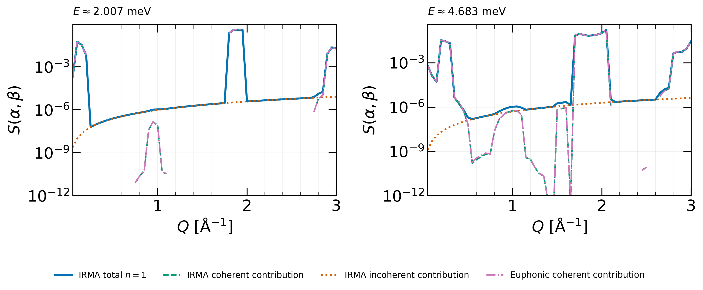

*Origin of the low-Q separation: cuts at 2.007 and 4.683 meV (energies of
the tabulated grid, no interpolation). The coherent and incoherent
components are weighted by their fractions of the total bound scattering
cross section, so their plotted contributions add exactly to the IRMA
total; the Euphonic coherent curve is given the same coherent weight. At
coherent zeros, the small incoherent contribution sets the finite IRMA
total.*

### The Debye-Waller attenuation isolated

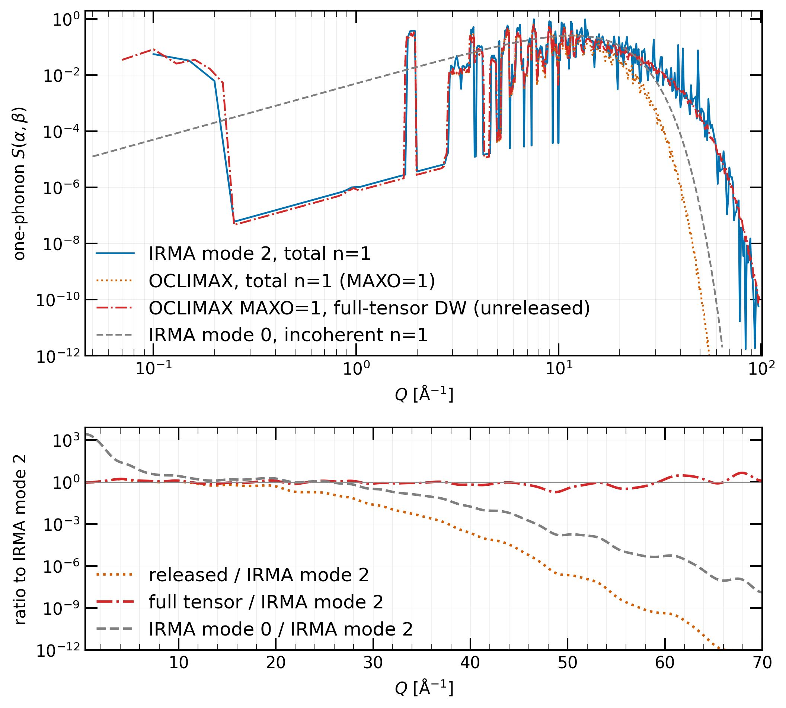

*Directional Debye-Waller attenuation in the graphite one-phonon S(α,β) at
E ≈ 2 meV and 296 K. Top: raw cuts (symmetric form) on a logarithmic Q
axis: IRMA modes 2 and 0, the released OCLIMAX (first-order Debye-Waller
approximation), and the unreleased full-tensor variant, all at MAXO=1.
Bottom: each result divided by mode 2 after Gaussian smoothing in Q with
σ = 1 Å⁻¹.*

Against mode 2, the released OCLIMAX is suppressed to approximately 0.48 at
Q = 20 Å⁻¹ and 2.3×10⁻⁷ at Q = 50 Å⁻¹, directional-to-first-order
factors of about 2.1 and 4.4×10⁶; the full-tensor variant's ratios at the
same points are 1.19 and 0.34. IRMA mode 0 shows the same qualitative
roll-off at a different magnitude, as expected: its Debye-Waller factor is
fully isotropic, while the released OCLIMAX retains a first-order
anisotropic correction. The selected one-phonon feature contributes little
to the integrated S(α,β), but the high-Q tail is dominated by the
multiphonon orders, which OCLIMAX convolves with a fully isotropic
Debye-Waller factor; that attenuation accounts for the few-percent offset
in the integral of the full S(α,β) below.

---

## The full S(α,β) against OCLIMAX and the released evaluation

OCLIMAX also provides the complete inelastic S(α,β), one-phonon plus all
multiphonon orders. With the multiphonon order matched (MAXO=223), the
shared-window integrals of the symmetric-form S(α,β) agree to about 4%
(R = 0.96). The order is converged: rerunning the OCLIMAX references at the
auto-sized orders of the corresponding IRMA evaluations (217 here;
104 and 102 for [beryllium](beryllium.md) and
[BeO](beryllium-oxide.md)) leaves every plotted cut and quoted ratio
in the validation record unchanged.

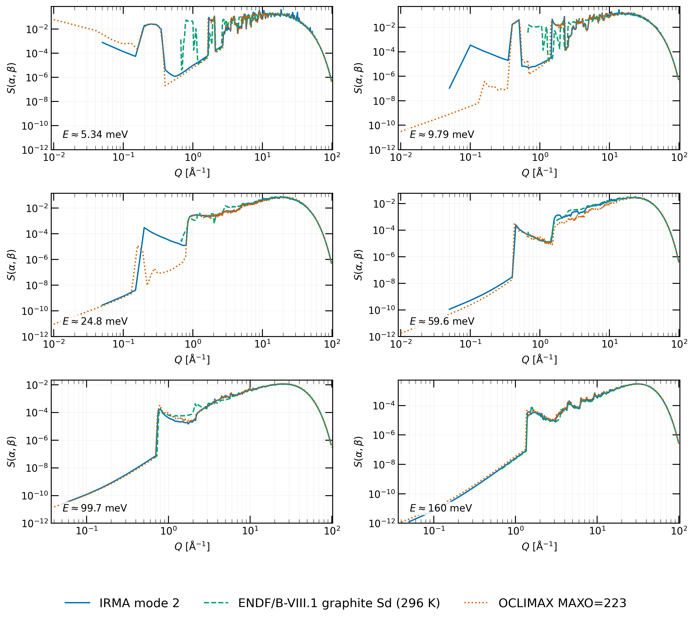

*Graphite full mode-2 S(α,β) (symmetric form) at 296 K, compared with
OCLIMAX (MAXO=223) and the ENDF/B-VIII.1 graphite+Sd evaluation, which was
generated with FLASSH from a different phonon model.*

Three features of the plotted curves deserve comment. First, the evaluated
graphite+Sd file is tabulated from a minimum α of 3.1×10⁻³, so at these
energies its cuts begin near Q ≈ 0.7 Å⁻¹, well above the lowest Q reached by
the calculated curves. Second, the Sd file contains broad spikes between
roughly Q ≈ 0.7 and 2 Å⁻¹, at the coherent interference minima where IRMA,
OCLIMAX, and the Euphonic one-phonon term all agree on deep near-zeros; the
origin of this structure in the evaluation is not established here. Third,
the OCLIMAX curves become erratic toward the smallest Q, where each ΔQ shell
of the expanded phonon mesh contains only a few modes; the values there
change with the shell width and should not be read as physical.

The 4% residual has the same origin as the high-Q separation in the
one-phonon cuts: OCLIMAX attenuates with an isotropic, orientation-averaged
Debye-Waller factor, IRMA retains the tensor, and the residual accumulates
in the high-Q multiphonon tail. Three observations support this
attribution. The Q < 4 Å⁻¹ band contributes only about 0.1% of the
integral, so the visible low-Q structure is not the source. Mode 1, which
drops the coherent one-phonon term but keeps the tensor, gives nearly the
same integral ratio as mode 2 (0.951 versus 0.958), so neither is the
coherent term. And mode 0, which uses an isotropic factor as OCLIMAX does,
lands on the opposite side of the OCLIMAX integral from the directional
modes.

---

## Processed cross sections

Here and below, NJOY processing means the full module chain (RECONR,
BROADR, THERMR, ACER), with cross sections extracted at the final VIEWR
stage and THERMR carrying the local corrections described on the
[NJOY interoperability](../njoy.md) page. The IRMA mode-2 and OCLIMAX
S(α,β) tables are processed with lin-lin (INT=2) interpolation, written by
IRMA's `iint` option; the ENDF/B-VIII.1 evaluation keeps its own log-lin
flag, which reproduces the published cross section.

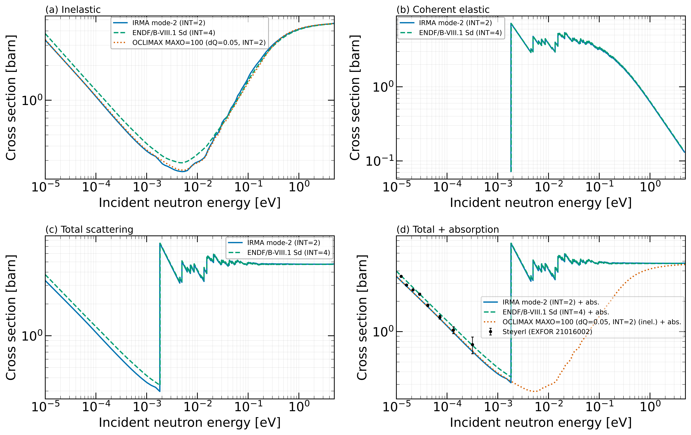

*Graphite cross sections at 296 K: IRMA mode 2 and OCLIMAX with lin-lin
interpolation, against the ENDF/B-VIII.1 graphite+Sd evaluation on its own
log-lin interpolation. Panels: inelastic, coherent elastic, total
scattering, and total-plus-absorption with the Steyerl measurement (EXFOR
21016002).*

The mode-2 and OCLIMAX curves track each other closely and are both near
0.24 b at the inelastic cross-section minimum, where they differ by about
3%. The interpolation choice matters on production-sized grids: log-lin
interpolation floors the deep coherent near-zeros of the tabulated S(α,β),
while lin-lin preserves them and raises the cross section at the minimum by
about 9% at 296 K and, with thermal broadening, about 6% at 500 K. On a
sufficiently dense (α, β) grid the two schemes converge. The same reasoning
applies to the graphite+Sd evaluation: its S(α,β) also carries sharp
coherent structure, so log-lin is retained only to reproduce the published
cross section, and lin-lin processing would raise its cross section in the
same way at the minimum and below the Bragg cutoff. For a smooth incoherent
S(α,β) such as mode 1's, log-lin remains adequate.

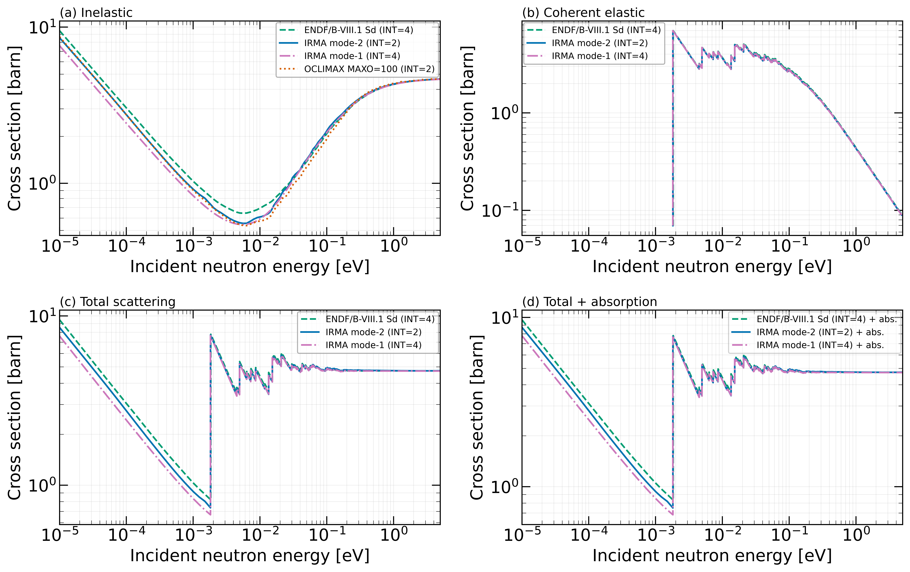

*The 500 K counterpart, with the same processing and interpolation
conventions. The OCLIMAX curve appears in the inelastic panel only.*

The processing chain itself is closed against an independent integration:
`thermr_mimic`, a local reimplementation of THERMR's tabulated-S(α,β)
cross-section integration, and corrected NJOY THERMR agree to a median of
0.05% and at worst 0.8% on the uniform dQ = 0.05 Å⁻¹ table.

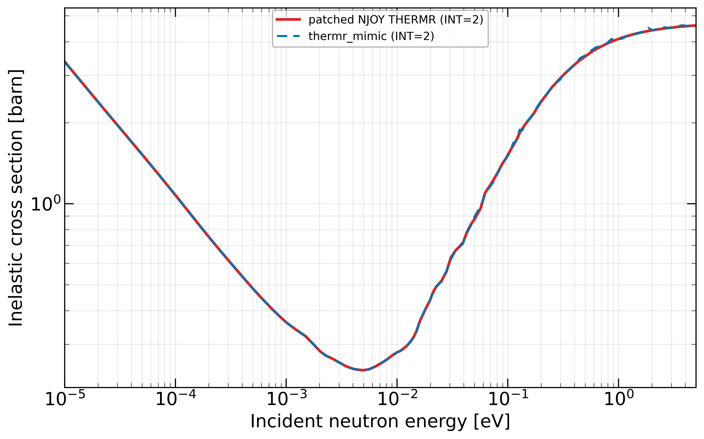

*Graphite mode-2 inelastic cross section from `thermr_mimic` and corrected
NJOY THERMR on the uniform dQ = 0.05 Å⁻¹ grid; the two curves overlap at
this scale.*

The α/Q-grid convergence study (automatic grid −0.33% on the 0.01–25 meV
integral against the dQ = 0.01 Å⁻¹ reference, 1.2% rms pointwise) lives on
the [Automatic grids](../grids.md) page.

### Total cross section at two temperatures and the Steyerl measurement

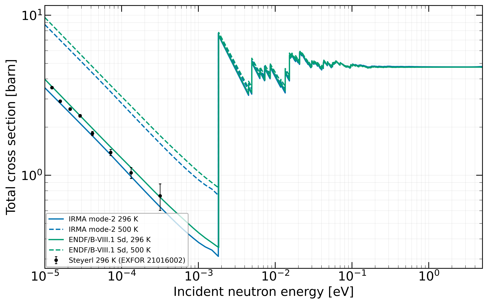

*Graphite total cross section (scattering plus natural-carbon absorption)
at 296 and 500 K: IRMA mode 2 against the ENDF/B-VIII.1 graphite+Sd
evaluation, with the Steyerl measurement at 296 K (EXFOR 21016002).*

The natural-carbon absorption cross section (isotope-weighted C-12 and
C-13, taken from the SCALE-distributed ENDF files) is added to every curve
for comparison with the transmission-derived measurement; it is not
calculated by IRMA. Below the (002) Bragg cutoff at 1.82 meV, coherent
elastic scattering is absent, so the measurement tests the sum of the
inelastic and absorption contributions. The mean ratio of the calculated
total to the eight Steyerl points below the cutoff is 0.930: the
calculation runs about 7% below the measurement. The numerical effects
quantified above (a −0.33% grid effect and a +0.10% processing effect on
the same thermal integral) are far smaller, so the offset lies in the
physical inputs: it could come from the phonon model, from the measured
sample, or from the transmission measurement itself, and this single
comparison cannot tell which.

It is important to note that this comparison holds only below the Bragg
cutoff. Above 1.82 meV the measurement contains coherent Bragg scattering,
which an inelastic-plus-absorption curve does not; comparing the two across
that edge mixes scattering components and gives a meaningless ratio.

---

## End to end against measured spectra: VISION and ARCS

The same graphite phonon model drives the
[instrument forward model](../spectra.md) and is overlaid on measurements of
IG-110 nuclear graphite on the indirect-geometry VISION and direct-geometry
ARCS spectrometers at the Spallation Neutron Source. These comparisons test
peak positions, spectral shape, and their temperature or momentum
dependence; they do not test absolute intensity, so each comparison carries
a fitted intensity normalization, stated at its figure.

### VISION

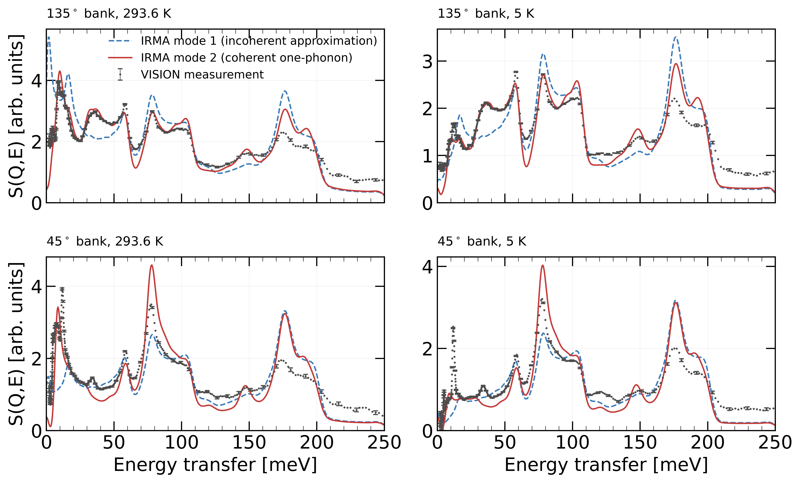

*VISION spectra of IG-110 graphite in the 45° and 135° detector banks (gray
points, drawn every sixth point) and IRMA mode 2 (red) and mode 1 (blue
dashed) at 293.6 K (left) and 5 K (right). Each calculated curve is scaled
by the ratio of the measured to its calculated 30–220 meV integral; peak
positions are not adjusted.*

The calculations are folded with a Gaussian response of standard deviation
σ(E) = 1.5294 + 0.009967 E + 9.814×10⁻⁷ E² meV, which combines the
published VISION resolution with an empirical contribution chosen from the
measured 58, 78, and 175 meV line widths; the coefficients are
user-settable. The forward model predicts relative intensities only: it
projects S(α,β) onto the instrument's kinematics and resolution, and it
models nothing else about the measurement. The measured count rate, the
amount of sample in the beam, self-shielding, multiple scattering, and the
instrument background are all outside the calculation. Each calculated
curve is therefore scaled once, by the ratio of the measured to its own
calculated 30–220 meV integral; absolute scattering is tested separately by
the cross-section comparisons above.

The calculated spectra reproduce the measured bands at 58, 78, 105, 147,
and 175 meV. The band positions are a parameter-free prediction of the
phonon model, and near 175 meV they agree to about 1 meV, better than one
percent. The calculated peaks are slightly broader than the measured ones;
since the calculated widths are set mainly by the response function, this
points to the chosen response rather than to the phonon model. The
difference between the two calculated curves is the coherent one-phonon
term: mode 2 follows the measurement more closely, most visibly at low
energies in the 135° bank, where mode 1 puts intensity in the wrong places;
at the 78 meV peak in the 45° bank, mode 2 overshoots the measurement and
mode 1 undershoots it. Above about 205 meV, the highest phonon energy in
the model, one-phonon scattering ends; the intensity measured there comes
from multiphonon scattering and instrument background, and the calculation
includes the multiphonon part but not the background.

### ARCS

The mode-2 powder maps are compared with ARCS data from the same material
at 300 K and incident energies of 300, 215, 130, and 30 meV, reduced with
Mantid into 0.25° polar-angle groups with the k_i/k_f factor applied. The
resolution model uses the recorded chopper state: the ARCS-700-1.5-AST
package at 600 and 540 Hz for E_i = 300 and 215 meV, and the
ARCS-100-1.5-AST package at 600 and 300 Hz for E_i = 130 and 30 meV.

*Measured ARCS S(Q,E) maps of IG-110 graphite at 300 K (left) and the IRMA
mode-2 single-scatter calculations (right) for E_i = 300, 215, 130, and
30 meV. Within each row the two maps share a logarithmic color scale after
the calculation is scaled to the measured intensity over the 0.3–0.8 E_i
band. The calculated elastic line uses the same Debye-Waller factors as the
inelastic calculation.*

At E_i = 30 meV, both maps show the acoustic cones emerging from the powder
Bragg positions, and the prominent acoustic and optical bands appear in the
same (Q, E) regions at the higher incident energies. This is a visual
comparison of where the intensity lies; no dispersion curves were extracted
from the maps or fitted. The measurement also contains diffuse intensity
between the cones, most clearly at 30 meV, consistent with the multiple
scattering and background that the single-scatter forward model does not
include.

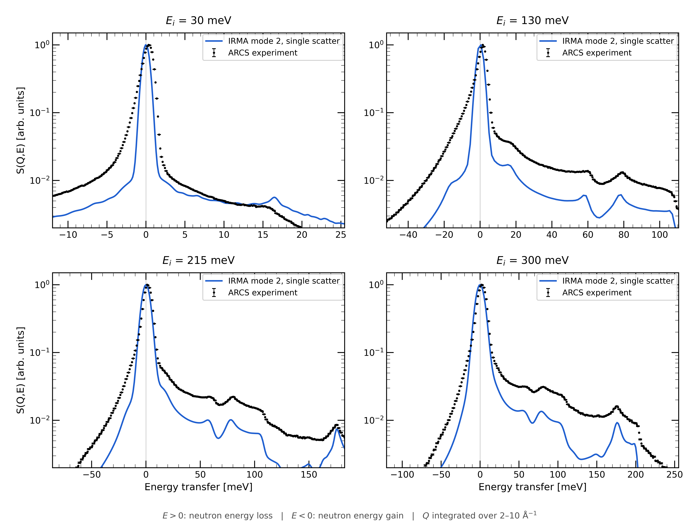

*Energy cuts integrating the maps over 2 ≤ Q ≤ 10 Å⁻¹. Each measured and
calculated curve is independently normalized to its own elastic peak and
plotted on a logarithmic scale; both energy-gain (E < 0) and energy-loss
(E > 0) sides are shown.*

Because every curve is normalized to its own elastic peak, the cuts compare
the inelastic-to-elastic line shape. The calculated elastic line is a
symmetric Gaussian, whereas the measured one is asymmetric, with a tail
toward the energy-gain side inherited from the moderator pulse, so the two
line shapes differ near the elastic peak by construction. Peaks identified
in both the measured and calculated cuts agree in position to within
2.8 meV, and part of that offset is instrumental: the measured elastic line
itself sits not at zero but at +0.4 to +2.6 meV, and the offset grows with
incident energy, consistent with moderator emission-time and
chopper-phasing delays that the nominal time-to-energy conversion does not
include. The McStas simulations below, which model the moderator and
choppers, reproduce the shift at +0.3 to +2.3 meV. On the energy-loss side,
the 58 and 78 meV bands and, when kinematically accessible, the optical
band near 175 meV follow the measurement. On the energy-gain side the model
generates intensity through Bose annihilation, but the measured intensity
is larger: the calculated-to-measured gain-side area ratios are 0.33, 0.29,
0.63, and 0.85 for E_i = 30, 130, 215, and 300 meV. Because each curve was
first normalized to its own elastic peak, these are line-shape ratios, not
absolute cross-section ratios; the deficit is consistent with multiple
scattering and background omitted from the single-scatter calculation,
which the McStas comparison examines next.

### ARCS through McStas: the transport application

The mode-2 evaluation was also tested after export to the companion
[NCrystal plugin](../ncrystal-plugin.md). A 300 K material-data file
(produced with 4000 coherent and 1000 incoherent/multiphonon directions,
predating the 10000/1000 campaign sampling) was loaded into an ARCS McStas
model. The graphite plate was represented by its measured dimensions,
39.6 × 50.0 × 4.00 mm³, a bulk density of 1.80 g/cm³ derived from its
14.25 g mass, and a 30 × 45 mm² incident beam; the model did not include
the sample environment present in the measurement (the aluminum cryostat,
sample holder, and sample stick). The stock-NCrystal comparison curve uses
the phonon spectrum behind the ENDF/B-VIII.0 crystalline-graphite
evaluation (carried into ENDF/B-VIII.1 as the non-Sd variant), so it
differs from the phonon model in the IRMA material-data files. These
comparisons are qualitative; no intensity χ² was calculated.

*Measured and simulated ARCS maps at 300 K. Rows are E_i = 300, 215, 130,
and 30 meV; columns show the measurement, the IRMA analytic single-scatter
calculation, McStas with stock NCrystal graphite (incoherent
approximation), and McStas with the IRMA plugin. Each calculated map is
scaled independently to the corresponding measured map.*

At E_i = 30 meV, the plugin calculation resolves the coherent acoustic
cones in the low-Q powder-scattering region, where the incoherent
approximation produces a smooth continuum; coherent band structure remains
visible at the higher incident energies. Resolving the cones requires an
exported energy spacing of about 0.15 meV; coarser sampling washes out the
dispersion. Because each calculated map is scaled independently, the
comparison tests the morphology of the intensity in (Q, E), not absolute
magnitude or the relative normalization of the three models.

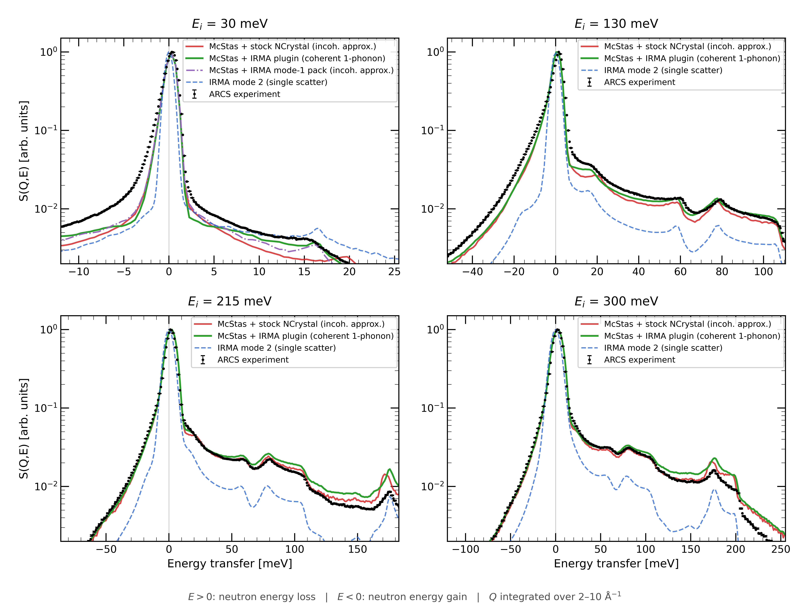

*ARCS cuts integrated over 2 ≤ Q ≤ 10 Å⁻¹ at E_i = 30, 130, 215, and
300 meV: the measurement (black points), the IRMA mode-2 single-scatter
calculation (blue), McStas with stock NCrystal graphite (red), and McStas
with the IRMA plugin (green). Every curve is independently normalized to
its own elastic peak. The E_i = 30 meV panel adds McStas with the IRMA
mode-1 material-data file (purple dash-dotted).*

Because the McStas simulations model the moderator pulse and choppers, they
reproduce the measured elastic line better than the analytic Gaussian: most
of its asymmetric tail and its energy offset. Both McStas calculations
place more relative intensity in the inelastic continuum and on the
energy-gain side than the analytic single-scatter result, and this reduces
the deficit identified in the cuts above; because of the independent
normalization, their difference is not an additive estimate of multiple
scattering or other beamline contributions. The E_i = 30 meV panel adds a
same-model test of the coherent one-phonon term in transport: a mode-1
material-data file exported on the same grids and run with identical
beamline settings, so only the physics mode differs. Both IRMA modes
produce the measured feature near 16 meV; stock NCrystal places its
counterpart near 20 meV, so the position is set by the phonon model rather
than by the scattering treatment. With the phonon model fixed, the coherent
one-phonon treatment improves the shape: mode 2 follows the measured
continuum up to the feature and comes closest to its intensity, while
mode 1 dips below the data just before it.

Two discrepancies remain, one at each end of the energy-transfer range.
First, at E_i = 215 and 300 meV, both McStas calculations exceed the
measurement at the largest energy transfers after peak normalization:
integrated over 0.6–0.85 E_i, the excess is about 33% for stock NCrystal
and 48–57% for the IRMA plugin. Its cause is unresolved; the calculation
does not distinguish errors in the graphite multiphonon or Debye-Waller
treatment, sample orientation, omitted sample-environment scattering, and
the simulated multiple-scattering contribution. Second, at E_i = 30 and
130 meV, neither simulation reproduces the tails of the measured elastic
peak. A similar excess occurs in facility vanadium calibration runs with
the same chopper settings, which supports an instrumental origin associated
with the 100-series Fermi-chopper transmission rather than a
graphite-scattering feature.

---

## What the graphite suite establishes

The classic kernel reproduces the published tape to 3.4×10⁻⁵ across ten
temperatures. The directional one-phonon term agrees with Euphonic to a
shared-domain integral ratio of 1.00001 (coherent component against
coherent component), and the high-Q suppression in isotropic codes is
attributed to the isotropic Debye-Waller approximation, an attribution
supported by a controlled mode-0 comparison. The full mode-2 S(α,β) tracks
order-matched OCLIMAX to 4%, with the residual localized to the anisotropic
Debye-Waller convention in the high-Q multiphonon tail. The processed cross
sections track OCLIMAX to about 3% at the inelastic minimum, the processing
chain is closed to 0.05% median against corrected THERMR, and the numerics
are converged well below the 7% offset against the Steyerl total, an offset
that lies in the physical inputs and that this comparison alone cannot
localize further. Finally, the same phonon model, driven through the
forward model and through McStas transport, reproduces the measured VISION
band positions to about 1 meV and the measured ARCS map morphology,
with the coherent one-phonon treatment (mode 2) measurably closer to the
data than the incoherent approximation in backscattering and in the
transport cuts.
