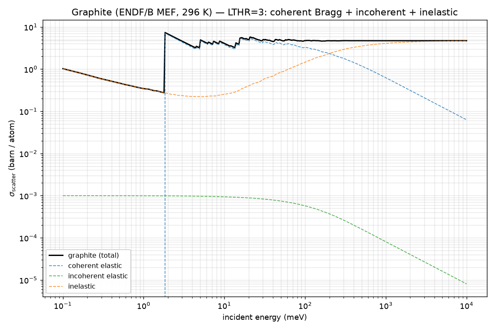
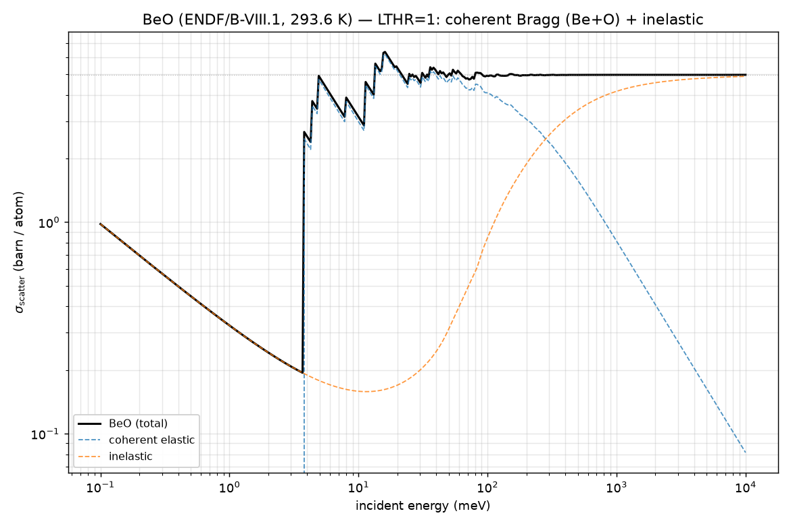
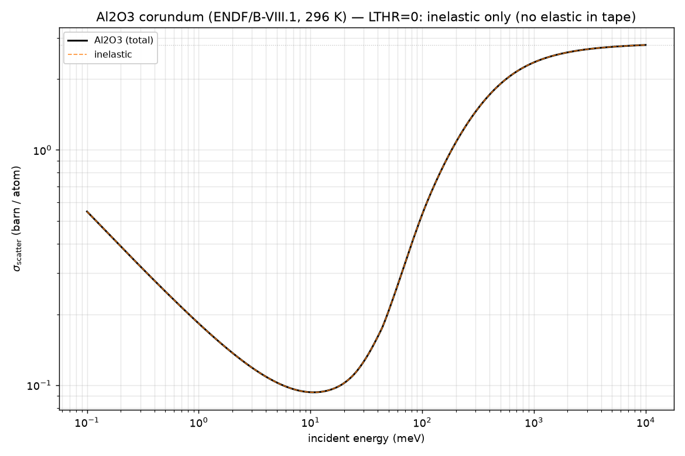
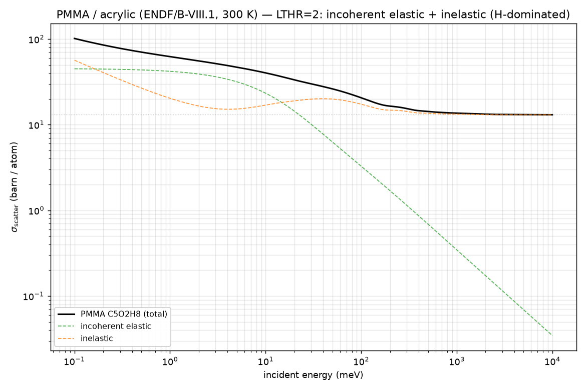

# Examples

Each example is a self-contained per-material folder holding its ENDF/TSL
tape(s), a converter config, and the expected output figure:

```
examples/
  plot_cross_section.py     reusable "plot sigma(E) in NCrystal" helper
  graphite/   graphite_mef_296K.endf            graphite_xs.png   (LTHR=3: coh+incoh+inel)
  beo/        beo.yaml      tsl-{Be,O}inBeO.endf beo_xs.png        (LTHR=1: coherent + inel)
  al2o3/      al2o3.yaml    tsl-{Al,O}inAl2O3.endf al2o3_xs.png    (LTHR=0: inelastic only)
  pmma/       pmma.yaml     tsl-{C,O,H}inC5O2H8.endf.gz pmma_xs.png (LTHR=2: incoh + inel)
```

Every example is the same two steps:

1. **Convert** the tape(s) → an NCrystal pack + `.ncmat` with
   `python -m ncrystal_plugin_ENDFTSL`.
2. **Plot** the per-atom cross section through NCrystal with
   [`plot_cross_section.py`](plot_cross_section.py).

Install the plugin first (so NCrystal discovers it), then run the commands from
**this `examples/` directory**:

```bash
cd ..  &&  pip install . --no-build-isolation --no-deps  &&  cd examples
```

The four materials span every elastic case an ENDF/TSL tape can carry. The
generated `.ncmat`/`.endftslpack` are git-ignored (regenerate them with the
convert command); the tapes, configs, and figures are tracked.

> The cross sections are the plugin's faithful reproduction of the **ENDF/TSL
> evaluation** — they are not meant to match NCrystal's own built-in materials,
> which use a different physics source (a VDOS model). Expect the *shapes* to
> differ even where the normalization is identical.

---

## 1. Graphite — single species, all three channels (`LTHR=3`)

Single-species tapes use the positional form (no config). Graphite's tape is
`LTHR=3` (mixed elastic): **coherent** Bragg edges, a small **incoherent**
elastic line, and the **inelastic** S(α,β).

```bash
python -m ncrystal_plugin_ENDFTSL graphite/graphite_mef_296K.endf -o graphite \
    --material-id graphite --symbol C --mass 12.0107 --density 2.26 --temperature 296

python plot_cross_section.py graphite/graphite.ncmat --temp 296 --channels \
    --label graphite --legend-loc "lower left" -o graphite/graphite_xs.png
```



The sawtooth is the coherent Bragg-edge structure, sampled verbatim from the tape's
cumulative `S(E)` edge table; it switches on at the first Bragg edge (~1.8 meV).

---

## 2. BeO — polyatomic 1:1, coherent + inelastic (`LTHR=1`)

Two principal scatterers (Be, O), one tape each, listed in
[`beo/beo.yaml`](beo/beo.yaml). Both tapes are `LTHR=1` (**coherent** + inelastic,
no incoherent). Each carries the **full per-atom Bragg edges**; the converter
fraction-weights each by 0.5 so the two packs sum to the per-atom coherent cross
section. This is the polyatomic-with-coherent case (cross-species interference
through the shared edge structure).

```bash
python -m ncrystal_plugin_ENDFTSL --config beo/beo.yaml -o beo
python plot_cross_section.py beo/beo_endftsl.ncmat --temp 293.6 --channels \
    --label 'BeO' --legend-loc "lower left" -o beo/beo_xs.png
```



The coherent Bragg-edge structure (blue) is the sum of the Be and O fraction-weighted edge
tables; its first edge sits near 3.7 meV.

---

## 3. Al₂O₃ (corundum) — polyatomic 2:3, inelastic-only (`LTHR=0`)

Two scatterers (Al, O) in [`al2o3/al2o3.yaml`](al2o3/al2o3.yaml). These
ENDF/B-VIII.1 tapes have **no MF7/MT2 elastic (`LTHR=0`)**, so the material is
**inelastic-only** — there are no Bragg edges, because the evaluation does not carry
one. (That is a property of the tape, not the plugin; if you need corundum's Bragg
elastic, take it from the crystal structure separately.)

```bash
python -m ncrystal_plugin_ENDFTSL --config al2o3/al2o3.yaml -o al2o3
python plot_cross_section.py al2o3/al2o3_endftsl.ncmat --temp 296 --channels \
    --label 'Al2O3' --legend-loc "upper left" -o al2o3/al2o3_xs.png
```



The high-energy plateau (~2.85 b/atom) is the per-atom free-gas limit
`0.4·σ_free(Al) + 0.6·σ_free(O)` — a check that the polyatomic fractions are
normalized per atom.

---

## 4. PMMA / acrylic glass C₅O₂H₈ — polyatomic 5:2:8, hydrogenous (`LTHR=2`)

Three scatterers (C, O, H) in [`pmma/pmma.yaml`](pmma/pmma.yaml). All three tapes
are `LTHR=2` (**incoherent** elastic + inelastic, no coherent — correct for an
amorphous plastic). Hydrogen dominates (`σ_bound ≈ 82 b`), so the low-energy cross
section is large and incoherent-elastic.

PMMA's three tapes are large, so they ship **gzipped** — decompress them first
(the converter needs the plain ENDF text):

```bash
for f in pmma/*.endf.gz; do gunzip -c "$f" > "${f%.gz}"; done   # -> pmma/tsl-*C5O2H8.endf

python -m ncrystal_plugin_ENDFTSL --config pmma/pmma.yaml -o pmma
python plot_cross_section.py pmma/pmma_endftsl.ncmat --temp 300 --channels \
    --label 'PMMA C5O2H8' --legend-loc "lower left" -o pmma/pmma_xs.png
```



The high-energy plateau (~13 b/atom) is `Σ fᵢ·σ_free,i` (H-dominated). The
incoherent-elastic channel reproduces the ENDF `(σ_b/2)(1−e^{−4EW'})/(2EW')`
formula exactly, fraction-weighted across the three species.

---

## Using the material in NCrystal directly

Once converted, the `.ncmat` is an ordinary NCrystal input:

```python
import NCrystal as NC
sc = NC.createScatter("pmma/pmma_endftsl.ncmat;temp=300K")
print(sc.crossSectionIsotropic(0.025))          # per-atom sigma at 25 meV, barn
# isolate one channel:
NC.createScatter("pmma/pmma_endftsl.ncmat;temp=300K;comp=incoh_elas")
```

For a compiled host (e.g. a McStas instrument) that does not import the Python
package, point NCrystal at the built shared library:

```bash
export NCRYSTAL_PLUGIN_LIST=/abs/path/to/libNCPlugin_ENDFTSL.so
```

## Notes

- **Per atom.** NCrystal cross sections are per atom; the converter scales each
  principal pack by its atom fraction so the packs sum to the per-atom average.
- **Temperature.** `--temperature` / the config `temperature` must be **one of the
  temperatures stored in the tape** (MF7/MT4). The converter selects that column
  exactly — it does **not** interpolate — and errors on an unlisted value.
  (Al₂O₃ stores 77/80/100/200/293.6/296/300 K; PMMA 20/77/196/233/293.6/300/… K.)
- **One tape per principal scatterer.** A polyatomic config lists one ENDF/TSL tape
  per species, with atom `fraction`s that sum to 1.
- **Tape provenance.** The BeO, Al₂O₃ and PMMA tapes are standard ENDF/B-VIII.1
  thermal-scattering evaluations; graphite is the small MEF tape vendored for the
  test-suite.
